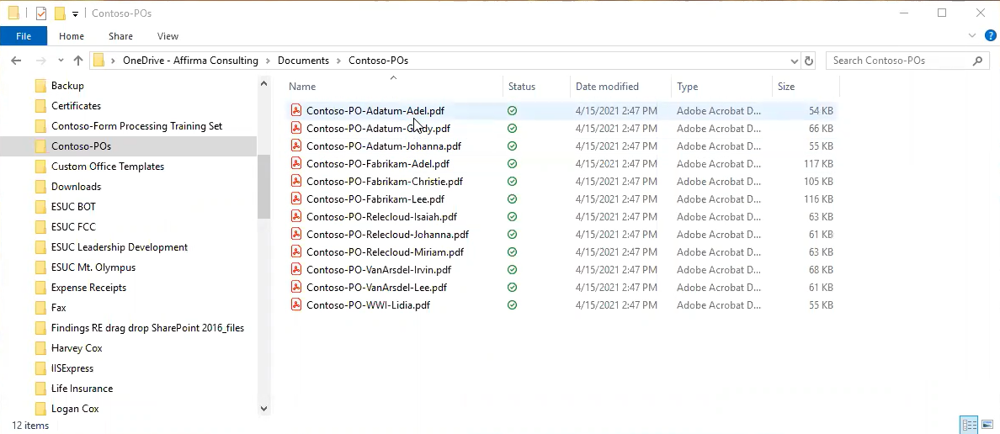
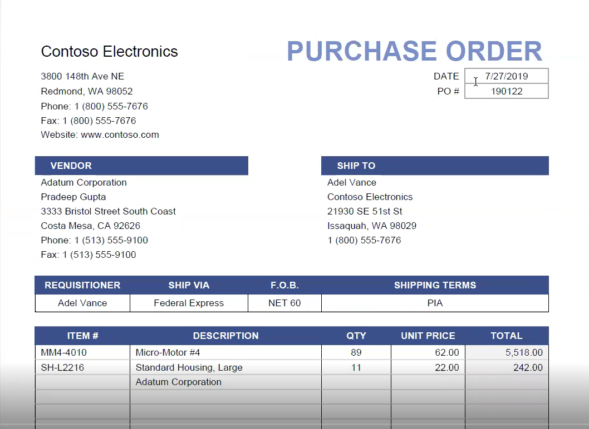

Contoso Electronics has a library of purchase order forms. To find a single purchase order, a user must open and browse each file to find the one they need.

If you open one of the files, you see that these are structured documents. Information like names and addresses all have assigned places. You have boxes for dates and unique identifiers like purchase order number.  

Opening another purchase order will bring up different data, but the structure of that data remains the same. While someone created a file naming convention that includes the name of the supplier in the file name, you cannot see the purchase order number without opening each document.

Suppose you go to accounting and ask questions such as: which vendor are we ordering the most material from? Where are we spending the most money with vendors? On what products? Without opening every file and transcribing that information into a spreadsheet, accounting can’t provide that information. Fortunately, SharePoint Syntex form processing can extract that data for you.
