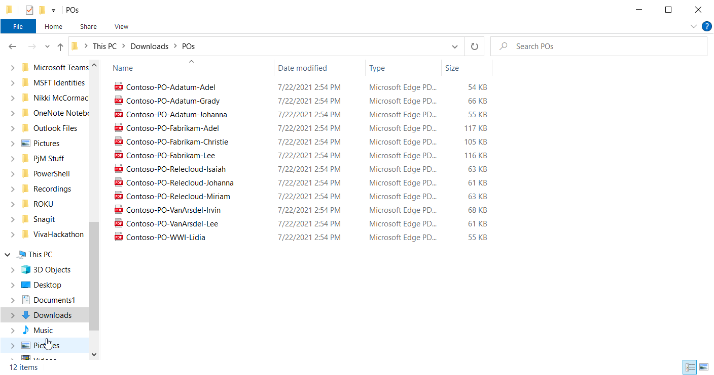
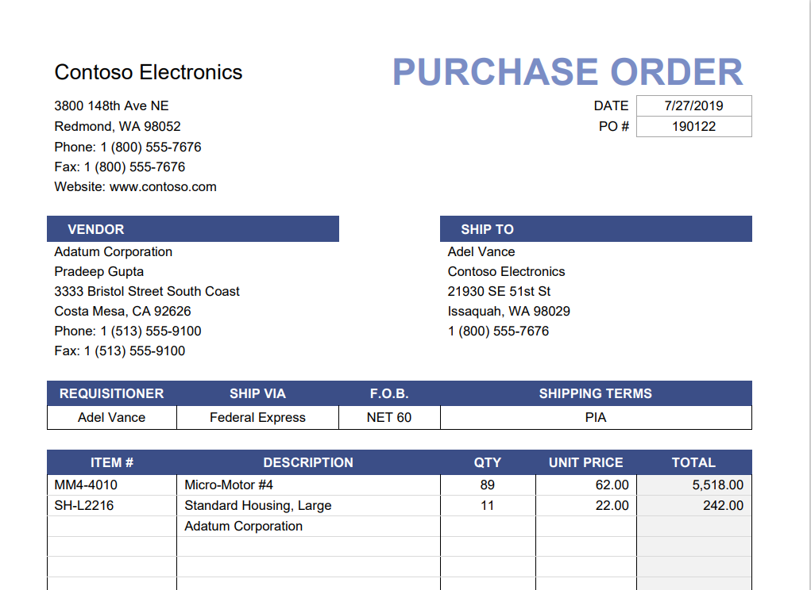

Contoso Electronics has a library of PO forms. To find a single PO, a user must browse for and open each file to find the one they need.

If you open one of the files, you see that it is a structured document. Information like names and addresses all have assigned places and include boxes for dates and unique identifiers like PO number.  

Opening another PO will bring up different data, but the structure of that data remains the same. In the Contoso POs, someone created a file naming convention that includes the name of the supplier in the file name, however, you cannot see the PO number without opening each document individually.

Suppose you go to Accounting and ask questions such as: which vendor are we ordering the most material from? Where are we spending the most money with vendors? On what products? Without opening every file and transcribing that information into a spreadsheet, accounting can't provide that information. Fortunately, SharePoint Syntex form processing can extract that data for you.
