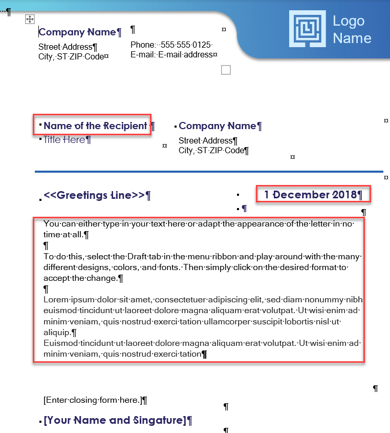
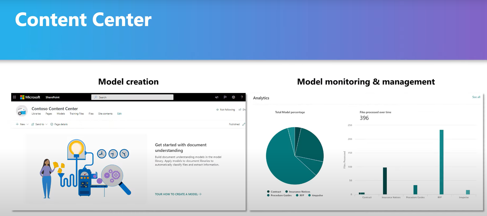

SharePoint Syntex is made up of two main features that make it a service for content understanding, processing, and compliance:

- Document understanding models  
- Form processing models

Contoso Electronics needs a clear understanding of documents such as sales letters. To process these kinds of documents and extract knowledge from them, you'll use the SharePoint content center to build document understanding models. Document understanding models include features such as retention labels, classifiers, and extractors you'll use to organize your document libraries.

Here, you'll learn about the parts of document understanding models and how they work together.

## What's a document understanding model?

A document understanding model uses AI to _automatically_ classify documents within a SharePoint document library and, if you choose, to extract specific information from these documents. Document understanding models are created in a content center and classify and extract information from _unstructured_ documents.

For your organization, unstructured documents may include product testing reports, project documents, or any text-based content that isn't structured like a form.

### What's a content center?

A content center is a special SharePoint site that enables you to create, train, and manage models. You can also view and track which models are applied to which document libraries.

A default content center is created during the SharePoint admin setup process, but you can create more content centers if it makes sense for your organization. The departments in your organization use different kinds of documents and need different models. For example, the Human Resources department and Sales departments use different kinds of documents and have different privacy and security compliance requirements. As a result, you may want to create different content centers to house each of their models.

Content centers offer you control and clear insight into your content. Your content centers help ensure proper governance throughout your data by helping you establish the processes that adhere to the compliance and security standards in your business.

### What's a classifier?

A classifier is a type of document understanding model that identifies the document _type_ and then classifies it accordingly.

At your organization, you'll probably need several classifier models. You could create a classifier model that identifies government letters and one specifically for sales letters.

### What's an extractor?

An extractor is _part_ of a document understanding model that pulls the information from your documents. You can create an extractor before or after you've created your document understanding model.

For example, imagine you've created a document understanding model that classifies all of your sales letters. Later you realize that it would be helpful to see when a letter's date, allowing you to archive some letters and more quickly address others. You can create an extractor for _Date Sent_ so the model can analyze the documents for the "date sent" field that you identify, then placing this value into a column for each of your documents in the SharePoint document library.

### What's an explanation?

An explanation is _part_ of your classifier model or extractor. An explanation describes what will be either classified or extracted.

Explanations types include:

- Phrase list – Words, phrases, numbers, or patterns that are part of the document type
  - Example – When processing sales contracts, this could be a text string such as _Requester Company Type_, which would enable you to easily pull and analyze the industries your company is successfully selling.
- Proximity – How close one phrase is to another
  - Example – If _Requester Company Type_ and _Date Sent_ are always within a certain distance from each other, then this can be defined by a proximity explanation.

### What's a sensitivity label?

Sensitivity labels let you apply encryption, sharing, and Conditional Access policies to the documents that your models identify. For example, you want your model to not only identify financial documents that contain bank account numbers or credit card numbers that are uploaded to your document library, but also to apply an _Encryption_ sensitivity label to them to restrict who can access that content. SharePoint Syntex models honor the label order rules and do not overwrite an existing label that was manually applied by a user to the file.

> [!NOTE]
> At this time, sensitivity labels are available only for document understanding models. Support for sensitivity labels for form processing will be available shortly.

### What are retention labels?

Retention labels give you the option to apply retention settings to your documents. Retention settings are policies defining how documents are kept or deleted. Retention labels enforce _who_ may delete documents and _when_ they may delete them. They are created in the Microsoft 365 compliance center but will appear as part of the compliance section of your model once they're created in the compliance center.

Retention labels can be helpful when dealing with any sensitive information within your SharePoint document library that should be retained for records purposes. For instance, at Contoso Electronics, there may be letters received from the government regarding regulatory standards and compliance requirements. A retention label titled _Legal_ could be added to these documents to ensure any document with this label is never deleted and is retained in your library forever. That way, if a team member attempts to delete the labeled document at some point, they won't be able to.

## How do the parts of the document understanding model work together?

When creating a document understanding model, it helps to understand how each of the parts flow into one another and inform each other.

- **Content center** – This is where you'll begin, where you'll create your model. You can either use a default content center or create a new content model, based on the needs of your organization.
- **Classifier** – This is the document understanding model type you'll create within a content center.
- **Extractor** – Creating an extractor is not mandatory. It can be created before or after you build your document understanding model. If you already know the information that you want to extract, create the extractor beforehand, or, if you don't, wait until you have a better understanding of your model.
- **Explanation** – Explanations are part of your classifier model and must be included so that the model knows exactly what it's looking for and how it's classifying the documents.
- **Sensitivity label** - Sensitivity labels can be used to apply encryption, sharing, and Conditional Access policies to documents.
- **Retention label** – This is optional but can be applied to any document understanding model. It can even be added to a document library that has already had the document understanding model applied.
