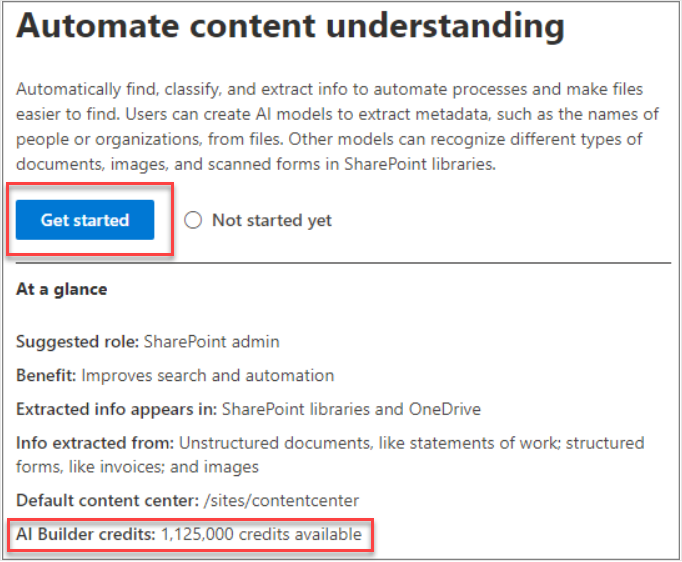
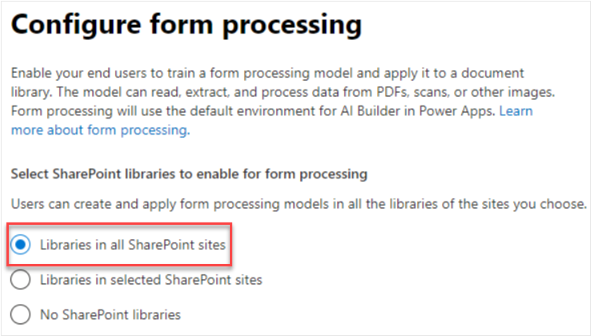
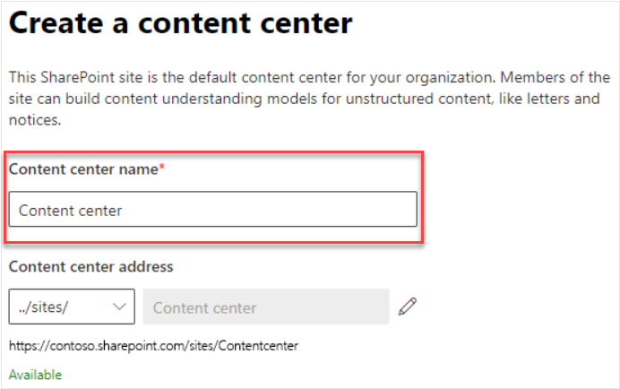
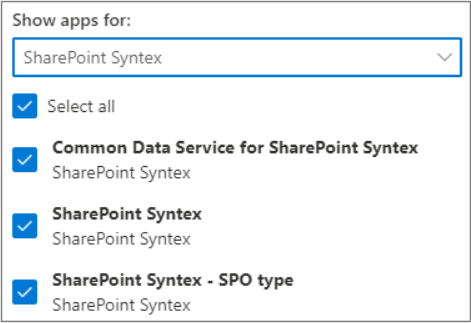

Contoso has decided to set up and activate SharePoint Syntex for the Human Resources department, which has several large libraries of documents and forms that have become harder and harder to locate. You begin setting up SharePoint Syntex by navigating to Contoso Electronics' Microsoft 365 admin center and following the steps listed below:

1. Select **Setup**.
1. Navigate to the **Files and content** section.  
1. Select **Automate content and understanding**.
1. Select **Get started**.

> [!NOTE]
> Available AI Builder credits, if you have them, are listed under **At a glance** in the Automate content understanding section.

## Configure form processing

- On the **Configure form processing** page, you choose whether the users in Human Resources can create form processing models in their SharePoint document libraries.  
  - Enabling this feature puts a menu option on the document library ribbon called **Create a form processing model**. It must be enabled for _each_ SharePoint document library where Contoso Electronics' Human Resources staff want to create form processing models.
  - For **Which SharePoint libraries should show option to create a form processing model**, you have the following options:
    - **Libraries in all SharePoint sites** – this option makes form processing available in all SharePoint libraries.
    - **Libraries in selected SharePoint sites** – this option allows you to select which sites you want to use to create forms processing models. Accommodates up to 50 sites
    - **No SharePoint libraries** – used if you prefer not to create form processing models right away. This setting can be changes after setup is complete.

> [!NOTE]
> Removing a site after it has been included does not affect existing models applied to the libraries in that site or the ability to apply document understanding models to a library.

### Power Platform

If you have more than one Power Platform environment setup, you can pick which one you want to use for form processing. _This option does not appear if you have a single environment configured._

For **Power Platform**, you can select:

- **Use the default environment**.
- **Use a custom environment** to use a custom environment.

    

- Select **Next**.

## Create the content center

In this step, the _default_ content center is created. A content center is the model creation interface. It also contains information about which document libraries have published models applied to them.

- In the **Create a content center** page, you create a SharePoint content center site where users can create and manage document understanding models.
  - For **Site name**, type in the name of your _default_ content center.
  - The **Site address** shows the URL for the site, based on what was selected for the site name.
  - To change the name, select **Edit**.

    

- Select **Next**.

> [!Important]
> A SharePoint admin can choose to create additional centers as needed. While a single content center may be fine for environments for which you want a roll-up of all model activity, you may want to have additional centers for multiple departments within your organization, which may have different needs and permission requirements for their models.

## Review and finish

1. On the **Review and finish** page, look over the selected settings.
1. Make any necessary changes.
1. Select **Activate**.
1. Select **Done** on the confirmation page.
1. The form returns to the **Automate content understanding** page.
1. Select **Manage** to make configuration changes if necessary.

## Assign licenses

Finally, you will assign licenses to everyone who will use any SharePoint Syntex features.

To assign licenses, return to the Microsoft 365 admin center.

1. Under **Users**, select **Active users**.
1. Choose the users to license.
1. Select **Manage product licenses**.
1. Choose **Apps** from the drop-down menu.
1. Select **Show apps for SharePoint Syntex**.
1. Under **Apps**, select _all three_ license types: **Common Data Service for SharePoint Syntex**, **SharePoint Syntex**, and **SharePoint Syntex - SPO type**.

    

1. Select **Save changes**.

You have successfully set up and activated your first SharePoint Syntex environment. To create a content center dedicated to the Human Resources department, or when Contoso decides to roll out SharePoint Syntex to other departments, you'll need return to the SharePoint admin center to add more sites:

1. Navigate to the **Active sites** page
1. Select **Create**
1. Select **Other options**
1. Create a new content center following the same steps as the default content center.

 

> [!VIDEO https://www.microsoft.com/videoplayer/embed/RE4CPSF]

## Learn more

- [Create a content center](/microsoft-365/contentunderstanding/create-a-content-center)
