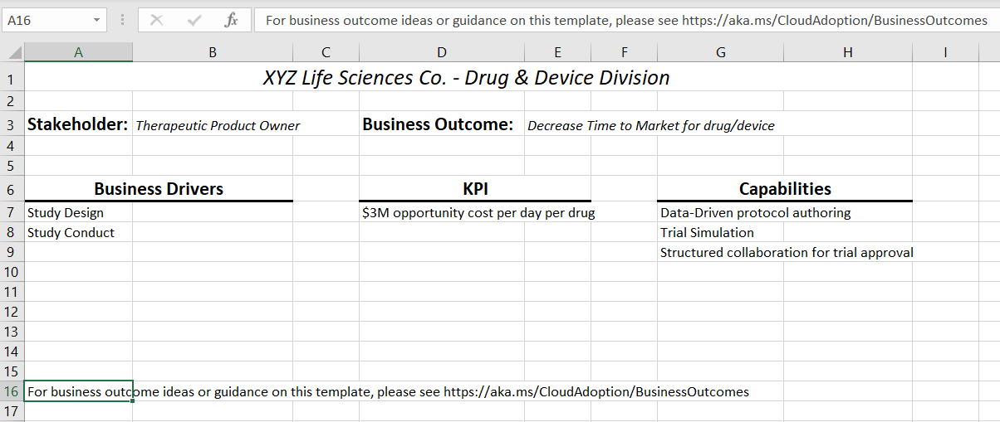

You've received the green light from your stakeholders for a phased rollout of SharePoint Syntex, starting with the struggling Sales team. Now the project team needs to nominate personnel for SharePoint Syntex roles. Each of those people will need to be brought into the larger project team as stakeholders. Along with your other stakeholders, you identify the following individuals:

- Since the knowledge admin creates content centers and manages security and access privileges, your project team identifies someone from IT to take on the role.
- The Sales manager identifies someone in their department for the content manager/model owner role.
- An IT admin takes on the role of Power Platform admin. This person will coordinate applying AI builder to Human Resource's libraries.

With stakeholders in place and roles defined, you can equip your executive team and champions with business case presentations. They'll drive your organization's understanding of the fiscal and agility outcomes that will result from implementing SharePoint Syntex.

## Business outcomes

### Fiscal outcomes

Anticipating the fiscal outcomes of adopting SharePoint Syntex is necessary, as spending and revenue is often top of mind for key stakeholders.

One of the primary ways SharePoint Syntex delivers ROI is through time saved and increased productivity. SharePoint Syntex provides more efficient and clear understanding of your documents, reducing the time spent on making sense of content, giving overloaded team members time back in their day for more essential tasks.

### Agility outcomes

Agility outcomes focus on increasing how quickly your organization can adapt to an ever-changing market. Your business needs to be able to keep up with the innovation of your industry, including updating and creating new products and processes that meet market demand. Time-to-market considers how quickly your internal teams can produce solutions and services that are in demand.

SharePoint Syntex supports agility. It quickly and efficiently produces document understanding and form processing models that your organization needs to understand content quickly to apply what you have learned to potential products, new processes, and the overall growth of your business.

### Outcome template

An outcomes template can help you define what your company needs to achieve your business outcomes. The template is broken into six parts:

- **Stakeholder**: The party, or parties, who will be the most invested or will benefit the most in a particular business outcome and will need to support its development.
  - _Example_: Contoso Electronics executives, managers, and IT teams.
- **Business unit**: The department of your organization that is directly impacted by this outcome.
  - _Example_: Contoso Electronics' Sales team.
- **Business outcome**: The outcome itself, or otherwise, the specific measurement or result that you are trying to produce.
  - _Example_: ROI, time back, and process management.
- **Business drivers**: The challenges that your organization is currently facing and the opportunities of this particular outcome.
  - _Example_: Time spent on processes instead of selling.
- **KPIs**: The key numbers that will help define how the change is measured
  - _Example_: Productivity numbers, such as hours spent working, employee ratings, etc.
- **Technical capability**: The technical skills and resources necessary to make your business outcome happen, such as solutions, services, applications, etc.
  - _Example_: SharePoint Syntex responsibilities and roles

## Executive buy-in

### Business case deck

An on-hand, easily accessible PowerPoint deck can be the easiest resource to provide executives with the information they need to help employees align on strategy. This deck should offer an overview of the initiative so that key executives can become convinced of and invested in the overall strategy. By understanding the strategy, leaders can more easily communicate it to the rest of the company.

Your deck can include:

- Overall goal
- Specific and measurable goals
- How goal aligns with larger company goals
- Key stakeholders
- Roles and responsibilities
- KPIs for measuring success
- Fiscal outcomes
- Agility outcomes
- Proposed rollout timeline

For Contoso Electronics, you likely created a PowerPoint deck when you drove the proposal for adopting SharePoint Syntex.

### Company readiness

When getting executive buy-in and aligning on strategy, it is important to also understand and communicate company readiness. Adoption of a new product or service will involve an onboarding process, as users become familiar with the solution and what it can do for them.

Evaluating company readiness can involve asking questions such as:

- What training is required to onboard users? How long will this take?
- What tools and resources are available for training, such as videos and courses?
- What solutions do we already have in place that may be replaced by this new solution?
- Which stakeholders will be the primary points of contact for questions?

Finally, in collaboration with the project team, you'll need to develop a strategy for rolling out SharePoint Syntex and a strategy for applying document understanding and form processing. Then align your Sales team on those strategies for phase 1.
