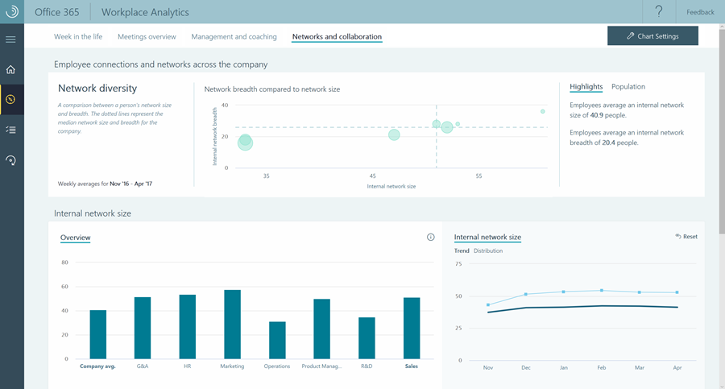

Analytics can provide insights into the working habits of individuals and organizations that can help you improve business processes and decision making. Microsoft 365 includes powerful data, analytics, and AI capabilities to help you:

- Focus on what matters to you
- Create healthy work habits and goals
- Organize time and tasks more effectively

>[!VIDEO https://www.microsoft.com/videoplayer/embed/RWtQu6]

**MyAnalytics** lets users see how they spend their time at work. MyAnalytics helps them see how to make their workday more efficient by looking at data about emails, meetings, and Teams calls and chats and on how they use Office 365. MyAnalytics is included in the Microsoft 365 E5 subscriptions. 

>[!NOTE]
> MyAnalytics doesn't use agents or tracking software, and it doesn't use data from any other activities on your computer, such as applications or websites viewed. 

**Workplace Analytics** lets administrators identify work practices across the entire organization. It helps drive an understanding of how your organization spends its time and how groups work together. 

