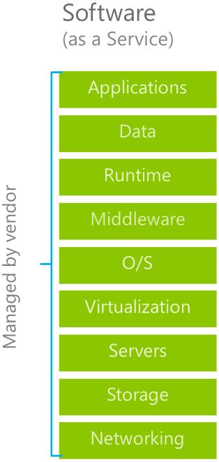

Software as a service, or **SaaS**, is software that’s centrally hosted and managed by a cloud service provider for its customers. The software architecture typically uses one version of the application for all customers and is licensed through a monthly or annual subscription. Office 365, Skype, and Dynamics CRM Online are examples of SaaS software. 

Organizations have no upfront costs. Instead, they pay a per-user subscription,. Users just use the application software. Organizations are not responsible for any maintenance or management of that software - that’s the cloud service provider’s job.