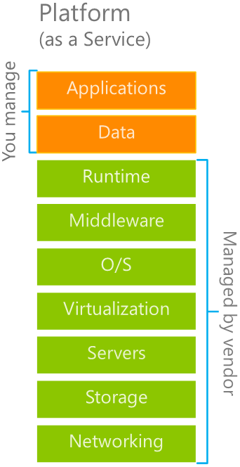

Platform as a service, or **PaaS**, provides an environment for building, testing, and deploying software applications. The goal of PaaS is to help you create an application as quickly as possible without having to worry about managing the underlying infrastructure. For example, when deploying a web application using PaaS, you don't have to install an operating system, web server, or even system updates.

PaaS is a complete development and deployment environment in the cloud, with resources that enable organizations to deliver everything from simple cloud-based apps to sophisticated cloud-enabled enterprise applications. You purchase resources from a cloud service provider on a pay-as-you-go basis and access them over a secure Internet connection.

PaaS is commonly used in these sce**narios:

- **Development framework**. PaaS provides a framework that developers can build on to develop or customize cloud-based applications. PaaS lets developers create applications using built-in software components. Cloud features such as scalability, high-availability, and multi-tenant capability are included, reducing the amount of coding that developers must do.
- **Analytics or organization intelligence**. Tools provided as a service with PaaS allow organizations to analyze and mine their data. You can find insights and patterns and predict outcomes to improve organization decisions such as forecasting, product design, and investment returns.

There are no upfront costs in PaaS – you pay only for what you consume. You’re responsible for developing your own applications, not for managing the server or infrastructure on which they run. This allows the developer to focus on their application or workload. The cloud provider is responsible for operating system management and network and service configuration. They provide a complete managed platform on which to develop and run applications.
