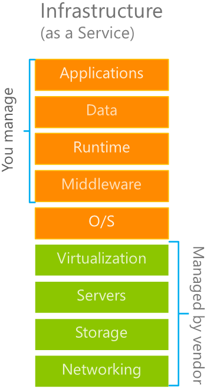

Infrastructure as a service, or **IaaS**, is the most flexible category of cloud services. It gives you complete control over the hardware that runs your application, which includes IT infrastructure servers in the form of virtual machines (VMs), storage, networks, and operating systems. Instead of buying hardware, you rent it with IaaS. It's an instant computing infrastructure, provisioned and managed 
over the Internet.

When using IaaS, ensuring that a service is up and running is a shared responsibility. The cloud service provider is responsible for ensuring the cloud infrastructure is functioning correctly. The cloud customer is responsible for ensuring the software they are running on the server is configured correctly, is up-to-date, and is available to their customers. 

IaaS is commonly used in these scenarios:

- **Migrating workloads**. Typically, IaaS facilities are managed in a similar way as on-premises infrastructure and provide a more efficient migration path for moving existing applications and its data to the cloud.
- **Test and development**. Teams in your organization can quickly set up and dismantle test and development environments, bringing new applications to market faster. IaaS makes scaling development environments up and down fast and economical.
- **Website hosting**. Running websites using IaaS can be less expensive than traditional web hosting with servers running at the edge of your network.
- **Storage, backup, and recovery**. Organizations avoid the expense and complexity of storage management, which typically requires skilled staff to manage data and meet legal and compliance requirements. IaaS is useful for managing steadily growing storage needs and unpredictable demands. 

There are no up-front costs. Organizations pay only for what they consume. They are responsible for the purchase, installation, configuration, and management of their own middleware and applications. The cloud provider is responsible for ensuring that the underlying cloud infrastructure that hosts the customer's virtual machines, with its software and data, is always available. In some cases, such as Azure, the cloud provider includes and supports updates to the underlying operating system, such as Windows Server or Linux.

