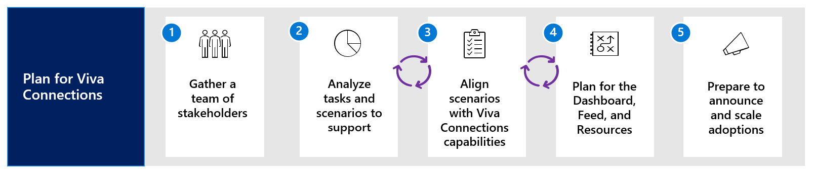

In the upcoming units, you'll learn about best practices, considerations, and technical details that will help you in the planning phase. The planning phase includes the following steps:

{width="6.5in" height="1.3947911198600176in"}

**Step 1**: Gather a team of stakeholders and meet technical
requirements

**Step 2**: Analyze tasks and key scenarios to support

**Step 3**: Align key scenarios to design plans for the Dashboard, Feed,
and Resources

**Step 4**: Plan for the Dashboard, Feed, and Resources

**Step 5**: Consider how to announce, launch, and scale

:::row:::
   :::column span="":::
      :::image type="icon" source="../media/lamna-logo-white-bg-200x200.jpg"  :::
   :::column-end:::
   :::column span="2":::
      In this module, let\'s imagine that you're the Internal Communications
Manager of Lamna Healthcare, a large chain of regional hospitals. The organization needs to communicate new policies and procedures constantly. Meanwhile, it needs to provide easy access to tools that allow employees to see their shifts and manage their time and absence, connect them with shuttles and café menus, and provide quick links to resources and forms. After carefully researching and examining existing platforms, executive leadership has decided that Viva Connections is an ideal solution since they already subscribe to Microsoft 365. 
   :::column-end:::
:::row-end:::

Leadership has asked you to lead the deployment of Viva Connections
along with a team of stakeholders that represent different roles. The
company operates with support from a variety of employees and intends to
use Viva Connections to support the following roles:

- Physicians and surgeons
- Medical records and information technicians
- Nurse practitioners
- IT professionals
- Service managers
- Human resources
- Office administrators
- Custodial staff                  |

Your first task is to build a team of stakeholders that represent these
groups. Stakeholders will help ensure the needs of everyone are
represented and will help prioritize which scenarios should be supported
by Viva Connections.