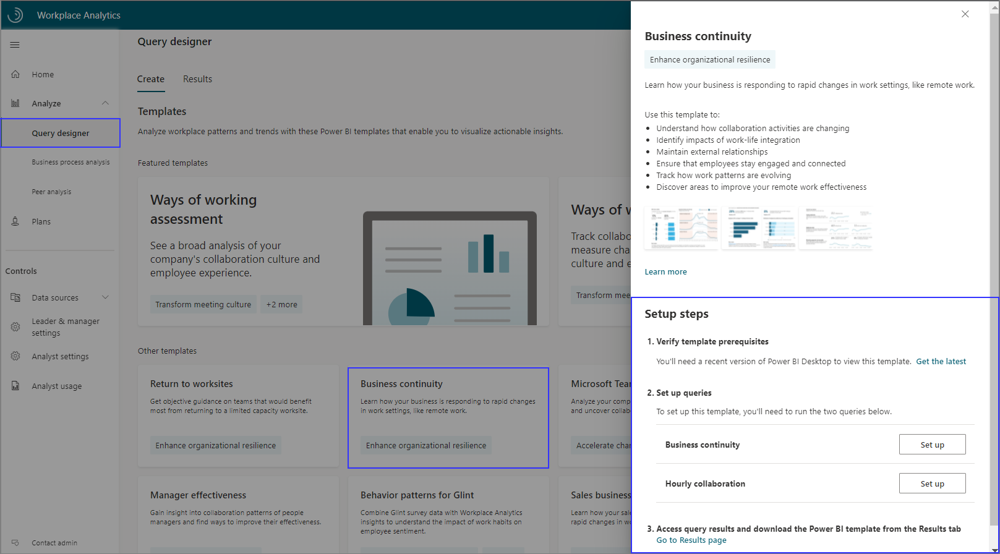
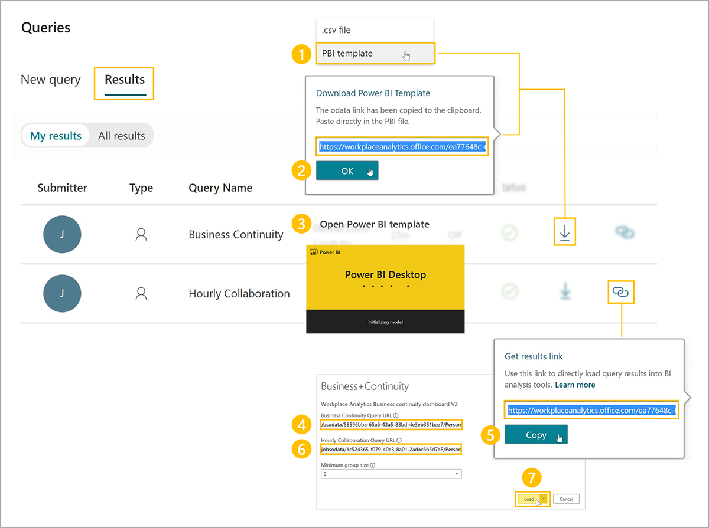
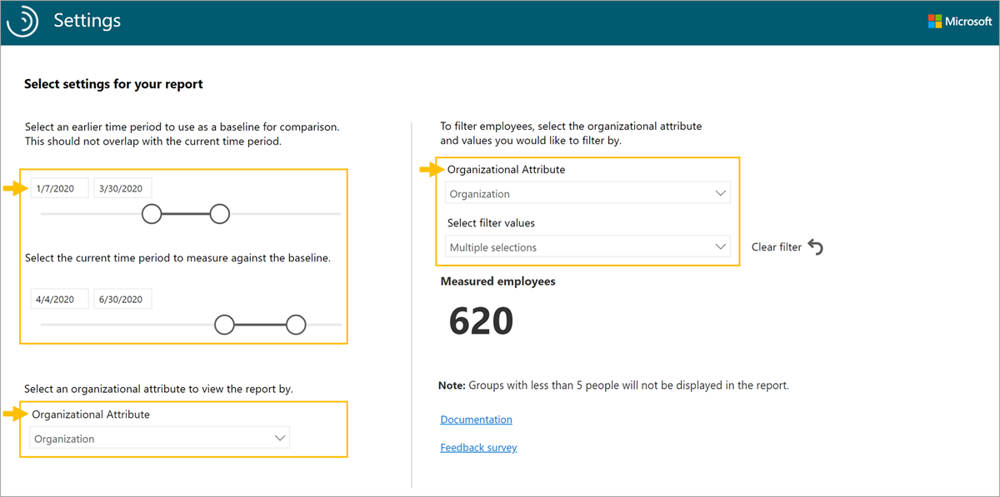

The Business continuity dashboard uses a prebuilt Power BI template populated by output (OData) from the Business continuity and Hourly collaboration queries through the Query designer in Workplace Analytics.

To set up the Business continuity dashboard:

1. Complete the template setup through the Query designer.
2. Download the template and load the query output.
3. Select the dashboard settings.

After the data is loaded the dashboard reports will generate automatically, resulting in multiple pages of Workplace Analytics insights, called reports. These reports can empower your organization to better support employees in new ways of working.

**1. Complete the template setup through the Query designer**. In the Query designer, select the Business continuity template and follow the on-screen instructions.

>[!IMPORTANT]
>Be sure to download and install the most recent version of Power BI to avoid issues setting up and loading data for the dashboard.

For each query, give it a descriptive name and select your date range and exclusions. To create a report that updates weekly, select **Auto-refresh** for each query.

Tips when running the queries:

* For best results, select **Last 1 year** so that you include the time period before and after any shifts in work patterns
* In **Select metrics**, keep all preselected metrics (don't delete any). The dashboard uses them to create the charts, graphs, and insights in the report pages.
* In **Select filters**, select **Active only** for **Which measured employees do you want to include**. Optionally, use additional filters to further refine the population for your analysis.
* Under **Organizational data**, leave the default attributes (Organization, LevelDesignation, TimeZone) selected. Optionally, select additional attributes that you'd like to include in the reports.
* Use these same parameters and filters in both the Business continuity and Hourly collaboration queries.

**2. Download the Power BI template and load the query output**. After the queries have finished running, you can access the Business Continuity Power BI template and data through the OData URL in **Query designer** > **Results**.

To load the data into the template:

1. Download the Power BI template from the **Business continuity** query result.
2. When prompted that the OData link was copied, select **OK**.
3. Open the downloaded Power BI template.
4. In Power BI, paste the OData link in **Business Continuity Query URL**.
5. For the **Hourly collaboration** result in Query designer, copy the OData link.
6. Return to Power BI and paste the OData link in **Hourly Collaboration Query URL**.
7. Select **Load** to load the data.

The dashboard visualizations on each page of the report populate with Workplace Analytics data, starting with the **Settings** page.

**3. Select the dashboard settings**. After you have loaded the data and the report is generated in Power BI, the dashboard opens to the **Settings** page, where you can confirm and change the settings for your analysis.

* Select time periods for comparison. These are the time periods you'll use to compare how workplace behavior has changed. The baseline period contains the collaboration you'll compare the current time period against.
* Select from the list of organizational attributes you chose to include in your query. Default attributes are **Organization**, **LevelDesignation** and **TimeZone**, but the list will include any organizational attributes selected when queries were run.
* To filter the reports further, select any of the available organizational attributes and filter values for the data you would like to include.

After you've selected the settings for the group you'd like to analyze, you can start using the dashboard. The populated Business continuity dashboard includes report pages on changing collaboration, work-life integration, external relationships, engagement and connectivity, evolving work patterns, and areas of improvement.

See the documentation link in [Learn more](#learn-more) for template updates, setup instructions, tips for sharing the dashboard, FAQs, and troubleshooting.

## Learn more

[Business continuity dashboard](/viva/insights/tutorials/power-bi-bc)
