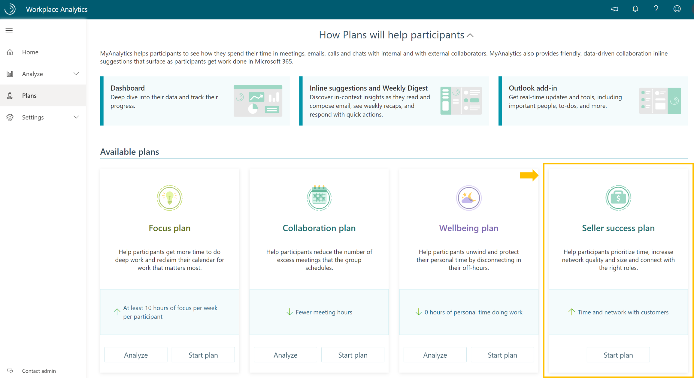
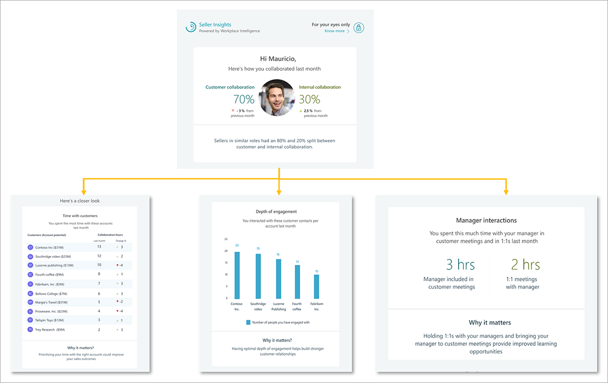
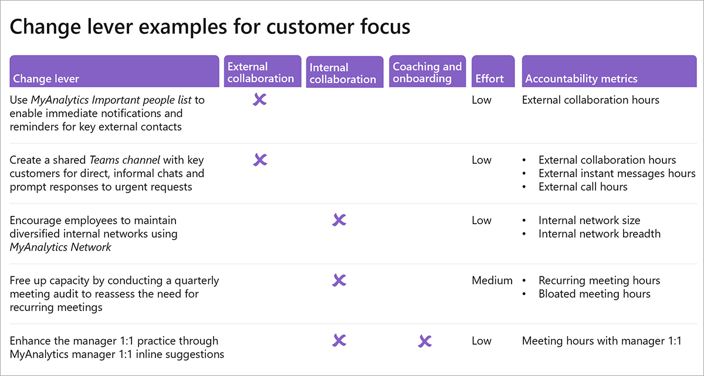
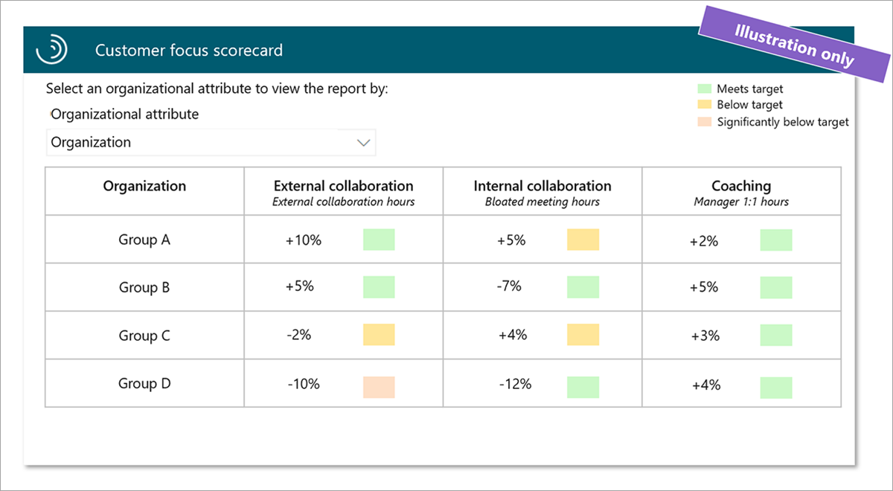

After you've identified opportunities and defined target groups for your customer focus change initiative, you can use the following additional tools to help drive behavioral change with your analysis.

## Enable Microsoft 365 tools

Microsoft 365 tools can assist you in driving change to improve customer focus.

### Activate a Seller success plan and encourage participants to use MyAnalytics

A Seller success plan can help sellers be more successful by showing the time spent with accounts by revenue potential, which contacts are engaged, and the number of interactions with managers in either customer or one-on-one meetings. After the plan is activated, you can track the progress of the participant group on a regular basis.

> [!NOTE]
> The Seller success plan requires CRM data.

The Seller success plan links to MyAnalytics and provides individual insights through email digests and in the recipient's MyAnalytics dashboard. Sellers receive a monthly email with insights around their collaboration habits, time spent with their most important accounts, the depth of engagement with key accounts, and a snapshot of their internal network.

Sellers can access their MyAnalytics dashboard by visiting myanalytics.microsoft.com.

## Design change tactics

Beyond the use of Microsoft 365 tools, you can use social norms and ways of working in your organization to design change tactics for customer focus. The design process can occur in many ways that start with identifying causes of and barriers to change. Examples of barriers to customer focus can include a lack of manager time for coaching or difficulty tracking external contacts. After you've identified causes and barriers to customer focus, you can design custom change tactics.

### Create a customer focus change tactics worksheet

A custom change tactics worksheet is an effective tool to drive change. You can measure progress with change levers and trackable metrics, which are important success factors in change management.

To create an effective customer focus change tactics worksheet, determine the following:

- **Change levers** - Add next step actions you can take to improve customer focus in your organization.
- **Analysis category** - Identify the analysis category the change lever applies to, that is, external collaboration, internal collaboration, or coaching and onboarding.
- **Level of effort** - Determine the level of effort involved in activating each change lever.
- **Accountability metrics** - Identify the customer focus related metrics you'll use to track and evaluate change.

Below is an example of a change tactics worksheet created for customer focus.

When creating your change tactics worksheet, it helps to follow best practices and strategies for specific business outcomes. For information about Workplace Analytics best practices, see the link in **Learn more**.

## Measure and track with dashboards

Measuring change is key to success with your customer focus initiative. Dashboards that incorporate metrics related to customer focus are a powerful tool to track progress. You can incorporate customer focus related metrics into a dashboard on an existing platform or use and customize Workplace Analytics Power BI templates to track customer focus related metrics.

### Create a tracking dashboard

One way to measure and track progress is to create a tracking board with key metrics that measure the effectiveness of your customer focus change initiative.

The following is an example of a tracking board created in Power BI. For each group and category, the dashboard indicates if when the group meets, is below, or is significantly below the target for external collaboration hours, bloated meeting hours, and manager one-on-one hours.

### Leverage Power BI templates

Analysts can also use and customize Workplace Analytics Power BI templates, and track the meeting culture and manager effectiveness metrics in the Ways of working tracker.

See the link in **Learn more** for more information about the Ways of working tracker.

## Learn more

- [MyAnalytics](/workplace-analytics/myanalytics/mya-landing-page?azure-portal=true)
- [Seller success plan](/workplace-analytics/tutorials/seller-success?azure-portal=true)
- [Change tactics best practices](/workplace-analytics/tutorials/gm-best-practices?azure-portal=true)
- [MyAnalytics Important people list](/workplace-analytics/myanalytics/use/use-the-insights#add-important-people?azure-portal=true)
- [Teams channels](/microsoftteams/teams-channels-overview?azure-portal=true)
- [MyAnalytics Network](/workplace-analytics/myanalytics/use/network?azure-portal=true)
- [Power BI templates in Workplace Analytics](/workplace-analytics/tutorials/power-bi-intro?azure-portal=true)
- [Ways of working tracker](/workplace-analytics/tutorials/power-bi-intro?azure-portal=true)
