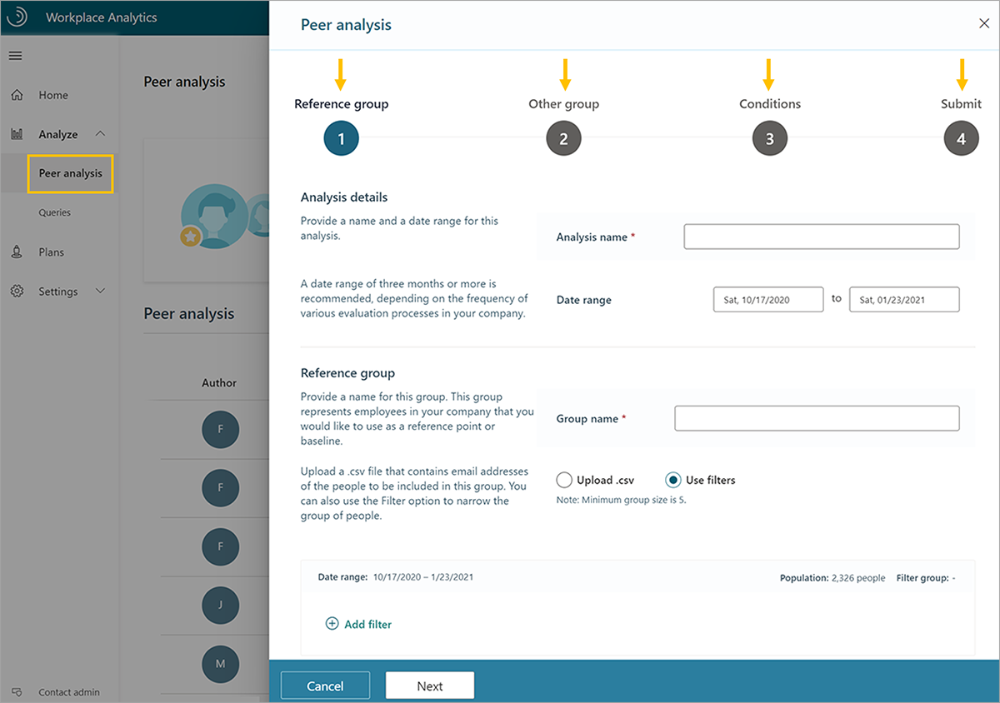
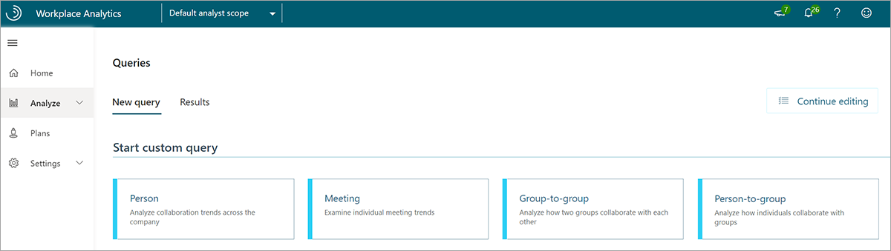
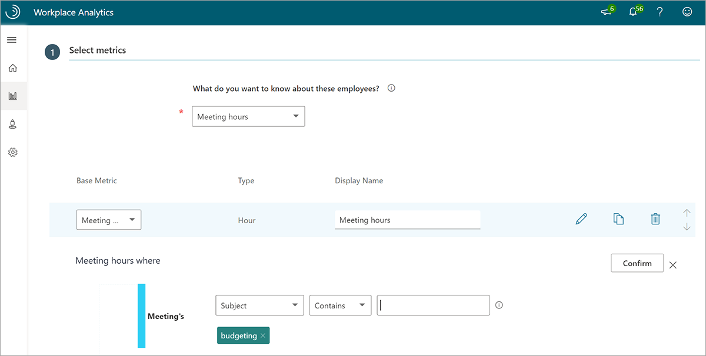
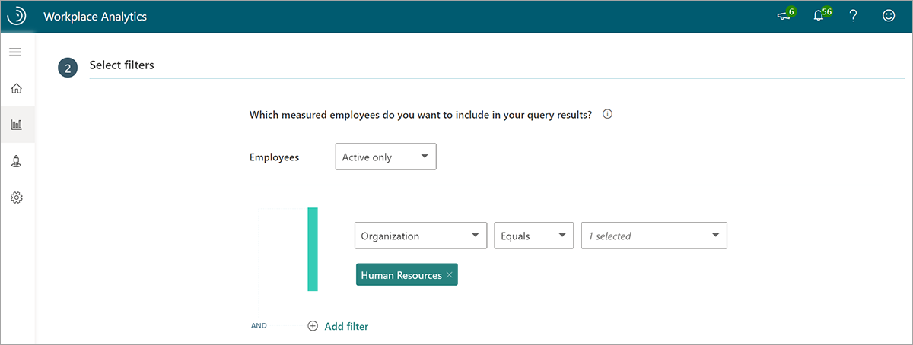
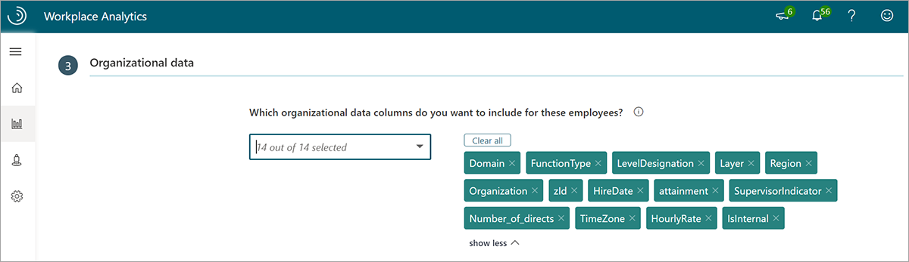
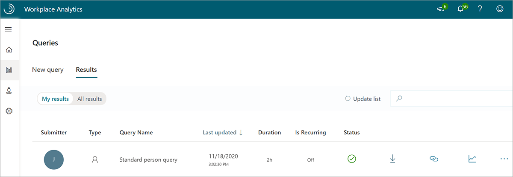
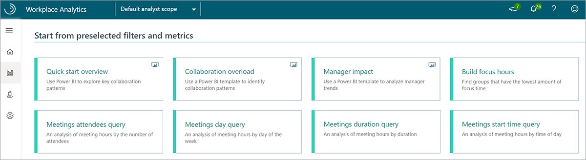
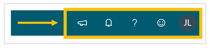

You can customize analysis a multiple of ways with Workplace Analytics.

## Workplace Analytics Analyze page

In addition to the business outcomes and associated insights on the Home page, there are two main ways of analyzing data in Workplace Analytics: Peer analysis and Queries.

### Analyze > Peer analysis

The **Peer analysis** feature in Workplace Analytics provides a way to compare the collaboration behaviors of two different groups. This can help you understand how two teams in the same function work differently, or how the work-life activities differ across the organization.

There are four steps to creating peer analysis. To begin, go to **Analyze > Peer analysis** and select **New analysis**.

1. Choose your **Reference group**. Provide a name and desired date range, name the reference group, and select employees to include by uploading a .csv file with email addresses or applying desired filters using attributes from the organizational data.
1. Choose your **Other group**. This is your comparison group. Name this group and select employees to include by uploading a .csv file with email addresses or applying desired filters using attributes from the organizational data.
1. Apply **Conditions** (optional). Use filters to specify the attributes that should be similar when comparing groups. For example, to compare managers in the "Reference group" to managers in the "Other group," add a conditional filter to include only managers in the output.
1. **Submit**. You can access your results in the **Peer analysis** page. Select the **View** (eye) icon to see the output.

**Peer analysis** output includes the date range, a **Highlights** section with differences in the three most variant metrics between groups, and charts that compare raw averages for multiple metrics.

### Peer analysis example scenario

You would like to understand the difference in collaboration patterns between the corporate finance office and regional finance offices at Contoso. In the Peer analysis page, you create a new analysis with corporate finance as the "Reference group", and the regional finance groups as the "Other group," and then select submit to view it.

The results show that corporate finance employees have 22 percent larger internal networks, but their external network connections are 17 percent smaller.

### Analyze > Queries

**Queries** give you access to row-level data and customizable metrics. You can import the row-level data into other analysis tools to create custom analyses, models, and dashboards.

Under **Start custom query** in **Queries**, you'll see a list of query options. The two most common are:

- **Person query**. Extract person metrics for analysis of aggregated **employee** data.
- **Meeting query**. Extract meeting-related metrics for analysis of aggregated **meeting** data.

Queries report the same underlying data, but the type of query determines the structure of the output. For example, each observation in a Person query represents a person, their measured collaboration, and their descriptive attributes. Each observation in a Meeting query represents a meeting, its attributes, and the total collaboration associated with the meeting attendees.

### Query steps

There are multiple steps to run a query.

1. Select the query you'd like to run.
1. In the **Description** field, enter the name of your query.
1. (Optional) Adjust the granularity of the timeframe (day, week, or month) and the date range.
1. (Optional) Select a set of rules excluding irrelevant calendar activity (meeting and attendee exclusions).

After you've made these selections, do the following to further refine the data for analysis.

**Step 1. Select your metrics**. Workplace Analytics metrics vary by query. You can select standard metrics from the list of options, but you can also customize some metrics by using filters. Here's an example of how you can pull meeting hours with the word "budgeting" in the subject line.

**Step 2. Select filters**. With Workplace Analytics queries, you can change the scope of the data you'd like to analyze by limiting it to active employees and applying additional filters using attributes from the organizational data. In this view, we've applied a filter to look at the Human Resources group at Contoso. (Active employees are defined as employees who sent at least one email or Teams chat message in a given week.)

**Step 3. Select organizational data**. You have the option to select which organizational attributes you'd like to include in your output.

**Step 4. Run the query**.

You can access your query results on the **Queries > Results** page. You can choose to view your results or all results in your organization. This page is where you can download the data in a .csv format, copy the OData link to load the data into business intelligence applications, and for some queries, visualize the results directly within Workplace Analytics.

You also have the option of selecting from a list of queries with preselected filters and metrics. They are a great starting point for specific analysis, and give you flexibility to add new metrics and customize them.

 Many of the predefined queries have a Power BI icon in the upper right corner. These include a download option for a Power BI Template. If you run these query options, you can download the template, load your data, and get an automatically generated report.

## Workplace Analytics Plans

You gain a lot of information from the insights, Peer analysis, and Queries about how employees in your organization get work done. With Workplace Analytics Plans, you can transform these insights into actions.

Enrollment in a Plan requires that an employee has access to MyAnalytics. A Plan combines team goal setting and tracking with useful suggestions in MyAnalytics to shift ways of working.

Microsoft currently offers the following plans:

- **Focus plan**. Helps participants get more time to do deep-dive work and reclaim their calendar for work that matters most.
- **Collaboration plan**. Helps participants reduce the number of excessive meetings that the group schedules.
- **Wellbeing plan**. Helps participants unwind and protect their personal time by disconnecting outside of work.
- **Seller success plan**. Helps participants prioritize time, increase network quality and size, and connect with the right roles.

For each plan type, you can select **Analyze** and get answers to questions involving relevant metrics. Then select **Start plan** to create, manage, and track a specifically targeted plan for employees in your organization.

Workplace Analytics Plans help give managers and employees visibility into how they are spending time to increase their focus and improve collaboration and wellbeing.

## Workplace Analytics Settings

Workplace Analytics enables analysts and admins to check the quality of your data sources.

In **Settings > Sources**, you can get a quick view of collaboration data for your measured population over time. You can use this view to identify any dates or date ranges you should include or exclude from your analysis, such as holidays.

You can also assess the quality and completeness (coverage) of the uploaded organizational data (HR attributes) for your measured population as shown here.

Additionally, if your Workplace Analytics administrator has uploaded CRM data, you can confirm the quality of join coverage (the percentage of CRM contact and sales assignment data associated with CRM accounts).

### Sources example scenario

You would like to get a high-level look at some fourth-quarter custom metrics by using a query and know you should probably exclude specific dates that might be outliers.

You open the **Sources** page and look at the collaboration data over time for the measured population. You see two dips in the data, both national holidays. You run a query, and after you have the output, you filter out the holiday dates for your analysis.

## Exclusions

Not all scheduled meetings are business-related. People often have personal appointments and block out time on their calendar. When doing analysis in Workplace Analytics, you might want to exclude excessively long or large meetings, or attendees who haven't responded or have responded as "tentative."

Workplace Analytics has a built-in solution to address these issues called **Exclusions**. Analysts can use meeting or attendee exclusions to create specific rules for which meetings or attendees to include while adding each rule to a dropdown list of rules for specific analyses.

With meeting exclusions, you can:

- Exclude canceled meetings.
- Exclude appointments (blocked time with only one attendee).
- Set thresholds for attendance size and duration of meetings to include.
- Exclude meeting subjects by topic.

Workplace Analytics has a default meeting exclusion rule that excludes meetings with only one attendee, meetings longer than eight hours, meetings with 250 or more participants, and canceled meetings. This rule is used if no other meeting exclusion is selected.

With attendee exclusions, you can:

- Exclude invitees who accepted meeting invitations as Tentative.
- Exclude invitees who did not respond to meeting invitations.

Use meeting or attendee exclusion rules in Workplace Analytics to exclude meetings or attendees you don't want to include in your analysis (or include meetings excluded in the default meeting exclusion rule).

### Exclusions example scenario

You would like to begin an analysis of remote workers. Remote workers at Contoso let their managers know they work from home by creating a one-person meeting titled, Remote Day.

Since the default meeting exclusion rule excludes these meetings, you need to create a new rule. You select **Analysis settings > Meeting exclusions** and create a new meeting exclusion rule to include meetings with only one person.

## Additional resources

You'll find some additional resources in the upper right of each screen.

- Select the **New features** (megaphone) icon to get information on new features in Workplace Analytics.
- Select the **Notifications** (bell) icon for notifications and alerts related to recent activity in Workplace Analytics. This feature shows dates of data refresh, organizational data uploads, newly created exclusions, and query auto-refresh. Notifications alert you when your queries have finished running.
- Select the **Help** (?) icon to find:
  - **Documentation**. Documentation provides extensive information about Workplace Analytics topics.
  - **FAQs**. Find frequently asked questions with the answers you are looking for.
  - **Blog**. The blog post offers Workplace Analytics feature updates and product releases; it updates monthly.
  - **Privacy guide**. The Privacy Guide has in-depth information about data protection, how you can control your data, and who has access to that data.
  - **Privacy policy**. This page features privacy notifications.
  - **Resource playbooks**. Choose from two playbooks on best practices.
- **Feedback**. Use this feature to send Microsoft your comments.
- **User icon**. The User icon features your tenant, partition, and role information. **Sign out** is also located here.

## Learn more

- [Peer analysis overview](/workplace-analytics/use/peer-analysis?azure-portal=true)
- [Queries overview and ways to query data](/workplace-analytics/tutorials/query-basics?azure-portal=true)
- [Workplace Analytics plans](/workplace-analytics/tutorials/solutionsv2-intro?azure-portal=true)
- [Workplace Analytics data sources](/workplace-analytics/use/data-sourcesv2?azure-portal=true)
- [Exclusions](/workplace-analytics/tutorials/exclusions-introduction?azure-portal=true)
