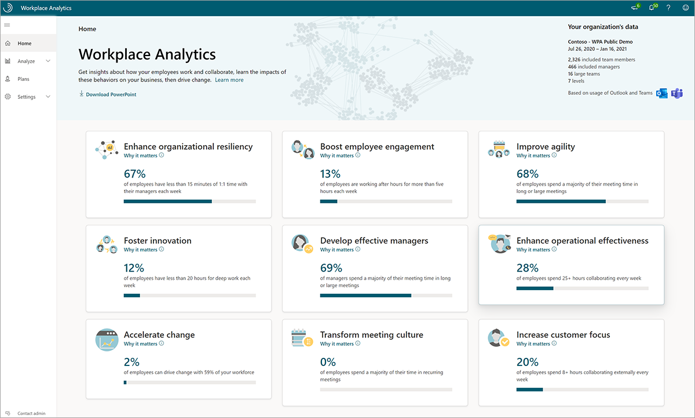
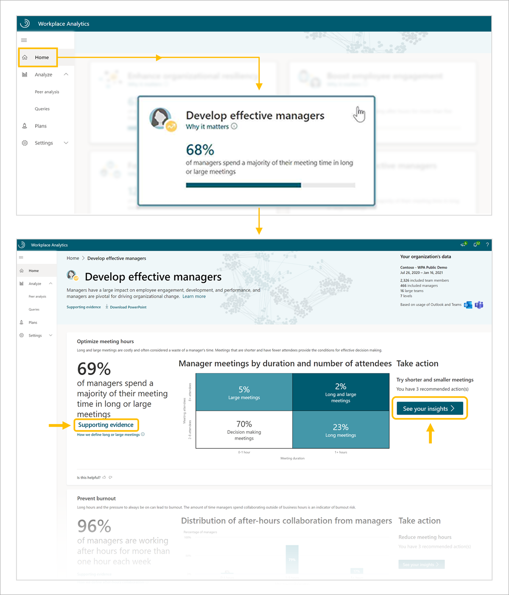
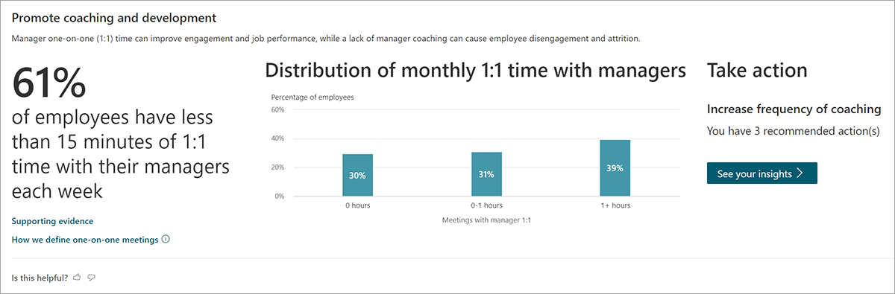
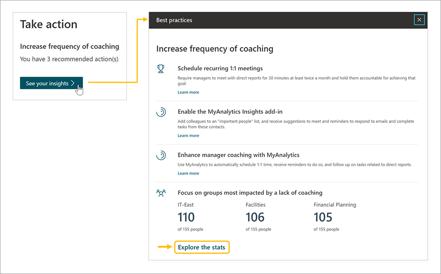
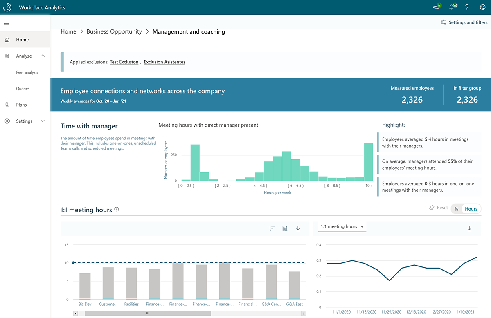
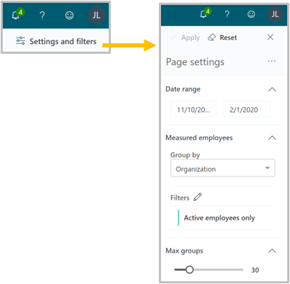
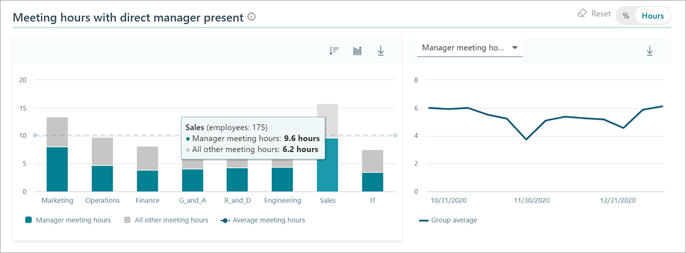

Workplace Analytics provides organizations with high-level insights into how employees spend their time, with recommendations and analysis to empower leaders to drive positive change.

## Workplace Analytics Home page

The Workplace Analytics **Home** page provides a quick look at leadership ready insights related to nine business outcomes. Each outcome provides a high-level look at relevant metrics, with links to supporting evidence and deeper analysis. These insights are useful to quickly identify patterns you want to investigate further.

In the upper right, **Your organization's data** gives you a high-level look at your organization's Workplace Analytics data, including the date range and measured employees included in the analysis. (**Measured employees** are defined as employees with a Workplace Analytics license.)

Scroll down to see the nine themed business outcomes.

> [!NOTE]
> The **Home** page reflects a rolling window of the six most recent months of weekly collaboration data.

The nine available business outcomes are:

- **Enhance organizational resiliency**. Discover ways to prepare your organization to respond to sudden changes, recover from disruption, and prosper.
- **Boost employee engagement**. Identify opportunities to promote job satisfaction and sense of belonging.
- **Improve agility**. Assess metrics related to your organization's ability to quickly adapt.
- **Foster Innovation**. Uncover if employees have enough time for deep work and are effectively sharing information to generate new ideas.
- **Develop effective managers**. Investigate how managers collaborate to improve employee engagement, development, and performance.
- **Enhance operational effectiveness**. Improve collaboration habits to transform organizational productivity.
- **Accelerate change**. Leverage influential groups to drive change in your organization.
- **Transform meeting culture**. Explore and optimize meeting habits to reduce collaboration overload and promote wellbeing.
- **Increase customer focus**. Target behaviors that engage employees and prioritize customer relationships.

Click any of the business outcomes and you'll see each contains high-level analysis for key leading indicators. The following example is a glimpse into the **Develop effective managers** outcome.

For additional resources and analyses, you can explore the following links:

- **Supporting evidence**. Get links to research articles and related information about organizations who have successfully used Workplace Analytics.
- **See your insights**. Get recommendations and deeper analysis to drive positive changes in your organization.

### Home page insights example scenario

You are an HR executive at Contoso Corporation, and have been asked to work with your team to determine if managers are spending enough time developing employees in the organization. Using Workplace Analytics, you navigate to the Home page, select the **Develop effective managers** outcome, and scroll down to the **Promote coaching and development** insight. There, you find that over 60 percent of employees at Contoso get less than 15 minutes of one-on-one time with their manager in a month, indicating a need for more coaching.

In the **Take action** section of the insight, you can select **See your insights** to see impactful next steps you can take to drive change in your organization. For example, in **Develop effective managers > Increase frequency of coaching > See your insights**, you'll see recommendations, such as scheduling recurring one-on-one meetings, and groups that could benefit the most from these recommendations. This example also provides a link to an **Explore the stats** dashboard to investigate further.

> [!NOTE]
> In addition to recommendations in the **Take action** section, you may see links to **Explore the stats** dashboards, additional reports in **Explore in Power BI**, or options to create **Plans** and track success. The combination of links available depends on the chosen insight and user role.

**Explore the stats** dashboards provide a quick way to look at Workplace Analytics metrics summarized by group over time. While the Home page provides high-level insights related to business outcomes, the **Explore the stats** dashboards cover a wider range of metrics. 

> [!NOTE]
> **Explore the stats** dashboards reflect a rolling window of the six most recent months of weekly collaboration data.

Within the Explore the stats dashboards, you have the option to filter the data. In the upper right corner of the browser, you can click **Settings and filters** to open **Page settings**. In Page settings, you can adjust the date range of the data, change how measured employees are grouped, add filters, and choose the maximum number of groups to see in the output.

### Explore the stats example scenario

As an executive on the HR team, you've just received word that according to a recent engagement survey, some employees at Contoso are not feeling empowered in their work. You decide to dive deeper into Workplace Analytics metrics related to manager-employee relationships and investigate opportunities to improve manager effectiveness.

In **Develop effective managers > Promote coaching and development > See your insights**, you select **Explore the stats** to view the **Management and coaching** dashboard. You would like a recent snapshot of the data, so in the upper right corner of the dashboard, you confirm the date range in **Settings and filters** is set to the last three months, group by **Organization**, and click **Apply**. In the **Meeting hours with direct manager present** bar chart, you notice that over half of the Sales group's meeting time is spent with their manager present, indicating an opportunity to simultaneously empower employees through delegation and free up manager time for strategic tasks.

## Learn more

- [Home page overview](/workplace-analytics/use/insights?azure-portal=true)
