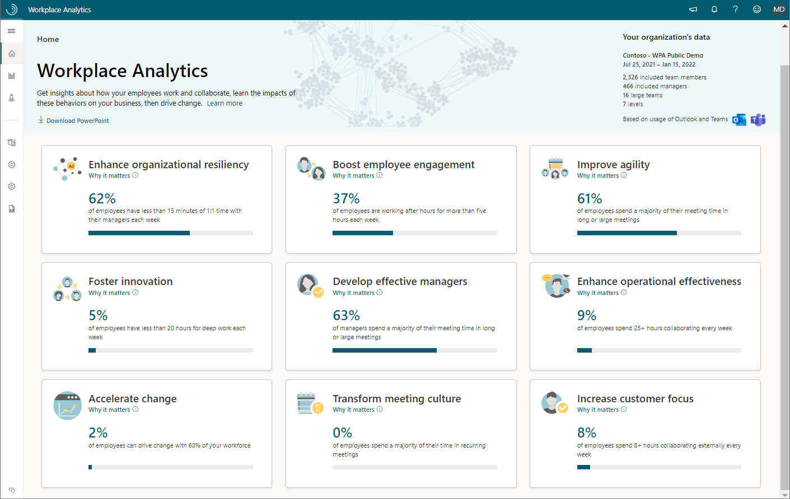
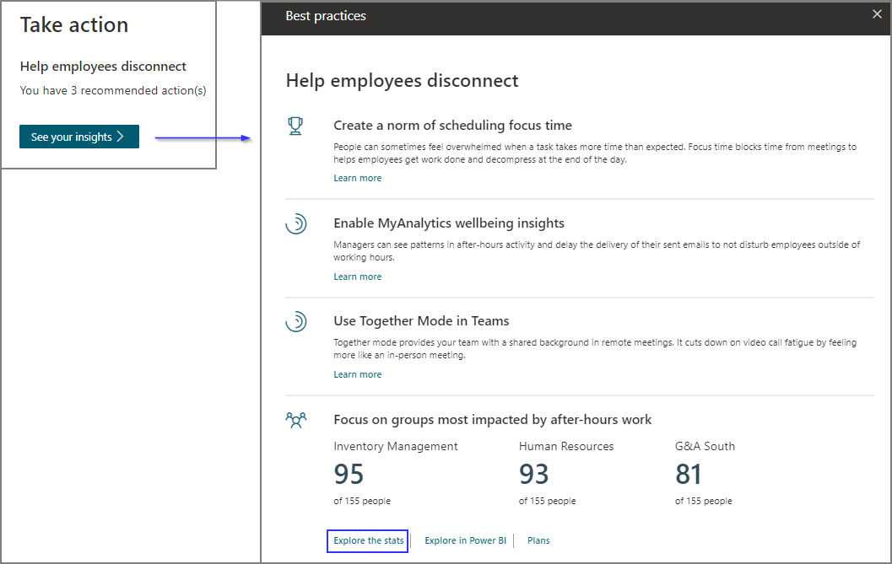

Workplace Analytics has high-level insights about how your employees spend their time, with recommendations and analysis to empower leaders to drive positive change.

## Home

The **Home** page shows leadership insights about the most popular business outcomes. Each outcome has a high-level insight based on your specific organizational data, with links to supporting evidence and more in-depth analysis. Leadership can use these insights to quickly identify work patterns requiring further investigation.

At the top right, **Your organization's data** shows the date range and the number of measured employees that are included in the analysis. **Measured employees** are assigned a Workplace Analytics or Viva Insights license.

Scroll down to see all of the themed business outcomes.

>[!NOTE]
>This analysis reflects a rolling window of the six most recent months of weekly collaboration data.

The following business outcomes are shown on the Home page:

* **Enhance organizational resiliency** - Discover ways to prepare your organization to respond to sudden changes, recover from disruption, and prosper.
* **Boost employee engagement** - Identify opportunities to promote job satisfaction and sense of belonging.
* **Improve agility** - Assess metrics related to your organization's ability to quickly adapt.
* **Foster Innovation** - Uncover if employees have enough time for deep work and are effectively sharing information to generate new ideas.
* **Develop effective managers** - Investigate how managers collaborate to improve employee engagement, development, and performance.
* **Enhance operational effectiveness** - Improve collaboration habits to transform organizational productivity.
* **Accelerate change** - Leverage influential groups to drive change in your organization.
* **Transform meeting culture** - Explore and optimize meeting habits to reduce collaboration overload and promote wellbeing.
* **Increase customer focus** - Target behaviors that engage employees and prioritize customer relationships.

Select any of the business outcomes to see high-level analysis based on the key leading indicators. The following example is a glimpse into the **Develop effective managers** outcome.

For additional resources and analyses, you can explore the following links:

* **Supporting evidence** - Get links to research articles and related information about organizations who have successfully used Workplace Analytics.
* **See your insights** - Get recommendations and deeper analysis to drive positive changes in your organization.

### Home page insights example scenario

You are an HR executive at Contoso Corporation, and have been asked to work with your team to determine if managers are spending enough time developing employees in the organization. Using Workplace Analytics, you navigate to the Home page, select the **Develop effective managers** outcome, and scroll down to the **Promote coaching and development** insight. There, you find that over 60 percent of employees at Contoso get less than 15 minutes of one-on-one time with their manager in a month, indicating a need for more coaching.

In the **Take action** section of the insight, you can select **See your insights** to see impactful next steps you can take to drive change in your organization. For example, in **Develop effective managers > Increase frequency of coaching > See your insights**, you'll see recommendations, such as scheduling recurring one-on-one meetings, and groups that could benefit the most from these recommendations. This example also provides a link to **Explore the stats** for more analysis.

>[!NOTE]
>In addition to recommendations in the **Take action** section, you might also see links to **Explore the stats**, **Explore in Power BI**, or the option to create **Plans** and track their success. The combination of these depends on the insights and your assigned role.

**Explore the stats** is a quick way to look at metrics summarized by groups over time. While the Home page shows high-level insights related to business outcomes, **Explore the stats** cover a wider range of metrics.

>[!NOTE]
>**Explore the stats** analysis reflects a rolling window of the six most recent months of weekly collaboration data.

Within the Explore the stats dashboards, you can change the filters and settings for the data shown on the page. At the top right of the page, select **Settings and filters** to open **Page settings**. In Page settings, you can change the date range of the data, how the measured employees are grouped, add filters, and change the maximum number of groups shown in the data.

### Explore the stats example scenario

As an executive on the HR team, you learned from a recent engagement survey that some employees at Contoso are not feeling empowered in their work. You decide to dive deeper into metrics relating to manager-employee relationships to investigate opportunities for improving manager effectiveness.

In **Develop effective managers** > **Promote coaching and development** > **See your insights**, you select **Explore the stats** to view the **Management and coaching** dashboard. You would like a recent snapshot of the data, so in the upper right corner of the dashboard, you confirm the date range in **Settings and filters** is set to the last three months, group by **Organization**, and select **Apply**. In the **Meeting hours with direct manager present** chart, you notice that over half of the Sales group's meeting time includes their manager, indicating an opportunity to simultaneously empower employees through delegation and free up manager time for strategic tasks.

## Learn more

[Insights](/viva/insights/use/insights)
