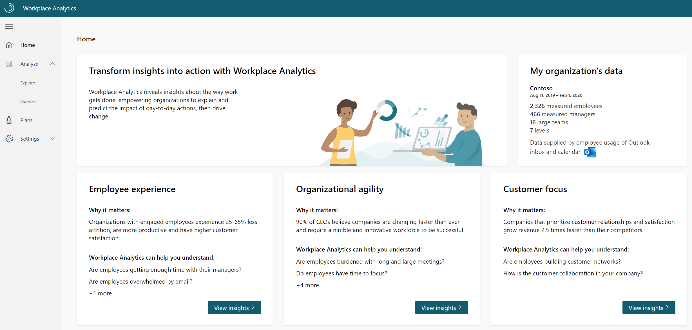
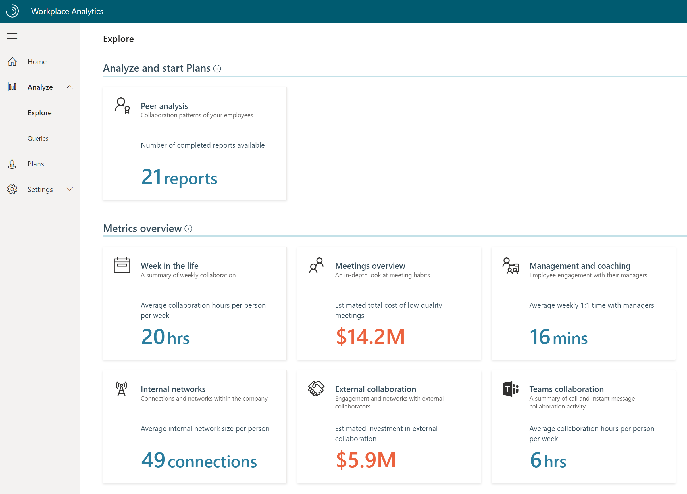
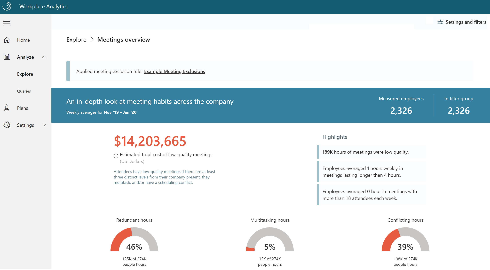
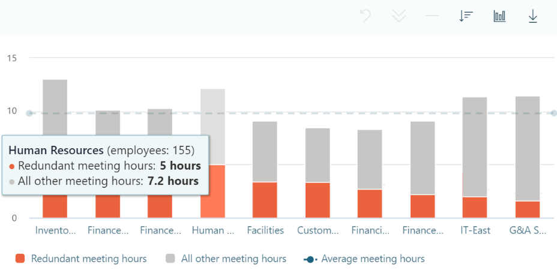

Workplace Analytics provides you with several ways to analyze and explore your data.

- **Home** shows the scope of your Workplace Analytics data and allows you to navigate to high-level insights aligned to research-based solution areas.
- **Analyze** contains two valuable tools: Explore dashboards and Queries. Explore lets you quickly compare base metrics by group, while Queries allow you to download row-level data for more in-depth analysis.
- **Plans** works with MyAnalytics, where available, to provide targeted programs to improve focus, collaboration, well-being, and seller success.
- **Settings** allows you to validate collaboration data, organizational data, and optional CRM data. It also lets you define what calendar activity, if any, to exclude from your analysis.

> [!NOTE] 
> Click the **menu** icon at the top of the panel. It compresses the menu so you can see a full screen view. Click again to reveal the entire menu.

## Workplace Analytics Home page

Use the Home page to get a quick look at the date range and **measured employees** you can include in your analysis, as well as a quick look into how work gets done. (**Measured employees** are defined as employees with a Workplace Analytics license.)

**My organization’s data** gives you a high-level look at your organization’s Workplace Analytics data, including the date range and a count of measured employees.

In addition to Explore, Workplace Analytics offers views into the following areas of collaboration:
 
- **Employee experience**. Understand employee engagement trends by investigating employee one-on-one time with their manager, email load, and time spent collaborating after hours.
- **Organizational agility**. Assess your organization’s ability to quickly adapt by exploring how employees collaborate. This could include too many inefficient meetings, not enough focus time, or how employees connect and share information.
- **Customer focus**. Explore external connections and time spent in external collaboration.

Choose **Explore the stats** and **View recommended plans** for quick links to the Explore dashboards and management plans. You’ll also find links within each solution area that provide supporting evidence and best practices for each behavioral metric.

Let's look at a real world scenario of how to use View insights:

Kevin is a HR business analyst at Contoso Corporation. His manager recently asked him to determine if employees are getting enough time with their managers. Using Workplace Analytics from the Home page, he selects  **View insights** in the Employee experience section. There, Kevin finds that nearly 60 percent of employees get less than 15 minutes of one-on-one time with their manager in a month, indicating a need for more coaching.

## Workplace Analytics Analyze page

In addition to the solution areas mentioned on the Home page, you can also analyze data in Workplace Analytics with Explore and Queries.

### Analyze > Explore > Metrics overview page

Explore provides a quick way to look at Workplace Analytics metrics summarized by group or over time. While the Home page provides a handful of leader-ready insights related to employee experience, organizational agility, and customer focus, the Explore pages cover a wider range of metrics for analysis, and can be useful to quickly identify patterns you want to investigate further.

On the Explore page under **Metrics overview**, you’ll see six available dashboards as shown below:

The following are available in Explore:

- **Week in the life**. Get a high-level look at weekly collaboration in your organization.
- **Meetings overview**. Evaluate the behaviors associated with low quality meetings.
- **Management and coaching**. Look at how much time employees are spending with managers.
- **Internal networks**. Uncover how employees and groups are connecting within the organization.
- **External collaboration**. Explore how employees collaborate with contacts outside your organization.
- **Teams collaboration**. Discover how your organization uses Microsoft Teams for collaboration.

By default, Explore data reflects a rolling window of the six most recent months of weekly collaboration data.

Within the Explore dashboards, you have the option to filter the data. In the upper right corner of the browser, you can select **Settings and filters** which will open the **Page settings**. In Page settings, you can adjust the date range of the data, change how measured employees are grouped, add filters, and choose the maximum number of groups you’d like to see in the output.

Let's look at a real-world scenario of how you'd use the dashboard feature to use Settings and filters:

Kevin, our HR business analyst at Contoso Corporation, recently discovered that 46 percent of meeting hours in his organization are flagged as redundant. He would like to dive deeper into the data in the Meetings overview page to identify groups that might be driving the higher level of redundant meeting hours in the organization. 

In the upper right corner of the Explore dashboard, he selects **Settings and filters**. In the Page Settings he groups by Organization and selects **Apply**. The following results indicate that employees in his HR department spend an average of five hours a week in redundant meetings.

### Analyze > Queries 

**Queries** give you access to row-level data and customizable metrics. You can import the row-level data into other analysis tools to create custom analyses, models, and dashboards.

Under **Start custom query** in **Queries**, you’ll see a list of query options. The two most common are:

- **Person query**. Extract person metrics for analysis of aggregated **employee** data.
- **Meeting query**. Extract meeting-related metrics for analysis of aggregated **meeting** data.

Queries report the same underlying data, but the type of query determines the structure of the output. For example, each observation in a Person query represents a person, their measured collaboration, and their descriptive attributes. Each observation in a Meeting query represents a meeting, its attributes, and the total collaboration associated with the meeting attendees.

### Query steps

There are multiple steps to run a query. 

1. Select the query you’d like to run. 
1. In the **Description** field, enter the name of your query. 
1. (Optional) Adjust the granularity of the timeframe (day, week, or month) and the date range.
1. (Optional) Select a set of rules excluding irrelevant calendar activity (meeting exclusions).

After you’ve made these selections, do the following to further refine the data for analysis.

**Step 1. Select your metrics**. Workplace Analytics metrics vary by query. You can select standard metrics from the list of options, but you can also customize some metrics by filtering with the various organizational data fields. Here's an example of how you can pull meeting hours with the word “budgeting” in the subject line.

**Step 2. Select filters**. By using Workplace Analytics queries, you can change the scope of the data you’d like to analyze by limiting it to active employees and applying additional filters with attributes from the organizational data. In this view, we’ve applied a filter to look at the human resources at Contoso. (Active employees are defined as employees who sent at least one email or Teams chat message in a given week.)

**Step 3. Select organizational data**. You have the option to select which organizational attributes you’d like to include in your output.

**Step 4. Run the query**.

You can access your query results on the **Queries > Results** page. You can choose to view your results or all results in your organization. This page is where you can download the data in a csv format, copy the OData link to load the data into business intelligence applications, and for some queries, visualize the results directly within Workplace Analytics.

You also have the option of selecting from a list of queries with preselected filters and metrics. They are a great starting point for specific analysis, and give you flexibility to add new metrics and customize them.

 A few of the predefined queries have a Power BI icon in the upper right corner. These include a download option for a Power BI Template. If you run this query option, you can download the template, load your data, and get an automatically generated report.

## Workplace Analytics Plans 

Insights gained from Explore and Queries can provide a lot of information about how employees in your organization get work done. With Workplace Analytics Plans, you can transform these insights into actions.

Enrollment in a Plan requires that an employee has access to MyAnalytics. A Plan combines team goal-setting and tracking with useful nudges in MyAnalytics to shift ways of working.

Microsoft currently offers the following plans:

- **Focus plan**. Helps participants get more time to do deep dive work and reclaim their calendar for work that matters most. 
- **Collaboration plan**. Helps participants reduce the number of excessive meetings that the group schedules.
- **Wellbeing plan**. Helps participants unwind and protect their personal time by disconnecting in their off-hours.
- **Seller success plan**. Helps participants prioritize time, increase network quality and size, and connect with the right roles.

For each plan type, you can select **Analyze** and get answers to questions involving relevant metrics. Then select **Start plan** to create, manage, and track a specifically targeted plan for employees in your organization.

Workplace Analytics Plans help give managers and employees visibility into how they are spending time to increase their focus and improve collaboration and wellbeing. 

## Workplace Analytics Settings 

Workplace Analytics enables analysts and admins to  check the quality of your data sources.

In **Settings > Data sources**, you can get a quick view of collaboration data for your measured population over time. You can use this view to identify any dates or date ranges you should include or exclude from your analysis, such as holidays.

You can also assess the quality and completeness (coverage) of the uploaded organizational data (HR attributes) for your measured population as shown here.

Additionally, if your Workplace Analytics administrator has uploaded CRM data, you can confirm the quality of join coverage (the percentage of CRM contact and sales assignment data associated with CRM accounts).

Let's look at a real-world scenario of how you'd check your data source quality

Kevin, our HR business analyst at Contoso Corporation, would like to get a high-level look at some fourth-quarter custom metrics by using a query. He knows he should probably exclude specific dates that might be outliers. 

Kevin opens the **Sources** page and looks at the collaboration data over time for the measured population. He sees two dips in the data, both national holidays. He runs his  query, and after he has the output, he filters out the holiday dates for his analysis.

## Meeting exclusions

Not all meetings scheduled are business-related. People often have personal appointments and block out time on their calendar. When doing analysis in Workplace Analytics, there also may be excessively long or large meetings you don’t want to include.

Workplace Analytics has a built-in solution to address these issues called **meeting exclusions**. With meeting exclusions, analysts can create specific rules for meetings to exclude for specific analyses.

With meeting exclusions, you have the option to:

- Exclude canceled meetings.
- Exclude appointments (blocked time with only one attendee).
- Set thresholds for attendance size and duration of meetings to include.
- Exclude meetings by subject line.

Workplace Analytics has a default meeting exclusion rule which excludes meetings with only one attendee, meetings longer than eight hours, meetings with 250 or more participants, and canceled meetings. This rule is used if no other meeting exclusion is selected.

Use meeting exclusion rules in Workplace Analytics to exclude meetings you don’t want to include in your analysis (or include meetings excluded in the default meeting exclusion rule).

Let's look at a real-world scenario of how you'd use a meeting exclusion rule

Kevin, our HR business analyst at Contoso Corporation, would like to begin an analysis of remote workers. Remote workers at Contoso let their managers know they work from home by creating a one-person meeting titled, Remote Day.

Since the default meeting exclusion rule excludes these meetings, Kevin needs to create a new rule. He opens **Analysis settings** in the menu to locate the **Meeting exclusions** page and creates a new meeting exclusion rule to include meetings with only one person.

## Additional resources

You'll find some additional resources in the upper right of each screen. 

- Select the **New features** (megaphone) icon to get information on new features in Workplace Analytics.
- Select the **Notifications** (bell) icon for notifications and alerts related to recent activity in Workplace Analytics. This feature shows dates of data refresh, organizational data uploads, newly created meeting exclusions, and query auto-refresh. Notifications alert you when your queries have finished running.
- Select the **Help** (?) icon to find:
  - **Documentation**. Documentation provides extensive information about Workplace Analytics topics.
  - **FAQs**. Find frequently asked questions with the answers you are looking for.
  - **Blog**. The blog post offers Workplace Analytics feature updates and product releases; it updates monthly.
  - **Privacy guide**. The Privacy Guide has in-depth information about data protection, how you can control your data, and who has access to that data.
  - **Privacy policy**. This page features privacy notifications.
  - **Resource playbooks**. Choose from two playbooks on best practices.
- **Feedback**. Use this feature to send Microsoft your comments.
- **User icon**. The User icon features your tenant, partition, and role information. **Sign out** is also located here.

## Learn more

- [Explore overview](https://docs.microsoft.com/workplace-analytics/use/explore-intro?azure-portal=true)
- [Queries overview and ways to query data](https://docs.microsoft.com/workplace-analytics/tutorials/query-basics?azure-portal=true)
- [Workplace Analytics plans](https://docs.microsoft.com/workplace-analytics/tutorials/solutionsv2-intro?azure-portal=true)
- [Workplace Analytics data sources](https://docs.microsoft.com/workplace-analytics/use/data-sourcesv2?azure-portal=true)
- [Meeting exclusions](https://docs.microsoft.com/workplace-analytics/tutorials/meeting-exclusions-intro?azure-portal=true)
