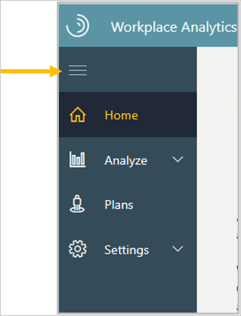
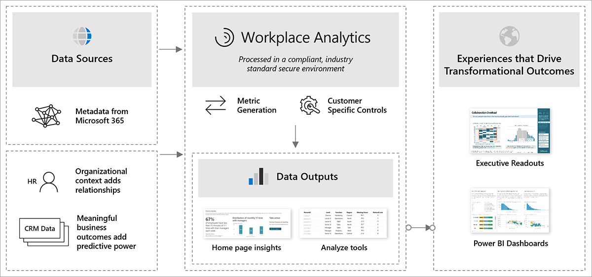
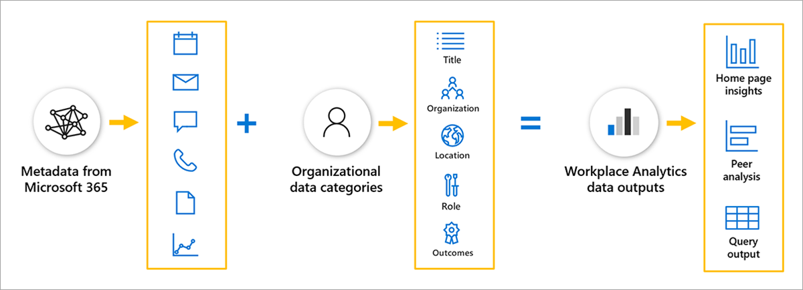
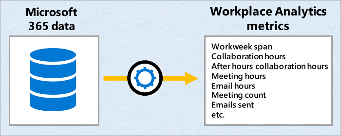
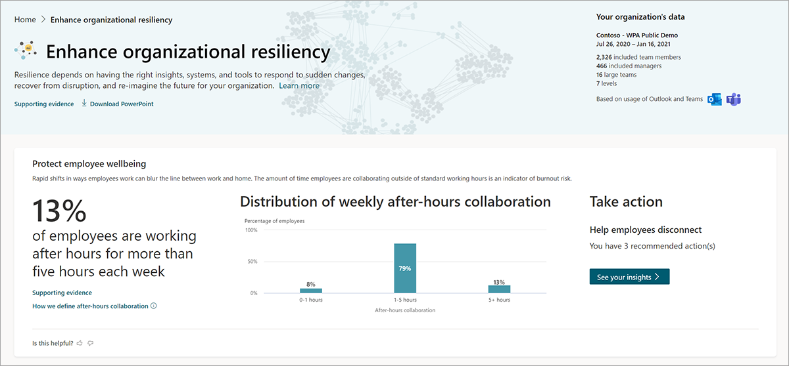
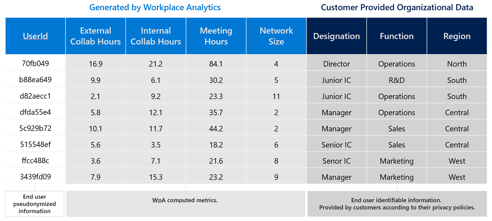

Workplace Analytics users can analyze and explore the data in multiple ways:

* The **Home** page shows high-level insights about your organizational data, with recommendations and options for in-depth analysis about research-based behavioral outcomes.
* The **Analyze** page enables more in-depth analysis with the Query designer, Business process analysis, and Peer analysis features.
* The **Plans** page works with personal insights, where available, to show targeted suggestions to help improve focus, collaboration, wellbeing, and sales success.
* The pages in the **Controls** section allow you to validate your data sources, define leader and manager settings, and define the analyst settings for system defaults, privacy, and meeting and attendee exclusions.

  

>[!NOTE]
>Select the **menu** (top) icon in the left navigation to toggle whether to show or hide the menu names.

The following shows how you can use these outputs to create executive presentations and business intelligence tools to drive transformational outcomes.

>[!div class="centered"]
>

## Data sources

What's under the hood? Workplace Analytics processes collaboration data from Microsoft 365. It then maps descriptive employee attributes, usually from the organization's human resource information system (HRIS) with the collaboration data. The following shows this process:

>[!div class="centered"]
>

The descriptive employee attributes from HRIS are known as **organizational data** in Workplace Analytics. This organizational data is uploaded by the Workplace Analytics admin. Because employee roles and positions do change, analysts can get more accurate information when this data is updated monthly or quarterly.

You can use organizational data to group and filter employees and understand how behaviors correspond to employee attributes. Workplace Analytics only requires a few basic organizational attributes, but the more data your admin adds, the more value added for analysis.

When Workplace Analytics processes collaboration data from Microsoft 365, it only processes metadata. Metadata is information **about** collaboration, like when and where items are sent (to and from), subject lines, and meeting attendee status. Workplace Analytics uses this metadata to generate metrics related to email usage, meetings, Teams instant messages, and calls. The collaboration data refreshes weekly.

Workplace Analytics joins the organizational data to the collaboration data to generate its data model for out-of-the-box insights and analysis.

## Organizational metrics

After the data sources are processed, employee data is de-identified and filtered, creating a large library of behavioral base metrics related to workplace behaviors, time use, and networks.

The **Home** page is a high-level look at these metrics within the top business outcomes for visibility into how work gets done.

Peer analysis compares base metrics between groups, allowing you to use organizational attributes to filter each population. The Query designer allows you to go one step further and customize base metrics. For example, measuring "recurring meeting hours" as compared to the base metric of "meeting hours."

See [Learn more](#learn-more) for links to the metric descriptions and the glossary for more details about what metrics are used in Workplace Analytics.

## Analysis outputs

Each themed business outcome on the **Home** page leverages multiple key indicators to offer views of how work happens, with links to further explore the stats and evidence-based suggestions on how to drive change for business success.

The following is a snapshot of the **Protect employee wellbeing** view, which can be found by selecting the **Enhance organizational resiliency** outcome.

**Peer analysis** helps you discover differences in collaboration behavior between groups.

The following is an example of Peer analysis output that highlights the metrics with the most variation and charts that compare metric averages between groups.

**Query designer** gives you access to row-level data and customizable metrics.

The following is an example of query output with organizational attributes (level, function, and region) and other related metrics (external and internal collaboration hours, meeting hours, and network size).

Query output is available as a downloadable .csv file or as an OData link that can be loaded into other business intelligence tools, such as Power BI for impactful reports and presentations. For some queries, you can also visualize the results directly in Workplace Analytics.

## Learn more

* [Metric definitions](/viva/insights/use/metric-definitions)
* [Glossary](/viva/insights/use/glossary)
