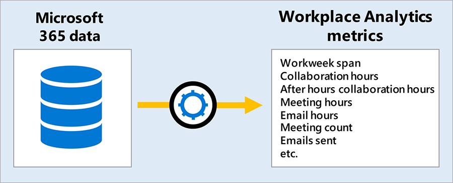
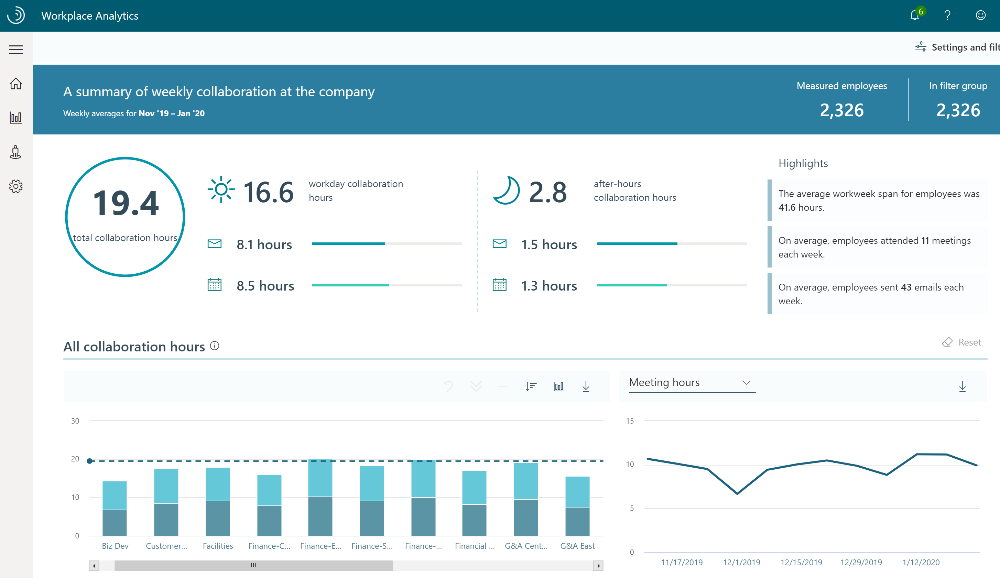

Workplace Analytics combines collaboration data from Office 365 with organizational data to create a large set of behavioral metrics that can be accessed in two ways: 

- **Explore dashboards**. Aggregated dashboards that give out-of-the-box insights
- **Flexible queries**. Query output using row level data for more in-depth analysis

These outputs can be used to create executive presentations and business intelligence tools to further drive transformational outcomes.

## Workplace Analytics data sources

What’s under the hood? Workplace Analytics extracts collaboration data from Office 365 and maps it to organizational attributes derived from your organization’s Human Resource system as outlined in this flow path.

Organizational data is uploaded by your Workplace Analytics administrator and should be updated monthly.

There are five required fields in Workplace Analytics, but the more data your organization adds, the more value you can get from it. It's the Human Resource attributes in this data that allow you to gain the most meaning from the analysis.

The metadata extracted from Office 365 includes raw data such as where items are sent (to and from), when items are sent, subject lines, and meeting attendee status. Workplace Analytics takes these items and generates metrics related to email usage, meetings, instant messages, and calls. Office 365 data refreshes weekly.

These data sources are combined to form the data set used in Workplace Analytics outputs: Explore dashboards and Flexible queries.

## Workplace Analytics metrics

Once the Workplace Analytics data sources are configured, the data is filtered, creating a large library of behavioral base metrics related to workplace behaviors. Examples include metrics related to productivity, engagement, networks, time use, and much more.  

Base metrics fall into four perspectives:

- **Person metrics**. Row level person perspective
- **Meeting metrics**. Row level meeting perspective
- **Group to group metrics**. Group perspective time investor group to collaborator group
- **Person to group metrics**. Person perspective time investor to collaborator group

The use of these metrics depends on the dashboard or query selected. Base metrics are filterable and customizable. You can correlate Workplace Analytics metrics and organizational attributes with other business information—generating powerful models and insights to drive positive business outcomes.

See the **Learn more** section below For a complete list of current Workplace Analytics metrics and terms.

## Workplace Analytics outputs

**Explore dashboards** are out-of-the-box summary pages that can identify potential problem areas through guided exploration. The screenshot below is a snapshot of the Workplace Analytics **a Week in the life** dashboard which gives you a high-level look at collaboration time in meetings, emails, and after hours for the average employee in a given organization.

**Flexible queries** (or simply queries) offer filterable and customizable data access to create valuable analysis.

Below is an example of output generated by a Flexible query. It includes selected Human Resource attributes (level, function type, and region), as well as selected Workplace Analytics metrics (external and internal collaboration hours, meeting hours, and network size).

Flexible query output is available as a downloadable csv file or as an OData link which can be loaded into business intelligence tools to create impactful reports and presentations.  For some queries, output is also available as a visualization to analyze within the tool itself.

These insights can inform leaders' decisions on enhancing their business, improving the employee experience, and/or expanding their customer focus.

## Learn more

- [Workplace Analytics metric definitions](https://docs.microsoft.com/workplace-analytics/use/metric-definitions?azure-portal=true)
- [Workplace Analytics glossary](https://docs.microsoft.com/workplace-analytics/use/glossary?azure-portal=true)
