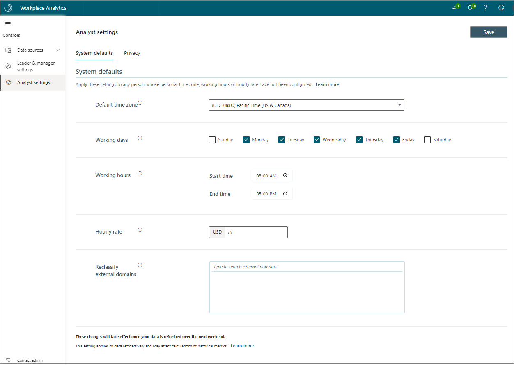
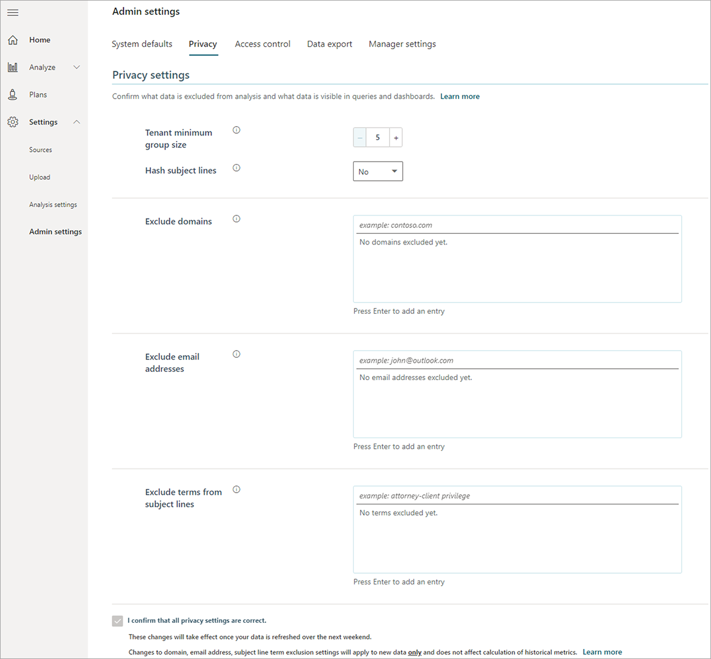

After the Microsoft 365 admin assigns a Workplace Analytics admin, that admin needs to set up the System defaults and Privacy settings before your organization can start using Workplace Analytics.

Your admin can also assign the analyst role to other people in your organization, who can then help with setting up the applicable Analyst settings and confirm the analysis population and collaboration data is accurate for analysis purposes.

## System defaults

The following system default settings apply to the employees you've included in the analysis population.

- **Default time zone**, **Working days**, and **Working hours** are used to calculate employees' collaboration hours within work hours and during after hours. The system defaults are applied only if the user hasn't previously personalized their settings in Outlook.
- Workplace Analytics uses the **Hourly Rate** to calculate the cost of employee time (for example, the cost of time spent in "low-quality" meetings). You can customize this value at aggregate levels in the organizational data file, or the Workplace Analytics admin can set a single number as a default.
- Workplace Analytics provides insights on how employees collaborate with other employees (not included in the analysis population) in the company or with external individuals, using domain information.

   You can use **Reclassify external domains** settings to include external domains as internal collaborators. For example: If your company has contractors or consultants as part of their internal teams, you'll want to include interactions with those people as internal as compared to external collaboration in your analysis. You can reclassify the consulting company's domain as internal with this setting. **Note**: This setting for reclassifying a domain will be available after the first Microsoft 365 data extraction.

>[!IMPORTANT]
>You can change the system default settings at any time. Changes are applied after the next data refresh of the organizational data or Microsoft 365 collaboration data. These changes apply to data retroactively and can affect previous calculations that use historical metrics.

## Privacy settings

You can set the following privacy settings for the employees in the analysis population.

- The **minimum group size** suppresses data for groups that are smaller than the specified value (the smallest value permitted is five). This setting is applied to your application immediately and also applies retroactively.
- If **hash subject lines** is set to **Yes**, subject lines are excluded from meeting-query results. This also has a word-cloud feature in the Meeting Exclusion wizard. Like **minimum group size**, this setting applies immediately and also retroactively.
- **Processing exclusions** (**domains**, **email addresses**, and **subject lines**): Any activity that involves the excluded criteria is not processed or measured as part of your data. These settings reduce the amount of collaboration data that's processed from employees and results in a reduced dataset available for analysis.

   **Example**: If you exclude sarah@contoso.com, any collaboration with this email address (either as the sender, receiver, or meeting attendee) will not be processed or measured.

   These exclusions apply to new data processed during the next data refresh and do not affect historical data.

You must confirm the privacy settings are correct (at the bottom of the page) before data processing will occur.

## Example scenario

You and Taylor attend a working meeting with the Workplace Analytics analysts to explore how the different Workplace Analytics settings will impact analysis. For the system defaults, although the business unit that's being analyzed is global in operations, the default time zone is set to Contoso's headquarters location, which is where the largest group in your business unit resides. The team also refines the hourly rate to $85 per hour, which HR says better reflects the fully loaded cost of Contoso's high-tech workforce.

For the privacy settings, the team applies the settings that were established by the business leaders and the privacy review. They exclude the external domain of Contoso's retained law firm because of the sensitivity of their communications and any related terms that their General Counsel provide are excluded.
