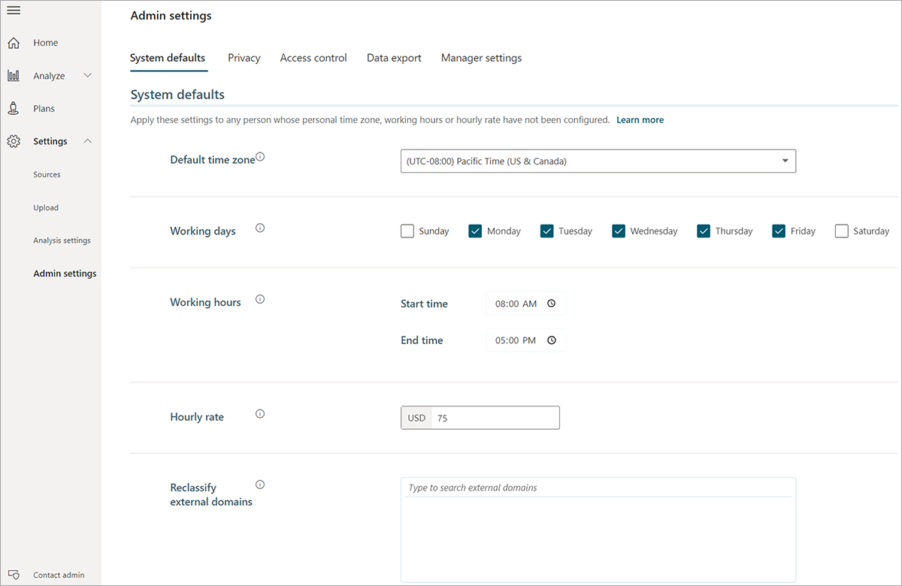

After the Microsoft 365 administrator assigns user roles, you need to configure system defaults and privacy settings before you can start using Workplace Analytics.

You can also set up additional partitions, manage access control, and configure data-export settings and manager settings. (These additional settings can be changed anytime after Workplace Analytics is live.)

## System defaults

The following system default settings apply to the employees you've included in the analysis population.

- **Time zone**, **Working days**, and **Working hours** are used to calculate employees' collaboration hours within work hours and during after hours. The system defaults are applied only if the user hasn't previously personalized their settings in Outlook.
- Workplace Analytics uses the **Hourly Rate** to calculate the cost of employee time (for example, the cost of time spent in "low-quality" meetings). You can customize this value at aggregate levels in the organizational data file, or the Workplace Analytics administrator can set a single number as a default.
- Workplace Analytics provides insights on how employees collaborate with other employees (not included in the analysis population) in the company or with external individuals, using domain information.

   You can use **Reclassify external domains** settings to treat external domains as internal collaborators. For example: If there are contractors or consultants that your company works closely with and you want to treat those interactions as internal collaboration instead of as external collaboration, reclassify the consulting company's domain as internal by using this setting. Note: The ability to reclassify settings becomes available only after the first Microsoft 365 data extraction.

>[!IMPORTANT]
>You change these system defaults any time. Changes are applied after the next data refresh of your organizational data or Microsoft 365 collaboration data. These changes apply to data retroactively and can affect previous calculations that use historical metrics.

## Privacy settings

You can set the following privacy settings for the employees in the analysis population.

- The **minimum group size** suppresses *dashboard* results for groups that are smaller than the specified value (the smallest value permitted is five). This setting is applied to your application immediately and also applies retroactively.
- If **hash subject lines** is set to **Yes**, subject lines are excluded from meeting-query results. This also disables the word-cloud feature in the Meeting Exclusion wizard. Like **minimum group size**, this setting applies immediately and also retroactively.
- **Processing exclusions** (**domains**, **email addresses**, **subject lines**): Any activity that involves these excluded criteria is not processed or measured as part of your dataset. These settings reduce the amount of collaboration data that's processed from employees and results in a reduced dataset available for analysis.

   **Example**: if you exclude sarah@contoso.com, any collaboration with this email address (either as the sender, receiver, or meeting attendee) will not be processed or measured.

   These exclusions apply to new data processed during the next data refresh and do not affect historical data.

You have to confirm these privacy settings (at the bottom of the page) before data processing begins.

## Example scenario

You and Taylor hold a working session with the Workplace Analytics analysts to explore how the different Workplace Analytics settings will impact their analysis. For the system defaults, although the business unit they're analyzing is global in operations, they set the default time zone to that of their headquarters, which is located where the largest group of that business unit resides. The team also refines the hourly rate to $85 per hour, which HR informs them better reflects the fully loaded cost of Contoso's high-tech workforce.

For the privacy settings, the team applies the settings that were established by business leaders and the privacy review. They exclude the external domain of Contoso's retained law firm because of the sensitivity of that communication and copy in the list of excluded terms that their General Counsel provided.
