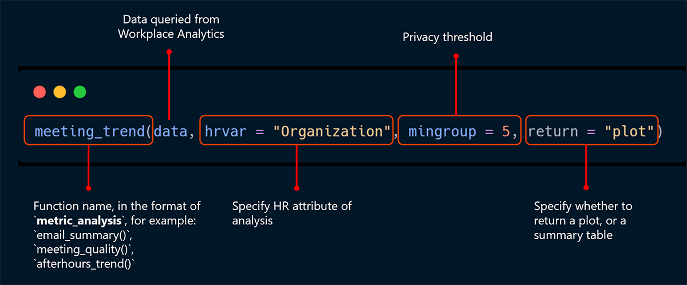
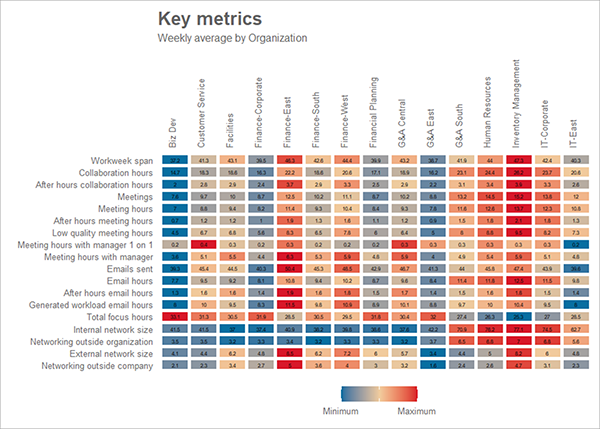
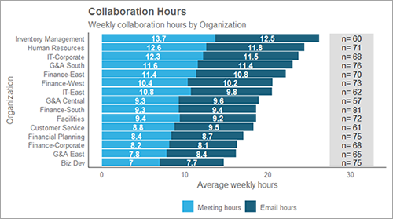
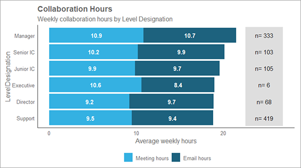
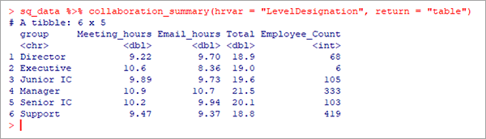
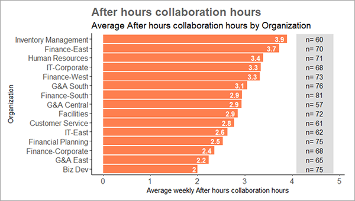
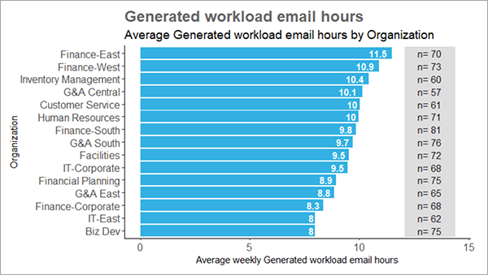
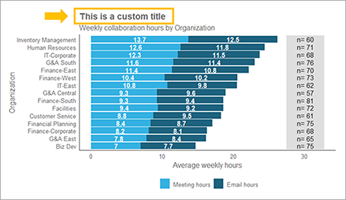

This section covers how to explore data from Viva Insights with Workplace Analytics in R.

After you have loaded the person query data and completed all necessary data validation, you can run a few functions to establish a baseline for your data. The following examples will continue to use `sq_data` as the demo person query data. For your analysis, be sure to replace this with the name of your query variable.

## Function structure

All functions in `wpa` follow a similar structure and include many common arguments. The following shows the basic structure of standard analysis functions:



We can explore the `sq_data` person query by using the `keymetrics_scan()` function.

The `keymetrics_scan()` function creates a summary table with a wide range of metrics included in a person query. Similar to the function we studied in the previous section, you can specify which HR attribute to use as a grouping variable with the `hrvar` argument, and what output to want (either "plot" or "table") with the `return` argument. For example, the following returns a heatmap table as a ggplot object (ggplot2 is an R package that is used to create data visualizations).

```R
# Returns a plot
sq_data %>% keymetrics_scan(hrvar = "Organization", return = "plot")
```

Output:



To save the output as a plot to your working directory, run the following:

```R
sq_data %>%
   keymetrics_scan(hrvar = "Organization", return = "plot")%>%
   export()
```

If you prefer output that you can copy and paste into Excel or PowerPoint as chart data, you can choose to return a data frame instead. To do this, specify `return = "table"`, where the function returns the data frame output in the console.

```R
# Returns a summary table
sq_data %>% keymetrics_scan(hrvar = "Organization", return = "table")
```

Note the use of the pipe operator `%>%` in these exercises. It's roughly used for "then," where the above action translates to taking the `sq_data` data frame, then apply the `keymetrics_scan()` function to it to return a plot, and export the output by saving the data frame.

"Piping" a data frame to `export()` will copy the data frame to the clipboard by default. You will see a message that the data frame has been copied, and then you can paste the copied data into Excel.

If at any point you want to understand more about the functions, you can:

* Enter a question mark in the console followed by the function name and run it.
For example: `?keymetrics_scan`
* View the underlying source code of the function with `View()`.
For example: `View(keymetrics_scan)`
* Visit the function reference page online through the link in [Learn more](#learn-more).

## Explore data with reports

You can create analysis with Workplace Analytics in R in two ways. The first is to run **quick start reports**, which are static HTML reports with plots and tables that highlight a specific area of analysis. For example, you can use `collaboration_report()` to get a collaboration report:

```R
sq_data %>% collaboration_report()
```

See the **Learn more** section for example output for a collaboration report.

When you run a report, an HTML file (opened with a web browser, like a website) is written to your working directory. For example, the collaboration report does the following:

* Embeds plots and tables on the corresponding subject. For `collaboration_report()`, the subject is collaboration.
* Stands alone as portable output You can share the HTML file through email that does not require server hosting and is viewable offline.
* Does not embed raw data. Because the report is effectively a static web page, only the plots and tables are exposed (as HTML and JavaScript).
* Contains interactive tables that you can use to export values, such as a PDF, a .csv for Excel, or paste to a clipboard.

The following are some examples of quick start reports you can use for baseline analysis:

* `collaboration_report()` - Summary and analysis on collaboration metrics such as email and meeting hours.
* `capacity_report()` - Summary and analysis on capacity metrics, such as length of week and time in after-hours.
* `coaching_report()` - Summary and analysis relating to coaching metrics in relation to time spent between managers and direct reports.
* `connectivity_report()` - Summary and analysis related to connectivity, including internal and external network size and breadth.

See the links [Learn more](#learn-more) for more information on quick start reports.

## Explore data with functions

In addition to running reports, you can also create individual analysis.

The `collaboration_summary()` function generates a stacked bar plot summarizing the email and meeting hours by an HR attribute you specify. If no HR attribute is specified, "Organization" will be used by default:

```R
sq_data %>% collaboration_summary()
```

Output:



By changing the `hrvar`argument, you can change the groups being shown easily:

```R
sq_data %>% collaboration_summary(hrvar = "LevelDesignation")
```

Output:



By default, all summary functions exclude groups with fewer than five individuals. This is also something that can be adjusted, using the `mingroup` argument:

```R
sq_data %>% collaboration_summary(hrvar = "LevelDesignation", mingroup = 10)
```

Finally, you can use `"table"` in the `return` argument to get a summary table instead of a plot. The `export()` function will copy the table data to the clipboard.

```R
sq_data %>% collaboration_summary(hrvar = "LevelDesignation", return = "table")
```

Output:



## Other summary functions

The package includes a wide range of summary functions that create bar plots for specific metrics, including the following:

* `email_summary()` - Summarizes email hours grouped by the selected HR attribute.
* `meeting_summary()` - Summarizes meeting hours grouped by the selected HR attribute.
* `one2one_summary()` - Summarizes manager one-to-one meeting hours, grouped by the selected HR attribute.
* `workloads_summary()` - Summarizes workweek span grouped by the selected HR attribute.
* `afterhours_summary()` - Summarizes after-hours collaboration hours grouped by the selected HR attribute.

These functions are equivalent to the `collaboration_summary()` function because they use person query data as the input, and accept the `hrvar`, `return`, and `mingroup` arguments.

Use the following to get a summary of after-hours collaboration:

```R
sq_data %>% afterhours_summary()
```

Output:



## Advanced functionalities for custom bar charts and tables

For other metrics, the `create_bar()` function is a good way to get a summary bar chart for any metric. This function requires a character string with the name of the metric you want to analyze. For example, the following specifies `"Generated_workload_email_hours"` as the metric:

```R
sq_data %>% create_bar(metric = "Generated_workload_email_hours")
```

Output:



The `create_bar()` function also accepts the `hrvar`, `return`, and `mingroup` arguments.

## Advanced functionalities for custom plots

All plots in the `wpa` R package are ggplot objects. This means you can customize them by adding the ggplot2 package and adding ggplot arguments and layers to the code. For example, you can use the following to change the title of a `collaboration_summary()` plot to a custom title:

```R
library(ggplot2)
sq_data %>% collaboration_summary() + ggtitle("This is a custom title")
```

Output:



The `wpa` R package has over 150 functions with different options. See the Learn more section for details about:

* What each function does.
* Required and available arguments and parameters for each function.
* Output returned when you use each function.

For a guided tour on the available visualization functions, see the following link for the `wpa` R package introduction.

## Learn more

* [`wpa` R package introduction](https://microsoft.github.io/wpa/analyst_guide.html)
* [`wpa` R package function reference](https://microsoft.github.io/wpa/reference/index.html)
* [`wpa` R package summary functions](https://microsoft.github.io/wpa/analyst_guide_summary.html)
* [Collaboration demo report](https://microsoft.github.io/wpa/report-demo/collaboration-report.html)
* [Capacity demo report](https://microsoft.github.io/wpa/report-demo/capacity-report.html)
* [Coaching demo report](https://microsoft.github.io/wpa/report-demo/coaching-report.html)
* [Connectivity demo report](https://microsoft.github.io/wpa/report-demo/connectivity-report.html)
* [Information on the ggplot2 package](https://ggplot2.tidyverse.org/e)
