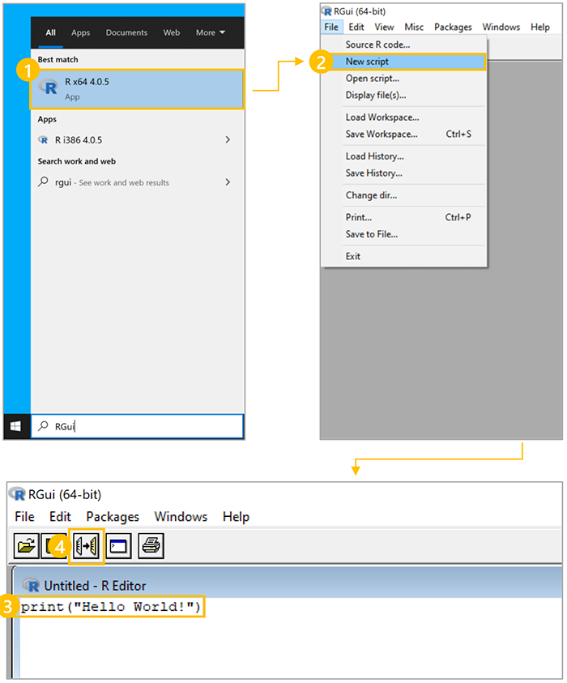
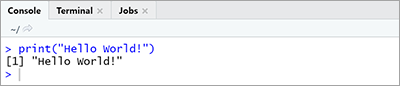

There are a few steps you need to complete to set up the `wpa` R package:

1. Download and install the open-source R software.
1. Install the `wpa` R package.
1. Load the `wpa` R package.

## 1. Download and install the open-source R software

To begin, install R on your machine from the R project website, [www.r-project.org](https://www.r-project.org?azure-portal=true). When you get to the R project site, you'll be prompted to choose a Comprehensive R Archive Network (CRAN) mirror. The Comprehensive R Archive Network, or CRAN, is a network of servers distributed around the world used to distribute R software and packages.

Select the CRAN mirror link. Don't choose a mirror that is close to you geographically: instead, select the cloud mirror, which automatically detects the optimal mirror for you. After  you have chosen the cloud mirror, download R.


> [!NOTE]
> You also have the option to download and install an integrated development environment (IDE) to improve your programming experience. IDEs provide useful features such as code auto-complete, syntax checks, and viewing panels not available with a plain text notepad. RStudio is a commonly used IDE for R.

## 2. Install the `wpa` R package

Before you can get started with the `wpa` package in R, you need to do a one-time install of the package to ensure it is downloaded and set up on your computer. The `wpa` R package is available on the CRAN. To automatically install it, run the following in R:

```R
install.packages("`wpa`")
```

> [!IMPORTANT]
> It is a best practice to restart your R session both before and after running this installation.

The `wpa` package is dependent on multiple other R packages. If you are prompted to update the `wpa` package, it is recommended you update all CRAN packages.

## 3. Load the `wpa` R package

Before you can use the `wpa` R package, you need to load the package at the beginning of each R session. Loading the package is analogous to installing and loading an app, except that it occurs within the R environment. For this purpose, you can think of R packages as apps for R.

Each R package is stored in a directory called a library. After the installation is complete, load the `wpa` R package in your session with the following:

```R
library(`wpa`)
```

> [!IMPORTANT]
> You only need to install the package one time; however, you will need to load it every time you start a new R session.

The `wpa` R package is designed to work side by side with other R packages from the Tidyverse. The Tidyverse is a collection of R packages designed for data science. We generally recommend loading `tidyverse` alongside `wpa`, as many of our examples use the data manipulation and plotting functions from the Tidyverse.

Run the following to install the complete Tidyverse:

```R
install.packages("tidyverse")
```

### Exercise: Create a script in R

If you are new to using R, the best way to learn how to write code is to try it for yourself. This exercise guides you through how to create a new script in R, write a short line of code, and view the output.

To complete the exercise:

1. Open R.
1. Select **File** > **New Script**.
1. Enter `print("Hello World!")`
1. Select **Ctrl**+**R** or select the button to **Run line or selection**.



After you run the script, you'll be able to see the output in the console:



Now that you have downloaded and installed R and loaded the `wpa` R package, you are ready to analyze Workplace Analytics data. The `wpa` R package has multiple built-in sample datasets, including the `sq_data` person query output and the `mt_data` meeting query output. You'll see these sample datasets demonstrated in many of the `wpa` R package functions in the following units.

> [!IMPORTANT]
> Note that `sq_data` and `mt_data` are the names of demo datasets that are pre-loaded with the `wpa` R package. Avoid assigning demo dataset names to imported data, as it makes it easy to accidentally analyze the demo data instead of analyzing your imported dataset.

## Learn more

- [Download and install R](http://www.r-project.org?azure-portal=true)
- [Download and install RStudio Desktop](https://www.rstudio.com/products/rstudio/download?azure-portal=true)
- [Download an installation file and install it locally](https://github.com/microsoft/wpa/releases?azure-portal=true)
- [Learn more about the Tidyverse](https://www.tidyverse.org?azure-portal=true)
- [`wpa` R package cheat sheet](https://github.com/microsoft/wpa/blob/main/man/figures/wpa%20cheatsheet.pdf?azure-portal=true)
