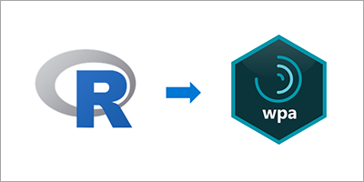
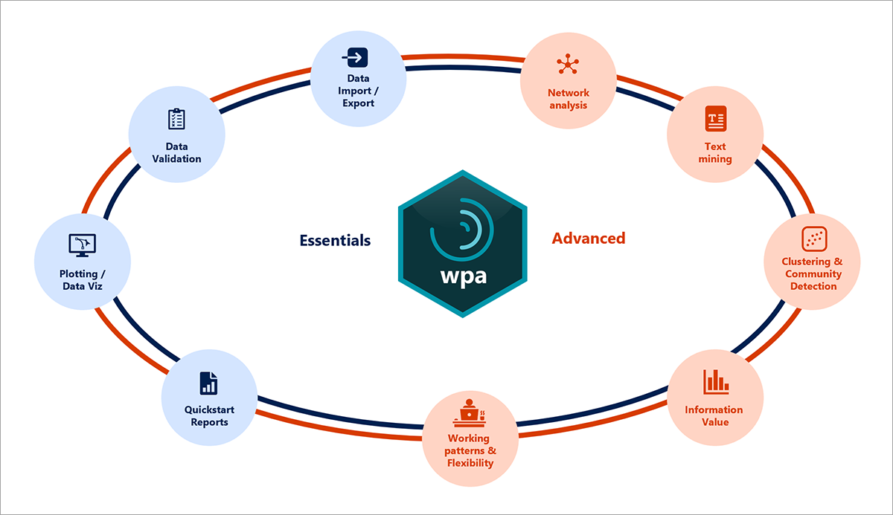

An R package is a collection of functions, data, and documentation that extends the capabilities of R. R packages allow you to take advantage of visualization capabilities, machine learning, and data wrangling, and are key to success with R. At the time of this writing, over 17,000 R packages are listed on the Comprehensive R Archive Network (CRAN). There are even more on GitHub.

The `wpa` R package is a set of tools and functions to analyze and visualize data from Viva Insights through the Workplace Analytics app.

The functions in the `wpa` R package provide low-code, pre-built analyses. These functions are designed to help analysts customize their analysis and go beyond the insights gained from the Power BI templates and dashboards that are available through the Query designer in Workplace Analytics.

The R logo is © 2016 The R Foundation. No changes have been made to the R logo in this module. [CC-BY-SA 4.0](https://creativecommons.org/licenses/by-sa/4.0/?azure-portal=true)

## Why use R for analysis?

The following are some reasons for using R to analyze Viva Insights data that's available through the Workplace Analytics app:

- **Cutting edge data science** - A  wide range of packages in R enable quick and effective implementation of data science techniques.
- **Reproducibility** - Code-based workflows make it easy to replicate analysis. R as a tool promotes this good practice.
- **Efficiency and scalability** - You can use R to analyze large datasets. Applying the R functions and automated processes reduce routine analysis time.
- **Integration and extensibility** - R offers access to a wide range of packages with advanced functions. You can use these functions to create advanced, in-depth analysis and seamlessly add to an R workflow.

## What can you do with the `wpa` R package?

The `wpa` R package includes a number of essential and advanced functions and features. This package uses data science techniques to help you deliver advanced analytics and create and maintain a streamlined data science workflow without switching over to a different solution.

The package currently includes over 160 different functions, as shown in the following graphic. These include essential features that analysts can use for a wide range of analyses and more advanced features that make use of advanced data science capabilities in R.

 

The `wpa` R package includes the following essential and advanced features:

- **Data import and export** - Run Workplace Analytics queries, import .csv data, and export plots and analysis in a wide range of formats.
- **Data validation** - Run an automated data validation report for Workplace Analytics data.
- **Plotting and data visualization** - Choose from over 60 pre-built Workplace Analytics data visualizations.
- **Quick-start reports** - Choose from multiple automated reports to quickly establish collaboration baselines.
- **Network analysis** - Create a network visualization based on person or group collaboration.
- **Text mining** - Analyze meeting subject lines using the text mining function.
- **Clustering and community detection** - Identify organically formed communities in your organization.
- **Information value** - Determine important features with employee sentiment data.
- **Working patterns and flexibility** - Measure and benchmark working patterns.

## Learn more

- [Base R Cheat Sheet](https://www.rstudio.com/wp-content/uploads/2016/10/r-cheat-sheet-3.pdf)
- [Resource on using R for data science](https://r4ds.had.co.nz)
- [`wpa` R package documentation](/viva/insights/tutorials/wpa-r-package)
- [`wpa` R package on CRAN](https://CRAN.R-project.org/package=wpa)
