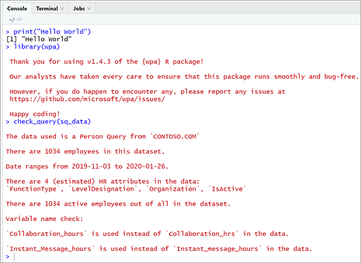
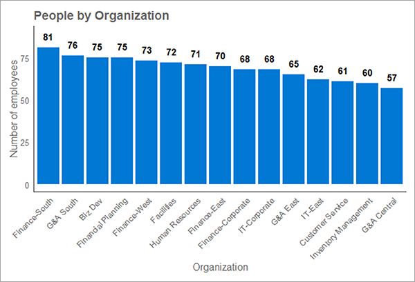

Before using R functions to analyze Viva Insights data from Workplace Analytics and start looking for insights, you need to validate the data. Validation is a best practice whether you are exploring the data, establishing a baseline, or creating advanced analytics.

## Why validate?

Data validation is essential for ensuring trust that it is accurate, clean, and helpful. The following are just a few of many important reasons to validate the Workplace Analytics data:

* Data validation ensures a dataset is a good basis for analyses, and acts as a proactive intervention to safeguard your analyses from the start.
* There might be gaps, anomalies, or errors in the organizational data, such as missing data, or the data might not have the right level of granularity. These issues might require fixing the data at the source, or interpreting the data differently. Any data biases should be caveated or accounted for.
* Outliers might exist in Workplace Analytics data, and often for legitimate reasons. For example, collaboration hours for a specific week or employee might be low because of a public holiday or paid time off. If these outliers aren't addressed, the interpretation of the data might be incorrect.

It is a good practice to have a comprehensive understanding of the data and perform checks for common biases, errors, and anomalies before analysis. Otherwise, the quality and reliability of the analysis might be at risk.

## Know your data

Before you begin with data validation, it's helpful to know more about your dataset, including:

* Type of query loaded (person query, meeting query, and so on)
* Number of unique employees in the dataset
* Date range of the dataset
* Organizational attributes in the dataset

You can quickly get this information with the `check_query()` function. Use the following to run the `check_query()` function on the inbuilt `sq_data` sample person query dataset.

```R
library(wpa)
check_query(sq_data)
```

The resulting output gives you a summary of the data, as shown in the following example:



The following functions are helpful for initially exploring your data (the examples use the `sq_data` person query output):

* `names(sq_data)` - Gets all column names.
* `class(sq_data$Date)` - Checks object type (this example checks the type of the Date column).
* `summary(sq_data)` - Gets summary statistics.
* `length(unique(sq_data$PersonId))` - Computes the number of unique values (this example computes the unique number of PersonIds).
* `dplyr::glimpse(sq_data)` or `skimr::skim(sq_data)` - Get an overview of the data.
* `View(sq_data)` - View the entire dataset (not recommended for large datasets).

Validating the structure of the data is as important as validating the data. You might check that the data is correctly imported into R if you observe any anomalies, such as:

* Unexpected or misspelled column names
* Unexpected number of rows in the data
* Unexpectedly high number of missing or unique values
* The Date variable is a type other than the character or date type

## Data Validation Report

An easy way to perform data validation with the `wpa` package is to run the data validation report:

```R
validation_report(sq_data)
```

This function generates an interactive HTML report in your working directory that includes a series of checks, including:

* Workplace Analytics settings
* Organizational data quality
* Microsoft 365 data quality

See the following **Learn more** section for demo validation report output.

The `validation_report()` only runs with person query output from Workplace Analytics, but you could also use meeting query data to include checks for meeting subject lines. To do so, run the following:

```R
validation_report(sq_data, meeting data = mt_data)
```

The data validation report provides recommendations on whether to adjust settings or consider specific assumptions before you proceed with your analysis. After you make the relevant adjustments, run the `validation_report()` again on the 'clean' dataset to make sure any potential issues have been identified.

Note that `validation_report()` only provides recommendations based on common scenarios observed with Workplace Analytics data. When deciding whether to make an adjustment, you should consider factors such as the quality of organizational data, context, and other known collaboration norms within the organization.

In addition to the validation report, you can also run a report to validate whether the meeting exclusion rules are set correctly. The `subject_validate_report()` function creates a text mining report in HTML by using a standard meeting query. This report highlights meeting subject lines with common exclusion terms to confirm if the meeting data includes a significant proportion of non-business-related meetings.

## Individual functions

The `wpa` R package provides more data validation functions you can use prior to embarking on a new analysis. These functions make up most of the automated checks of `validation_report()`, that you can run individually to extract more detailed information. For example, the report might identify certain employees as "non-knowledge workers," which can help you confirm if the distribution of these workers with respect to the organization make sense. The following are the key data validation functions included in this package.

## Organizational attributes

The `check_query()` function checks the query (data frame) and gives you a diagnostic message about the data query to the R console, with information such as the date range, number of employees, identified HR attributes, and so on.

```R
check_query(sq_data)
```

The `hrvar_count()` function counts the distinct people by the specified HR attribute, and returns a bar chart. The following example shows a bar chart for "LevelDesignation".

```R
hrvar_count(sq_data, hrvar = "LevelDesignation")
```



To run a blanket analysis for all the organizational attributes in the dataset, you can run `hrvar_count_all()` instead.

## Microsoft 365 data quality

There are three common reasons for removing certain employees or weeks from the data:

* A given week is likely a public holiday that impacts a significant proportion of the organization, such as Christmas or New Year's day.
* An employee is a non-knowledge worker who doesn't typically collaborate with email and meetings.
* An employee is off work for certain weeks because of annual leave, sabbaticals, and so on, which do not necessarily coincide with public holidays.

You can use a function in `wpa` to address each of the following:

* `identify_holidayweeks()` - Identifies weeks where collaboration hours are low outliers for the entire organization.
* `identify_nkw()` - Identifies employees with overall low collaboration signals, based on average collaboration hours. In addition to non-knowledge workers, this method would also capture any effective part-timers or freelancers, where their collaboration hours are significantly low.
* `identify_inactiveweeks()` - Identifies individual weeks where collaboration hours are low outliers for the entire organization.

These functions all include the option to either return the 'clean' dataset or return the original dataset with an appended flag that identifies the anomalous people or weeks.

The `wpa` R package also includes functions that identify privacy thresholds for your analysis, track changes to HR attributes in the organizational data, and identify employee tenure. See the links [Learn more](#learn-more) for more details about the available functions.

## Learn more

* [Data validation overview](https://microsoft.github.io/wpa/analyst_guide_data_validation.html)
* [Generate a Data validation report](https://microsoft.github.io/wpa/reference/validation_report.html)
* [Data validation report output](https://microsoft.github.io/wpa/report-demo/validation-report-demo.html)
* [The `wpa` R package function reference](https://microsoft.github.io/wpa/reference/index.html)
