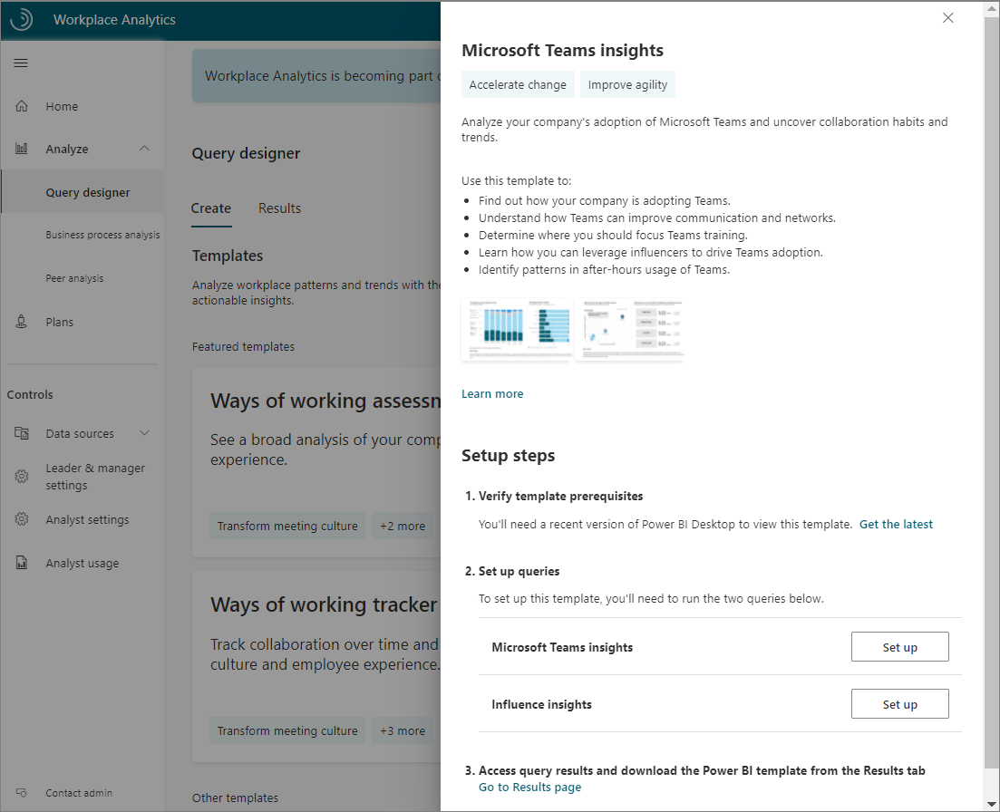

The Microsoft Teams insights dashboard uses a prebuilt Power BI template populated by output (OData) from Workplace Analytics with Viva Insights. The following is an example report that's available in Power BI with this template.

To set up the Power BI dashboard:

1. Complete the setup steps for the Microsoft Teams insights template.
2. Download the Teams insights Power BI template and load the query output.
3. Select your settings in the Teams insights dashboard.

After the data is loaded, the dashboard reports generate automatically. This results in multiple pages of Workplace Analytics reports that give a broad, diagnostic view of Teams adoption.

**1. Complete the setup steps for the Microsoft Teams insights template**. The Teams insights dashboard requires output from two queries. In Query designer, under **Templates**, select the Microsoft Teams insights template and follow the on-screen instructions to run the required queries.

>[!IMPORTANT]
>Be sure to download and install the most recent version of Power BI to avoid issues setting up and loading data into the dashboard.

As you run each query, give it a descriptive name. Then select your date range and applicable exclusions (use the same date range and filters for both queries). To create a report that updates weekly, select **Auto-refresh** for each query.

Some things to keep in mind when running the queries to populate the Teams insights dashboard:

* For best results, select the **Last 6 months** as a date range.
* In **Select metrics**, keep all preselected metrics, and don't delete any of them. The dashboard uses them to create the charts, graphs, and actionable data in the report pages.
* In **Select filters**, if you'd like, filter using the attributes from the organizational data to further refine the population.
* If you'll be filtering for a subset of the population, you'll need to edit all the preselected metrics in the Influencer insights query. If you want to view collaboration activity for Human Resources, you'll need to select the pencil icon and filter on **Organization = Human Resources** for each metric.
* For the Microsoft Teams insights query, in **Select Organizational attributes**, leave the default attributes, and then add any other attributes you'd like to include. Be sure to select the attribute that identifies people managers in your organization. If you cannot find a manager indicator field in the menu, contact your Workplace Analytics Admin to confirm that this data is available within Workplace Analytics.
* For the Influence insights query, in **Select Organizational attributes**, leave the default attributes selected. Don't delete them as they're needed to populate meeting-related charts and graphs in the report pages.

**2. Download the Teams Insights Power BI template and load the query output**. After the queries successfully run, you can access the template and data by copying the OData URL, which is available through the **Link** option for each query in **Query designer** > **Results**.

To load the data into the Teams insights Power BI template:

1. Download the Power BI template from the Microsoft Teams insights query result.
2. When prompted to paste the OData link directly in the Power BI file, select **OK**.
3. Open the downloaded Power BI template.
4. Paste the Teams insights OData link into the Teams insights Query URL field.
5. Return to your results in Workplace Analytics. In the Influence insights query result, copy the OData link to the Influence insights query output.
6. Return to Power BI and paste the Influence insights query OData link into the Influence insights Query URL field.
7. Load the data.

The dashboard visualizations on each page of the report will populate with data from Workplace Analytics, starting with the **Settings** page.

**3. Select your settings in the Teams insights dashboard**. After you've loaded the data to generate the report, change the following settings on the **Settings** page based on your specific analysis needs.

* Select the time period for your report.
* Select an organizational attribute to view the report by.
* To filter for specific groups of employees, select the organizational attribute and values you'd like to filter by.

After you've selected the settings for your population, you can start analyzing the results from the dashboard. The populated dashboard includes report pages on the state of adoption by group, how Teams is changing the ways of working, and how to speed adoption by using community influencers.

## Learn more

[Detailed instructions and troubleshooting for the Teams insight dashboard in Power BI](/viva/insights/tutorials/power-bi-teams)
