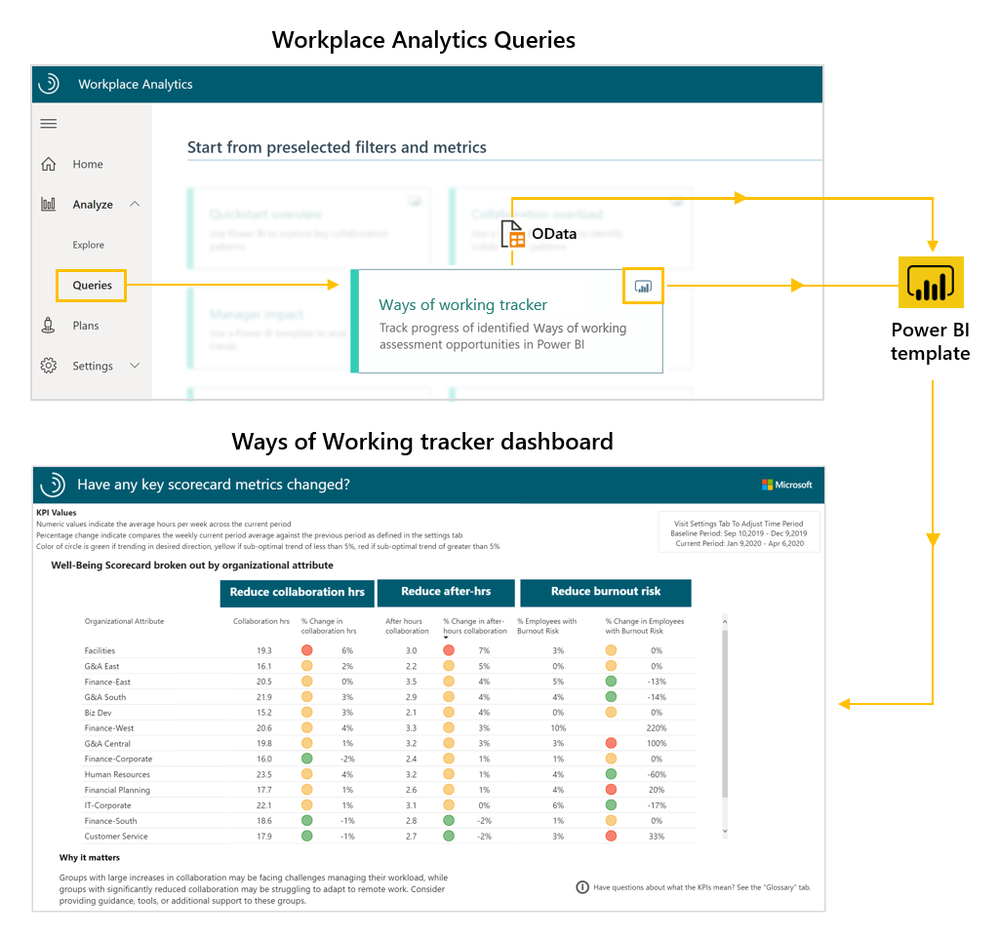
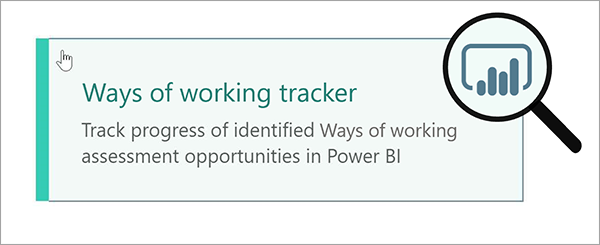
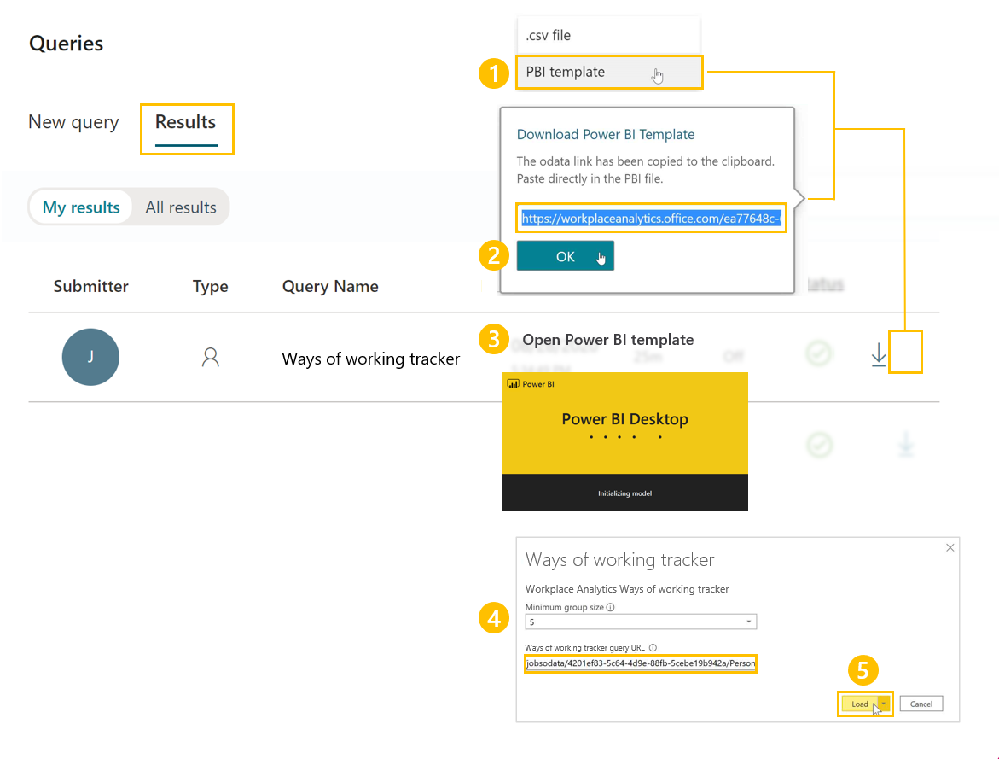
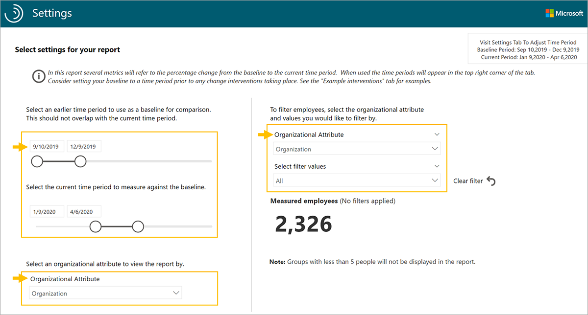
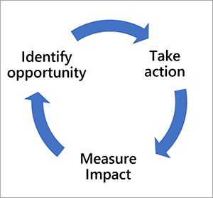

In addition to the in-product metrics found through features such as Workplace Analytics plans and Insights for people managers, you can measure change with flexible queries or by creating custom dashboards. Queries and dashboards help you measure the before and after impact of your change initiatives.

## Prepare the Ways of working tracker dashboard

The Ways of working tracker dashboard uses a prebuilt Power BI template populated by output (OData) from a Workplace Analytics query.

To set up the Ways of working tracker dashboard:

1. Run the Ways of working tracker query.
2. Download the Ways of working tracker Power BI template and load the query output.
3. Select your settings in the Ways of working tracker dashboard.

After the data is loaded the dashboard reports generate automatically, resulting in Workplace Analytics insights on how collaboration in your organization has changed over time. This data provides views into where you can improve employee wellbeing, meeting culture, and manager effectiveness.

## 1. Run the Ways of working tracker query

The Ways of working tracker dashboard requires output from a query in Workplace Analytics. On the Queries page, under **Start from preselected filters and metrics**, you'll find the **Ways of working tracker** query.

In the upper right corner of the Ways of the Ways of working tracker query, you'll notice a Power BI icon. This indicates there's a download option for a Power BI template that you can use to generate the reports in the dashboard.

> [!IMPORTANT]
> Be sure to download and install the most recent version of Power BI to avoid issues setting up and loading data into the dashboard.
>

Select this query to open it. Give the query a descriptive name and select your date range and meeting exclusions. To create a report that updates weekly, you can choose to enable **Auto-refresh** for each query.

- The Last six-month time period is selected by default. For best results, select the **Last one year** for the time period to see before and after any shifts.
- Under **Select metrics**, keep all preselected metrics, and don't delete any. The dashboard uses them to create the charts, graphs, and insights in the report pages.
- Under **Select filters**, filter using the attributes from the organizational data to further refine the population for your analysis.
- Under **Select Organizational attributes**, you can leave the default attributes (Organization, LevelDesignation) selected, or select other ones you would like to filter by when using the reports.

## 2. Download the Ways of working tracker Power BI template and load the query output

After the query has finished running, you can access the Ways of working tracker Power BI template and data via OData URL by clicking the **Results** tab on the Queries page.

To load the data into the Ways of working tracker Power BI template:

1. Download the PBI template from the Ways of working tracker result.
2. When prompted to paste the OData link directly in the PBI file, select **OK**.
3. Open the downloaded Power BI template.
4. Paste the Ways of working tracker OData link into the Ways of Working tracker Query URL field.
5. Load the data.

The dashboard visualizations on each page of the report will populate with Workplace Analytics data, starting with the **Settings** page.

## 3. Select your settings in the Ways of Working tracker dashboard

After you've loaded the data and the report is generated, the dashboard will open to the Settings page, where you have the option to adjust some settings for your analysis.

- Select a date range to use. This is the time period you'll use to track collaborative behavior over time.
- Select from the list of organizational attributes you chose to include in your query. Default attributes are Organization and LevelDesignation, but the list will also include any other organizational attributes selected when you ran the queries.
- To filter the reports further, select any of the available organizational attributes filter values for the data you'd like to include.

After you've selected the settings for the population you'd like to analyze, you can start using the dashboard. The populated Ways of working tracker dashboard includes report pages on how KPIs have changed and evolved over time, and in the last week, differences in collaboration between groups, manager effectiveness, after hours and meeting trends, a well-being scorecard, and key opportunity areas.

## Dashboard features

The Ways of working tracker contains key components that you can replicate when creating custom dashboards to track change over time.

- Line graphs to identify overall trends across KPIs
- Scorecards to track key change initiatives
- Visualizations to identify trends before and after actions have been taken

These outputs can be used to create executive presentations and business-intelligence tools to further drive transformation.

It's important to note that driving change is often a journey that consists of using Workplace Analytics to identify the opportunity, designing tactics to take action, and measuring impact. These steps allow you to continuously make progress on realizing your key business outcomes.

## Learn more

- [Ways of working tracker dashboard tutorial](/Workplace-Analytics/tutorials/power-bi-collab-track?azure-portal=true)

This topic includes template updates, setup instructions with video, things to remember when sharing the dashboard, FAQs, errors and troubleshooting, and support.
