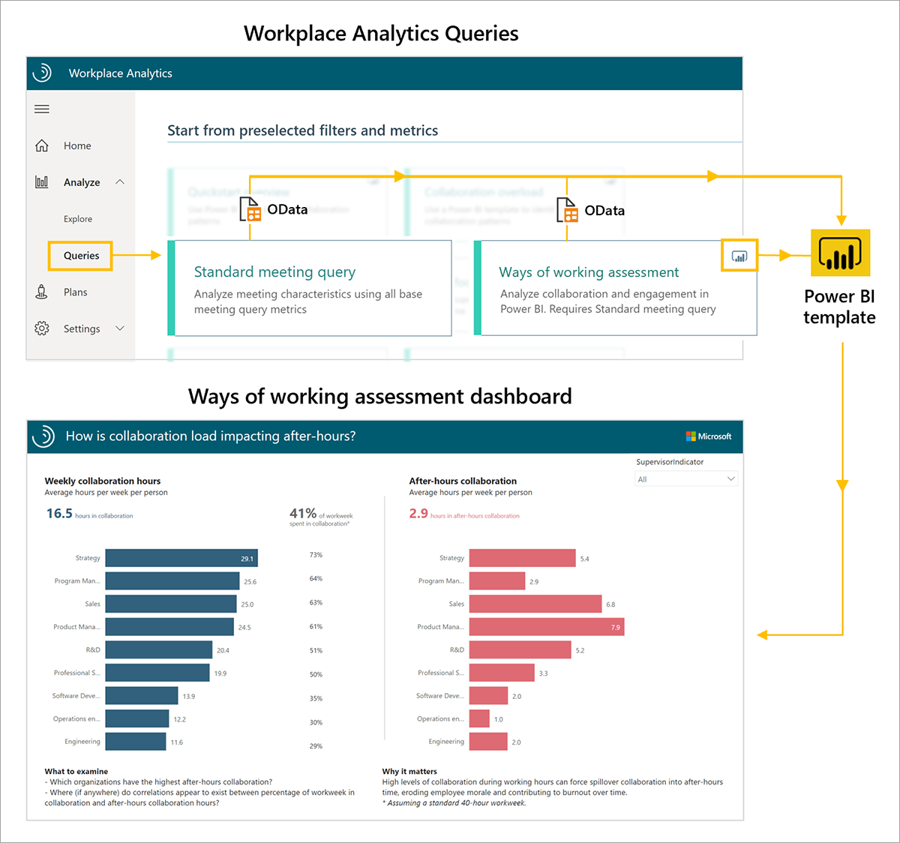
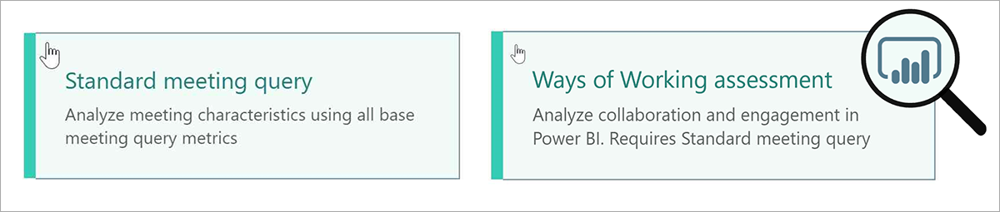

The Ways of working assessment dashboard uses a prebuilt Power BI template populated by output (OData) from two Workplace Analytics queries, Standard meeting and Ways of working assessment.

To set up the Ways of working assessment dashboard:

1. Run the Ways of working assessment and Standard meeting queries.
2. Download the Ways of working assessment Power BI template and load the query output.
3. Select your settings in the Ways of working assessment dashboard.

Once the data is loaded the dashboard reports will generate automatically, resulting in multiple pages of Workplace Analytics insights, called reports. These reports give a broad, diagnostic view of collaboration in your organization.

**1. Run the Ways of working assessment and Standard meeting queries**. The Ways of working assessment dashboard reports require output from two Workplace Analytics queries. On the Queries page, under **Start from preselected filters and metrics**, begin by running the Ways of working assessment and Standard meeting queries.

In the upper right corner of the Ways of working Assessment query, you'll notice a Power BI icon. This indicates there's a download option for a Power BI template that you can use to generate the reports in the dashboard.

> [!IMPORTANT]
> Be sure to download and install the most recent version of Power BI to avoid issues setting up and loading data into the dashboard
>

As you run each query, give it a descriptive name and select your date range and meeting/attendee exclusions.  (use the same date range and filters for both queries). To create a report that updates weekly, you can choose to enable **Auto-refresh** for each query.

Some tips to keep in mind when running the queries:

- For best results, select the **Last 6 months** or **Last 3 months** for the time period to see a diagnostic view of recent behavior.

- Under Select metrics, keep all preselected metrics. Do not delete any of these metrics. The dashboard uses them to create the charts, graphs, and insights in the report pages.

- Under **Select filters**, optionally filter using the attributes from the organizational data to further refine the population.

- If you're filtering for a subset of the population, you'll need to edit all the preselected metrics in the Standard meeting query as well. As an example, if you want to only view collaboration activity for Human Resources, for each metric in the Standard meeting query you would select the pencil icon and filter on **Organization = Human Resources**.

- In the Ways of working assessment query, under **Select Organizational attributes**, leave the default attributes (Organization, LevelDesignation) selected. Then locate and select the attribute that identifies people managers (if you cannot find a manager indicator field in the drop-down menu, contact your Workplace Analytics Admin to confirm it was included in the organizational data). Optionally, select additional attributes you'd like to include in the reports.

- In the Standard meeting query, under **Select Organizational attributes**, leave the default attributes (IsRecurring, Subject, and DurationHours) selected. Don't delete these attributes as they're needed for the meeting-related charts and graphs in the report pages.

**2. Download the Ways of working assessment PBI template and load the query output**. Once the queries have finished running, you can access the Ways of working assessment Power BI template and data through the OData URL by clicking the **Results** tab on the Queries page.

To load the data into the Ways of working assessment Power BI (PBI) template:

1. Download the PBI template from the Ways of working assessment result.
1. When prompted to paste the OData link directly in the PBI file, click **OK**.
1. Open the downloaded PBI template.
1. Paste the Ways of working assessment OData link into the Ways of working assessment Query URL field.
1. Return to your results in Workplace Analytics. In the Standard meeting query result, copy the OData link to the Standard meeting query output.
1. Return to Power BI and paste the Standard meeting query OData link into the Standard meeting Query URL field.
1. Enter the name of the supervisor indicator field you selected when running the Ways of working Assessment query.
1. Select **Load** to load the data.

The dashboard visualizations on each page of the report populate with Workplace Analytics data, starting with the Settings page.

**3. Select your settings in the Ways of working assessment dashboard**. After you've loaded the data and the report is generated, the dashboard opens to the Settings page, where you have the option to adjust some settings for your analysis.

- Select the time period for your report and choose whether to exclude certain weeks such as holiday weeks from the results.
- Select an organizational attribute to view the report by.
- Filter to your population of interest (if needed) along any organizational attribute.

Once you've selected the settings for the population you would like to analyze, you can start using the dashboard. The populated Ways of working assessment dashboard includes report pages on total collaboration, after hours, meeting culture, multitasking behaviors, manager relationships and more.

For a more detailed list of step-by-step instructions on Ways of working assessment dashboard setup and troubleshooting see the link below under **Learn more**. There you'll also find template updates, setup instructions with video, things to remember when sharing the dashboard, FAQs, errors and troubleshooting, and support.

## Learn more

[Ways of working assessment dashboard](/Workplace-Analytics/tutorials/power-bi-collab-assess?azure-portal=true)
