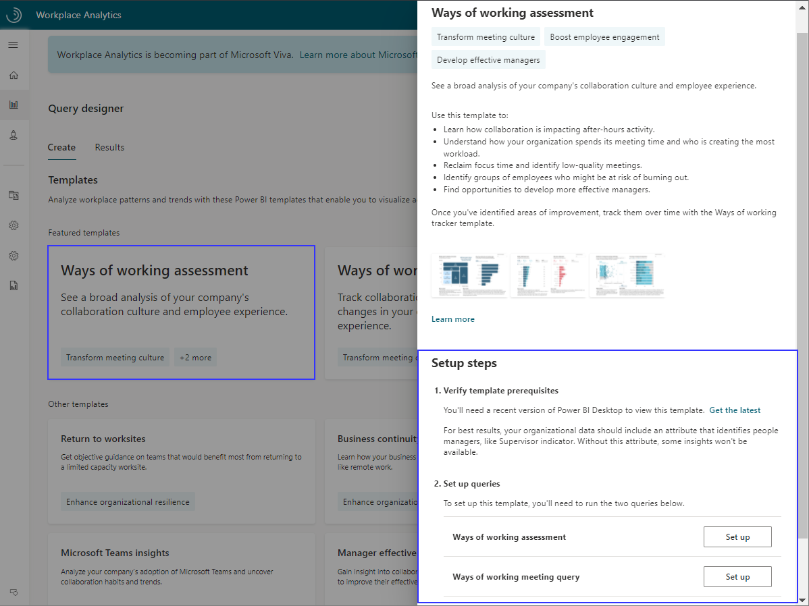
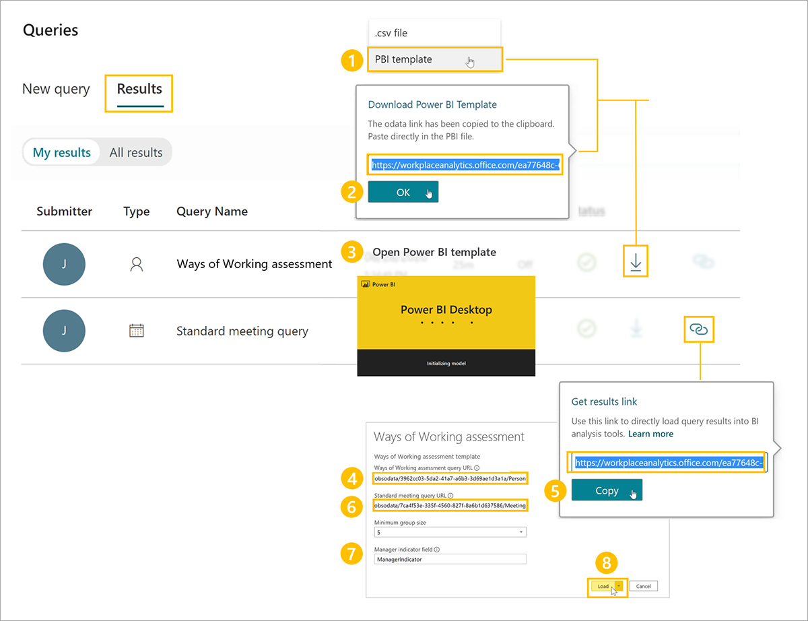

The Ways of working assessment dashboard uses a prebuilt Power BI template populated by output (OData) from the Ways of working assessment and Ways of working meeting queries available through the Query designer template setup steps.

To set up the dashboard:

1. Set up the template.
2. Download the template and load the query output.
3. Select the dashboard settings.

After the data is loaded, the dashboard reports will generate automatically in Power BI, resulting in multiple pages of organizational insights, called reports. These reports give a broad, diagnostic view of collaboration in your organization.

**1. Set up the template**. In Query designer, select the template and follow the on-screen instructions to set it up.

>[!IMPORTANT]
>Be sure to download and install the most recent version of Microsoft Power BI desktop to avoid any issues with setting up and loading data into the dashboard.

For each query, give it a descriptive name and select your date range and exclusions. Use the same date range and filters for both queries. To create a report that updates weekly, select **Auto-refresh** for each query.

Tips when running the queries:

* For best results, select the **Last 6 months** or **Last 3 months** for the time period to see a diagnostic view of recent behavior.
* In **Select metrics**, keep all preselected metrics. Do not delete any of these metrics. The dashboard uses them to create the charts, graphs, and insights in the reports.
* In **Select filters**, you can optionally filter by organizational data attributes to further refine the population.
* If you're filtering for a subset of the population, you'll need to use the same metrics and filters in both queries. For example, if you want to only view collaboration activity for Human Resources, for each metric in each query, you'd select the **Edit** (pencil) icon and filter by **Organization = Human Resources**.
* For the Ways of working assessment query, in **Select Organizational attributes**, leave the default attributes (`Organization`, `LevelDesignation`) selected. Then locate and select the attribute that identifies people managers (if you cannot find a manager indicator field in the menu, contact your Workplace Analytics Admin to confirm it's availability). Optionally, select additional attributes you'd like to include in the reports.
* For the Standard meeting query, in **Select Organizational attributes**, leave the default attributes (`IsRecurring`, `Subject`, and `DurationHours`) selected. Don't delete these attributes as they're needed for the meeting-related charts and graphs in the reports.

**2. Download the template and load the query data**. After the queries successfully run, in **Query designer** > **Results**, copy the OData URL for the Ways of working assessment query results.

To download the template and load the data into the Power BI dashboard:

1. In **Query designer** > **My results**, download the template from the **Ways of working assessment** query result.
2. When prompted to copy the OData link, select **OK**.
3. Open the downloaded Power BI template.
4. When prompted by Power BI, paste the OData link in the **Ways of working assessment Query URL** field.
5. In **Query designer** > **My results**, copy the OData link for the **Ways of working meeting query** result.
6. In Power BI, paste the OData link in the **Ways of working meeting query URL** field.
7. Enter the name of the supervisor indicator field you selected when running the Ways of working assessment query.
8. Select **Load** to load the data.

The dashboard visualizations on each page of the report populate with Workplace Analytics data.

**3. Select the dashboard settings**. After the data is loaded and the report is generated, you'll see Settings in the dashboard, where you can confirm and change the dashboard settings for your analysis.

* Select the time period for your report and choose whether to exclude certain weeks from the results, such as holiday weeks.
* Select an organizational attribute to view the report by.
* Filter to your population of interest (if needed) along any organizational attribute.

After confirming the settings for the population you want to analyze, you can start using the dashboard. This dashboard includes reports about total collaboration, after-hours work, meeting culture, multitasking behaviors, manager relationships, and more.

See the documentation link in [Learn more](#learn-more) for template updates, setup instructions, tips on sharing the dashboard, FAQs, and troubleshooting.

## Learn more

[Ways of working assessment dashboard](/viva/insights/tutorials/power-bi-collab-assess)
