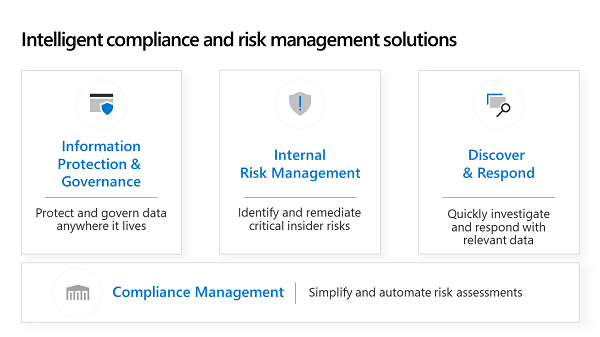

The exponential growth of data and the increased number and complexity of regulatory requirements is increasing the cost of compliance.  So, when we talk with customers about compliance, we are fundamentally talking about managing the cost of compliance.  Microsoft can help manage the cost of compliance by bringing more intelligence into risk 
assessment and management.

|||
| :-- | :-- |
| | Watch this video to understand how you can have the conversation around simplifying compliance management with business decision makers in your organization.|

>[!VIDEO https://www.microsoft.com/videoplayer/embed/RE3PP3I]

In the previous video, we talked about the shared responsibility model, **Compliance Manager** and **Service Trust Portal**, as ways to help simplify and automate risk assessments.  On top of compliance management, there are three categories of intelligent compliance and risk management solutions, as depicted in the image below.

Organizations need to protect and govern data anywhere it lives.  They also face the challenge of detecting, managing, and protecting sensitive information as it travels both inside and outside of the organization, while ensuring users remain productive.  This challenge calls for a multi-layered strategy that addresses a diverse set of organizational requirements and empowers customers to deliver information protection to their own apps and services, through an extensible set of APIs and tools.

|||
| :-- | :-- |
| | Watch this video to learn more about positioning a multi-layered approach for information protection within your organization.|

>[!VIDEO https://www.microsoft.com/videoplayer/embed/RE3PZsI]

In the last video, we focused the conversation around the challenges of **information protection and governance**.  This comprehensive approach to knowing your data, protecting your data, and governing your data, enables customers to address these challenges throughout the data’s lifecycle, anywhere it lives.  Now let's extend that conversation to identifying and remediating critical insider risks and the requirements needed to quickly investigate and respond with relevant data to address compliance obligations.

|||
| :-- | :-- |
| | Watch this video to help you meet the challenges associated internal risk management and discovery & response.|

>[!VIDEO https://www.microsoft.com/videoplayer/embed/RE3PP3H]

In the previous video, we talked about capabilities such as **communications supervision** and **privileged access management** to manage internal risk. We also described how **data investigations & remediation** and **advanced e-discovery** help organizations respond to regulatory requests with confidence using built-in search and discovery tools.  Our comprehensive set of intelligent compliance and risk management solutions gives customers the flexibility to implement the necessary controls to meet both internal and external security and compliance requirements.

Now that we’ve explored how to have the business conversations to position the value of a cloud based modern workplace with Microsoft 365 and Surface for Business, let’s move onto the knowledge check.

