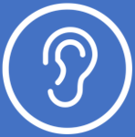
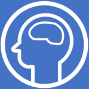
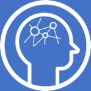
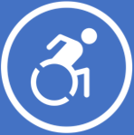
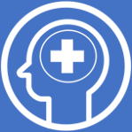

## Empowering a diverse workforce through Microsoft 365 Accessibility

When technology reflects the diversity of everyone who uses it, there are no limits to what people can achieve.  With more than a billion people worldwide with disabilities, accessibility is a human imperative that presents a real opportunity and responsibility to create inclusive technology for everyone.  Yet, only 1 in 10 people with a disability have access to the products and assistive technology they need.

Since disabilities can affect anyone of us, it’s important for companies to encourage and foster a culture of inclusiveness. Organizations that embrace inclusivity by employing and supporting persons with disabilities outperform their peers.  According to one study from Accenture over a four-year period, companies that supported disability and inclusion had 28 percent higher revenue, double the net income, and 30 percent higher economic profit margins than their peers.

This opportunity could lead to a $25 billion boost for the U.S. Gross Domestic Product (GDP) if more people with disabilities joined the labor force. One company leading the charge is TD Bank Group, headquartered in Toronto, Canada.  Along with their own Assistive Technologies Lab, TD is currently rolling out Office 365 and Windows 10 with the goal of empowering a diverse workforce that can drive innovation and help create inclusive customer products.

|||
| :-- | :-- |
| | Watch this video to see how TD Bank embraces a culture of diversity, accessibility, and inclusion in their modern workplace to boost employee engagement, productivity, and ingenuity.|

>[!VIDEO https://www.microsoft.com/videoplayer/embed/RE3OJBH]

As you just saw with TD Bank, embedding the principles of accessibility and inclusive design into its everyday practices helped build an accessibility culture that benefits everyone. Embracing inclusion and accessibility at Microsoft means doing it in a way that creates a sustainable culture of accessibility that lasts way beyond any of us.

To that end, we've embedded four pillars of accessibility into our DNA. The first of these pillars begins with our **culture** and our people at Microsoft.  It's important to hire talent with disabilities to ensure we create good **products** that work for everyone, with accessibilities embedded into those products and not just bolted on as an afterthought...then shoring it all up with **systems** across the company that think about inclusion from start to finish. Accessibility itself helps drive innovation to change what's possible for people with disabilities and ensures we have a continuous focus on the **future**.

Our accessibility efforts focus on the following areas to meet several accessibility standards (EN 301 549, WCAG 2.0, ISO/IEC 40500).

|||
| :-- | :-- |
| | **Vision** Accessibility tools and features for people who are blind, color blind, or have low vision – can include: a larger screen; a brighter screen and a screen reader to read text.|
| | **Hearing** For those people who are hard of hearing, have hearing loss, or have deafness, our specialized features can provide solutions including closed captioning, mono sound, and live call transcription.|
| | **Neurodiversity** Innovative tools such as dictation and Windows Hello sign-in can make the digital world more accessible for those people who live with dyslexia, seizures, autism, or other cognitive disabilities.|
| | **Learning** Our applications for people who have learning disabilities can help increase focus, concentration, and understanding—and include tools to improve reading and writing skills.|
| | **Mobility** Our suite of products helps people who have arthritis, quadriplegia, spinal cord injuries, and other mobility issues to navigate the digital world in non-traditional ways.|
| | **Mental Health** We're developing assistive technologies for people who have issues such as bipolar disorder, anxiety, PTSD, depression, or ADHD. Our products can help with distraction, reading, and concentration.|

Now that you've seen how everyone can do their best work with Microsoft 365, let's move onto the knowledge check.

