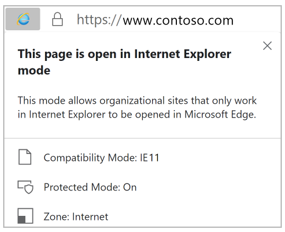

When a site loads in IE mode, the IE logo indicator displays on the left side of navigation bar. You can click the IE logo indicator to display additional information, as shown:

Watch the video below to see how Internet Explorer mode works in Microsoft Edge.

> [!VIDEO https://www.microsoft.com/videoplayer/embed/RE4FeB3]

As you saw in the video, you can define a subset of sites that are rendered seamlessly in IE mode on Microsoft Edge. Similarly, you can actively prevent people from using Internet Explorer and force them to use Microsoft Edge with IE mode.

Only those sites that you specifically configure (via policy) will use IE mode, all other sites will be rendered as modern web sites. For a site to use IE mode, you need to:

- List the site in the Enterprise Mode Site List XML defined in one of these policies:
    - Microsoft Edge 78 or later, "Configure the Enterprise Mode Site List"
    - Internet Explorer, "Use the Enterprise Mode IE website list"

    > [!NOTE]
    > We only process one Enterprise Mode Site List. The Microsoft Edge site list policy takes precedence over the Internet Explorer site list policy.

- Enable the **Send all intranet sites to Internet Explorer** group policy setting for Microsoft Edge 77 or later, so all intranet sites open in IE mode. 

### IE mode supports the following Internet Explorer functionality

- All document modes and enterprise modes
- ActiveX controls (such as Java or Silverlight)
- Browser Helper Objects
- Internet Explorer settings and Group Policies that affect the security zone settings and Protected Mode
- The F12 developer tools for IE, when launched with [IEChooser](/office/dev/add-ins/testing/debug-add-ins-using-f12-developer-tools-on-windows-10)
- Microsoft Edge extensions (Extensions that interact with the IE page content directly are not supported.)

### IE mode doesn't support the following Internet Explorer functionality
- Internet Explorer toolbars
- Internet Explorer settings and Group Policies that affect the navigation menu (for example - search engines, and home pages.)
- IE11 or Microsoft Edge F12 developer tools
