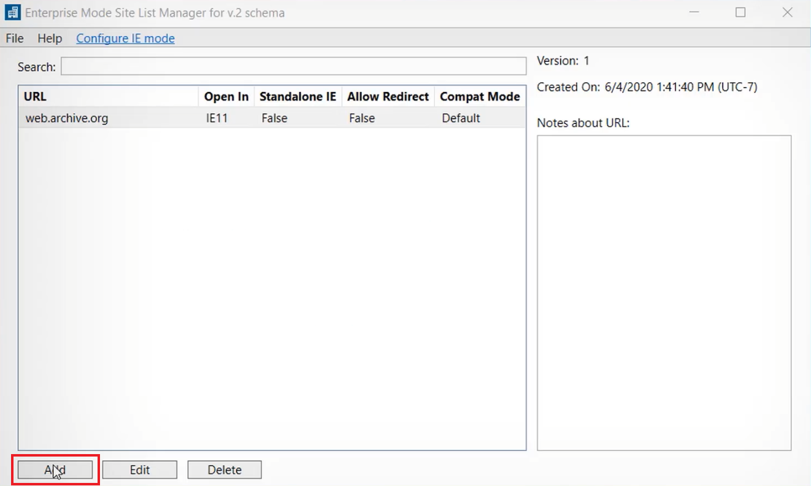
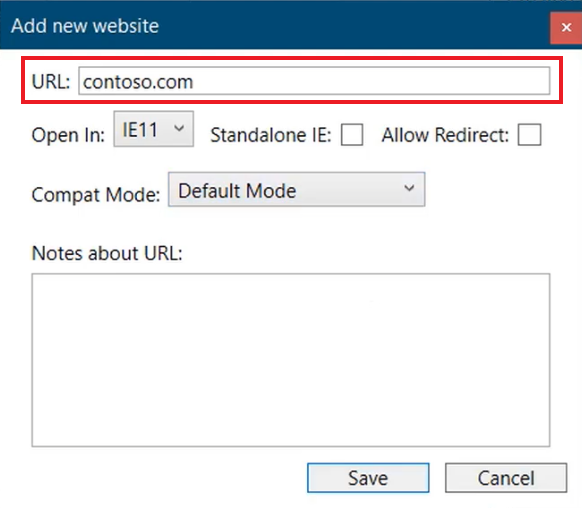
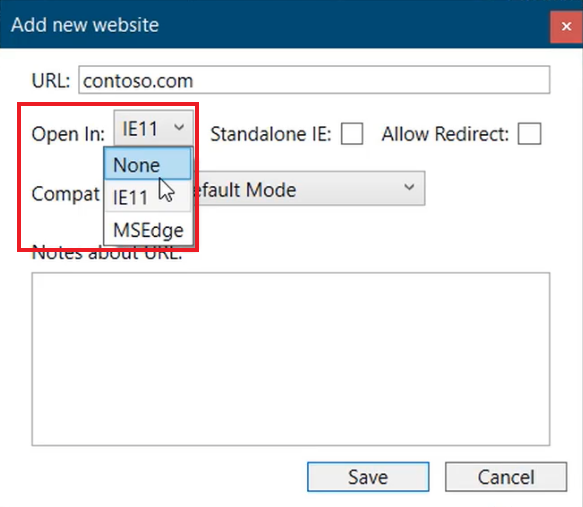
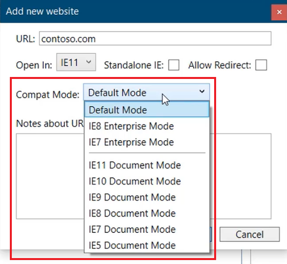

Enterprise Mode is a compatibility mode that runs on Internet Explorer 11, letting websites render using a modified browser configuration that's designed to emulate either Windows Internet Explorer 8 or Windows Internet Explorer 7, avoiding the common compatibility problems associated with web apps written and tested on older versions of Internet Explorer.

You can use IE11 and the Enterprise Mode Site List Manager to add individual website domains and domain paths and to specify whether the site renders using Enterprise Mode or the default mode.

In the video below, you’ll see how to configure legacy sites in the Enterprise Mode Site List Manager.

> [!VIDEO https://www.microsoft.com/videoplayer/embed/RE4Fm7D]

As you just saw in the video, the Enterprise Mode Site List Manager can be used to create a list of sites to be rendered in either IE 11 or Edge.  You can then use group policy to configure Enterprise Mode for the list of sites.

### Download and use the Enterprise Mode Site List Manager

1. Download and install the [Enterprise Mode Site List Manager (schema v.2)](https://aka.ms/EMSLM)
1. Open **Enterprise Mode Site List Manager** and select **Add** to enter a new site to the list.

    

1. Enter the URL that you want to target with Enterprise Mode. Entering HTTP and HTTPS is not required.

    

1. Select **None**, **IE11**, or **MSEdge** from the dropdown to force the URL to render using the browser you choose.  Selecting **None** from the dropdown will specify that site as a neutral site and render it in the currently open and running browser.

    

1. Check the **Standalone IE** box to open the site a new IE window.  It is recommended to leave this box unchecked and open the site in a new tab within Edge.
1. Check the **Allow Redirect** if you want redirected sites to open in the browser that’s currently open, or if it should render using the option selected in the **Open In** dropdown list. 
1. Select which IE level to render the site in from the **Compat Mode** dropdown list. **Default Mode** is recommended in most cases.

    

1. Select **Save** when complete, and then select **File > Save XML** from the application menu.
1. Save to a network location accessible by users in your organization.
1. Next, you’ll configure group policy to enable Enterprise Mode for the sites you just configured in the list.

> [!NOTE]
> In order for IE mode to work properly, authentication / Single Sign-On servers will need to be explicitly configured as neutral sites. Otherwise, IE mode pages will try to redirect to Microsoft Edge, and authentication will fail.  
> A neutral site will use the browser where the navigation started, either Microsoft Edge or IE mode. Configuring neutral sites ensures that all applications using these authentication servers, both modern and legacy, continue to work.
