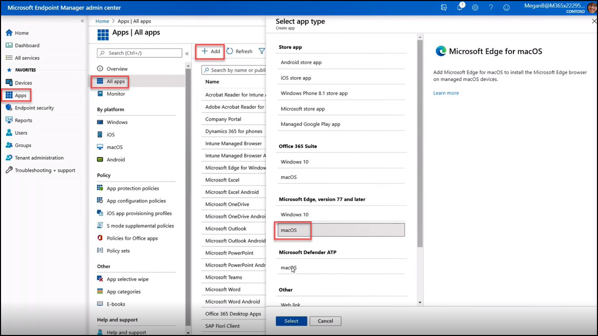
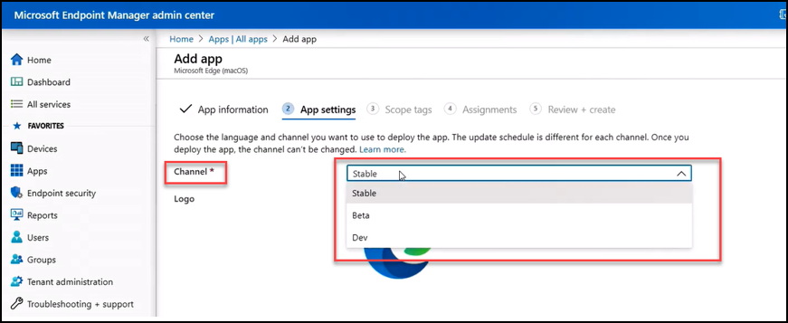
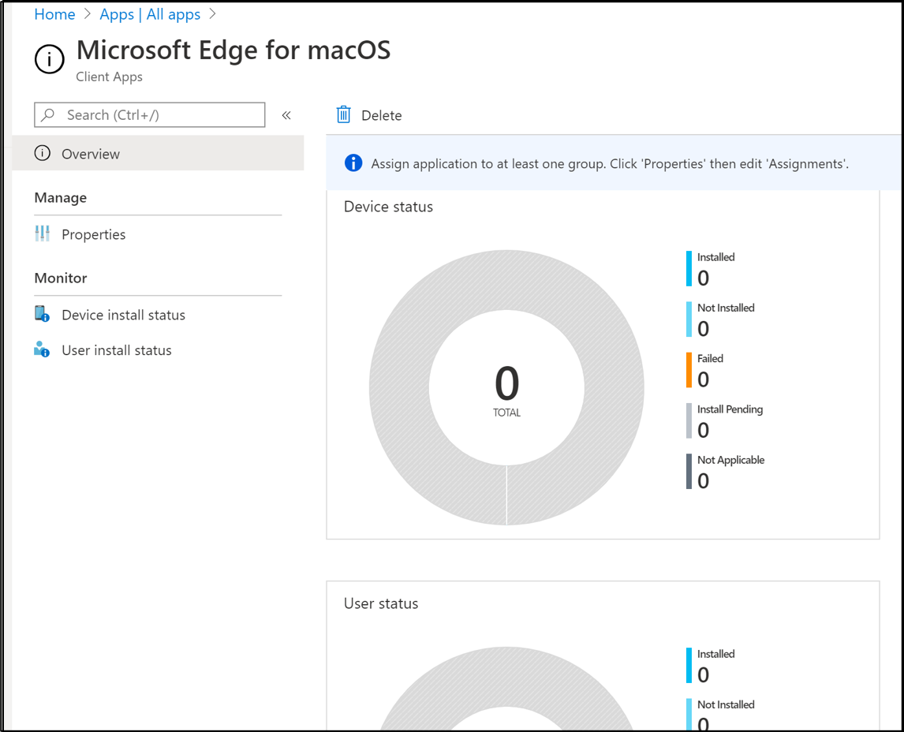

Microsoft Edge is fully integrated with Intune, for both Windows and non-Windows devices. Watch this video to see the steps to add Microsoft Edge for macOS as a package to deploy to users at scale.

>[!NOTE] 
> You cannot use the built-in application deployment of Microsoft Edge for workplace join computers. Built-in application deployment requires the Intune management extension, which only exists for AAD joined devices. You can still deploy Microsoft Edge version 77 and later using an .msi uploaded to Apps, see [Add a Windows line-of-business app to Microsoft Intune](/mem/intune/apps/lob-apps-windows).

 

>[!VIDEO https://www.microsoft.com/videoplayer/embed/RE4xAqm]

To recap:

 

1) From the Microsoft Endpoint Manager admin center, select **Apps**, then **All Apps**, then select **+ App**, to add an app.

2) From the **Select app type** screen, select the drop down-arrow and under **Microsoft Edge, version 77 and later**, select macOS, then press **Select**, as shown below.

 

    

    *Adding Edge on macOS with Microsoft Endpoint Manager*

 

3) On the **App Information** screen, update the information fields, as desired, then select **Next.**

4) From the **App settings** screen, select the desired **Channel**, from the drop-down, as shown below.

 

    

    *Edge settings in Microsoft Endpoint Manager*
 

5) From the **Scope tags** screen admins can add scope tags. This is a great way to filter profiles.

6) Then in the **Assignments screen**, select the devices, users, or groups to which deploy the application

7) Then finally from the **Review + Create** screen, verify the information, and select **Create** to deploy Microsoft Edge to the selected devices.

8) Admins will be able to see device and user install status, as shown below.

 
    

    *Dashboard for Edge for macOS*
