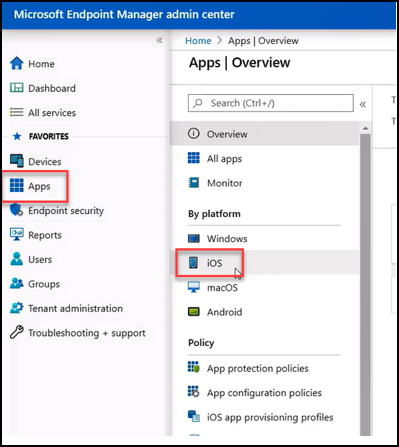
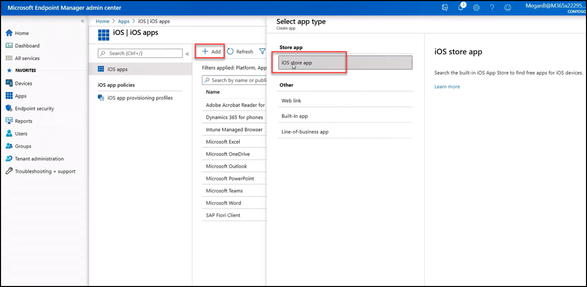
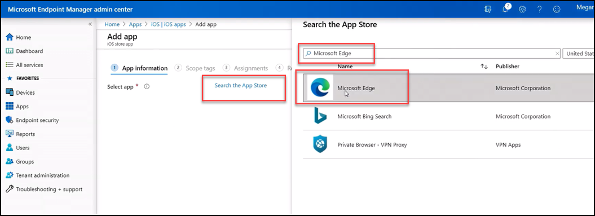
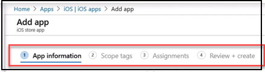

Lastly, we will walk through the process to configure and deploy Microsoft Edge to your mobile devices, using iOS devices as an example. 

>[!VIDEO https://www.microsoft.com/videoplayer/embed/RE4xFD3]

To recap, the process is very similar as shown above:

1) From the Microsoft Endpoint Manager admin center, select **Apps**, then under **By Platform**, select **iOS**, as shown below.

 

    

    *Add Edge for iOS devices in Microsoft Endpoint Manager*

 

2) From the **iOS apps** screen, select **+Add,**  then from the **Select app type** screen select **iOS store app**, as shown below. 

 

    

    *Search for Edge in the App Store, from Microsoft Endpoint Manager*

 

3) From the **Add app** screen select **Search the App Store**, then from the Search the App Store screen, enter **Microsoft Edge**. Select the **Microsoft Edge** from the list of options then press **Select**, as shown below.

 

    

    *Search for Edge in the App Store, from Microsoft Endpoint Manager*

 

4) Once the application is selected, the **Add app** screen displays. Admins will navigate through the different screens: 

	- Review **App Information** 

	- Apply **Scope tags** as needed 

	- On the Assignments screen assign the different iOS devices to which Microsoft Edge will be deployed, as on the **Assignments** screen 

	- Then **Review + Create**. Once the admin selects **Create**, Microsoft Edge will soon begin to appear on those devices

 

    

    *Screens to configure Edge for iOS in Microsoft Endpoint Manager*
 

Similar process would apply for Android devices, so regardless of the device mobile device platform, Intune makes greatly simplifies the process.
