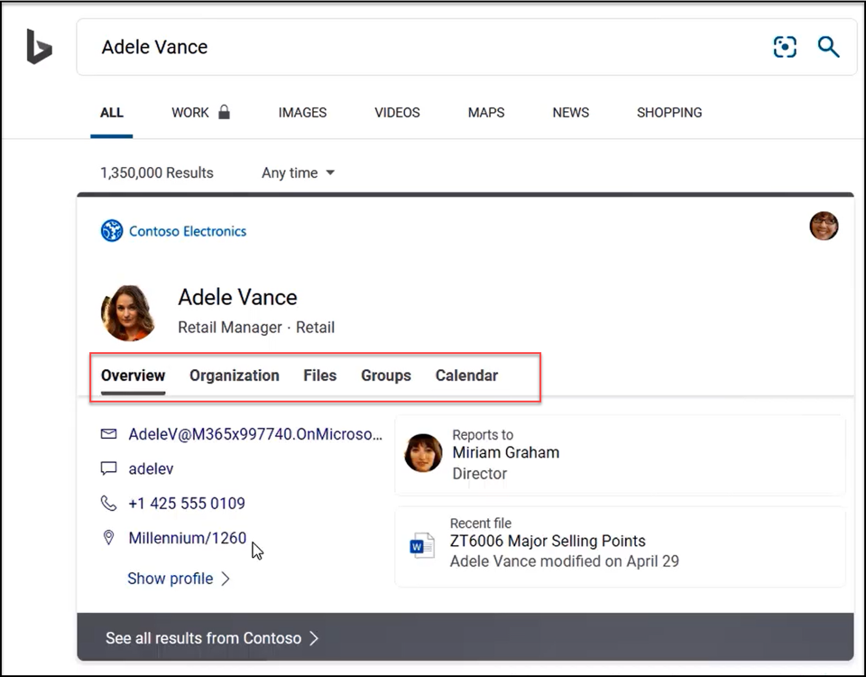
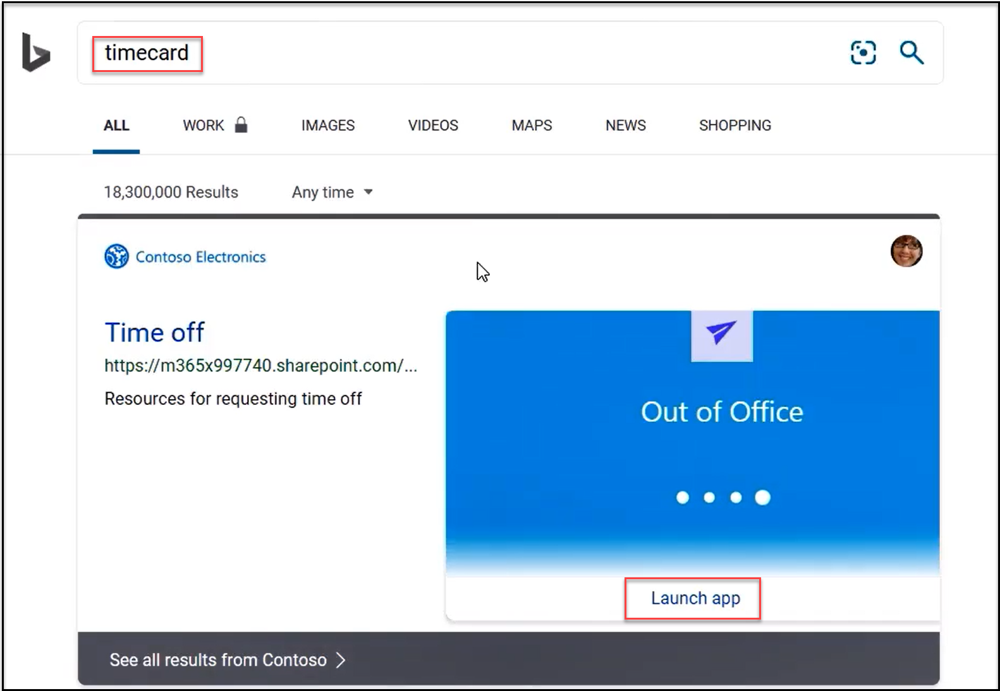

Microsoft Search helps users find relevant content. It's a secure way to search both your intranet and web content. This type of integration across the web and organizations is only available from Microsoft. With Microsoft Search, administrators can use their knowledge of an organization to make it easy for users to find relevant content.

 

In this video, you'll see the user experience that is possible with Microsoft search.

>[!VIDEO https://www.microsoft.com/videoplayer/embed/RE4xNsh]
 

To recap, users can search for internal corporate content, from within Microsoft Search. Examples of corporate content that can be searched include:

- Corporate sites – Users can search for corporate sites, such as HR. Results tailored to your organization appear along with public search results. Users can click into the search result for your company, to land on the internal corporate page.

- Q&A – Users can also enter a question, directly on the search bar, then click into the search result for your company, to land on the associated corporate page. 

- People – Users can search for people within your organization and based on the permissions configured in search, users can see information including organization hierarchy, groups to which the person belongs, upcoming meetings, office location, and even directions and office floor plan. 

 

    

   *Use Microsoft Search to search for people within your organizations*

 

- Content from OneDrive and SharePoint – Users can search for files or content that is stored across Microsoft OneDrive for Business and SharePoint.

- Interactive experiences – Microsoft search is integrated with Power Apps. Users searching for a topic, for which there is an associated app, can launch the app from within Microsoft Search. The image below shows the results for a search on timecard and the link to launch the app.

 

    

   *Use Microsoft Search to search and launch a timecard Power App*

All these search experiences that work from the Edge browser on your PC also work from the Edge browser on your mobile device. 

 

This search experience is also supported in Google Chrome and end users maintain flexibility over search engine settings.

 

