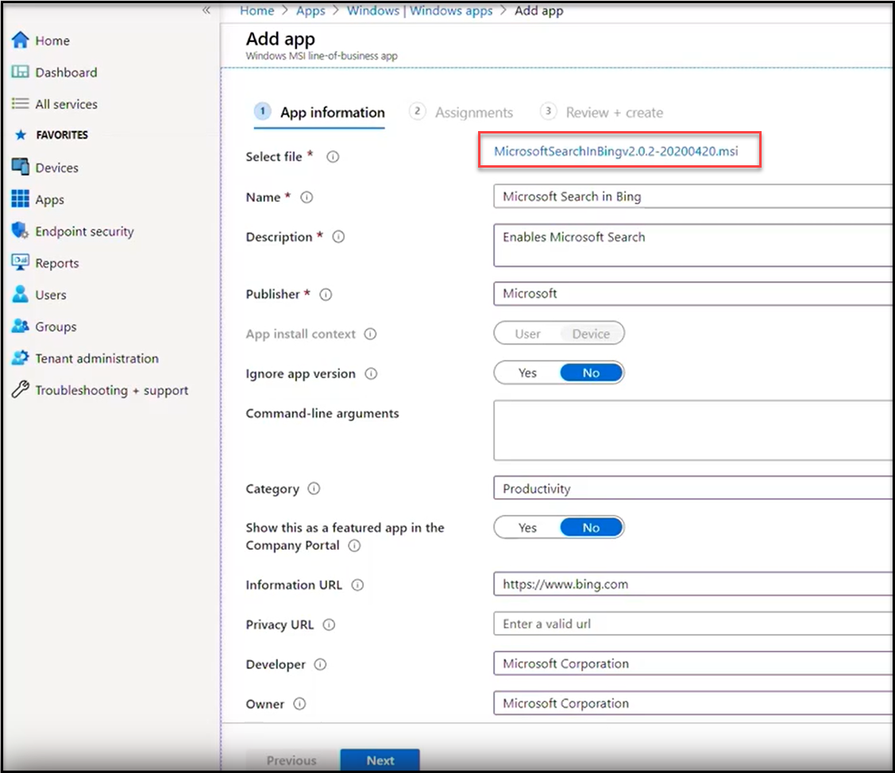
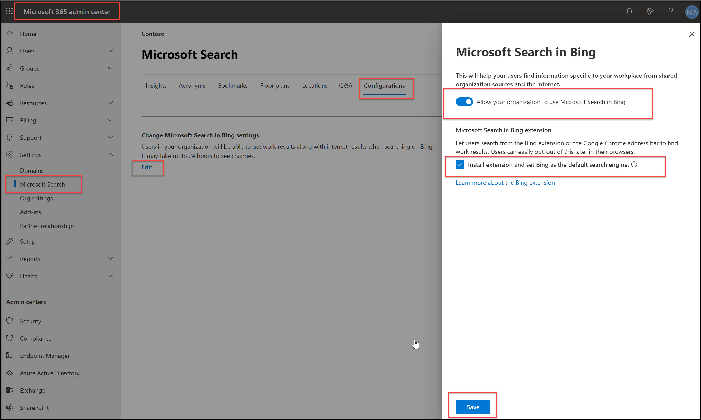
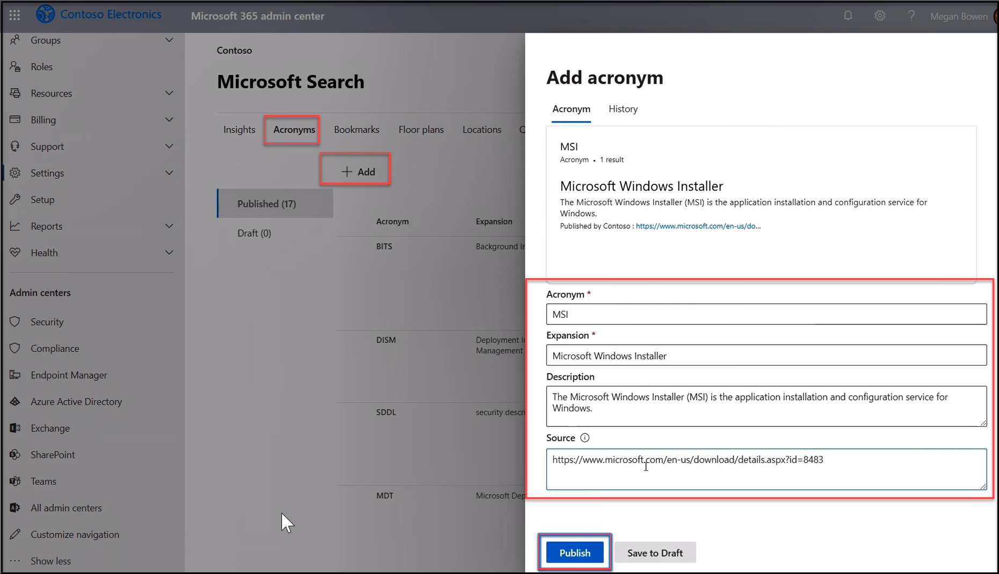
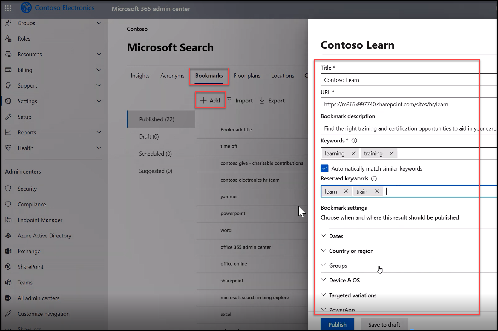

Microsoft Search is built into the new Microsoft Edge browser, so no additional configuration is needed. For Google Chrome, the browser extension needs to be provisioned and Bing configured as the default search engine. With Microsoft Search available on your client devices, you can set up the desired controls for your organization, including acronyms, bookmarks, locations, floor plans, and more. 

 

Watch this video to learn more.

 

>[!VIDEO https://www.microsoft.com/videoplayer/embed/RE4xAqn  ]
 

To recap, devices running the new Microsoft Edge Browser require no additional configuration to use Microsoft Search. For devices running Google Chrome, the steps for configuring Microsoft Search are as follows.

1) Download the required extension at [aka.ms/SearchMSI](https://aka.ms/SearchMSI). You can deploy this package with Microsoft Endpoint Manager or your preferred software distribution tool. 

 

    

   *Deploy MSI package to use Microsoft Search with GoogleChrome*

 

 

2) To allow the Google Chrome extension to be installed, follow the steps below:

	- Sign in to the **Microsoft 365 admin center** with your admin account. 

	- Then, go to **Show all** > **Settings** > **Microsoft Search** > **Configurations**, and then choose **Edit**.

	- There you'll see the **Install extension and set Bing as the default search engine** check box. The check box is not selected by default.

	- To allow the extension to be installed, select the check box, and then choose **Save**.

 
    

   *Install Microsoft Search extension and set Bing as default search engine, for Google Chrome*

 

 

To learn more, go to [How does the Microsoft Search in Bing extension for Google Chrome get installed?](/deployoffice/microsoft-search-bing).

 

Once devices are provisioned you to configure Microsoft Search controls, specific to your organization. Example configurations to add acronyms and bookmarks are shown below. 

1) Sign in to the **Microsoft 365 admin center** with your admin account, then, go to **Show all** > **Settings** > **Microsoft Search**

2) To configure Acronyms, select **Acronyms**, then select **+ Add**, then from Add acronym screen, populate the fields for **Acronym**, **Expansion**, the **Descriptio**n, and **Source.** Once all the fields are populated, select **Publish**, as show below.

 

    

   *Add an Acronym for Microsoft Search*

 

3) Similar steps apply to add Bookmarks. Select **Bookmarks**, then select **+ Add.** There are several options you can configure with bookmarks:

	- Define **title**

	- **URL** 

	- A **description** 

	- Relevant **keyword**s 

	- **Reserved keyword** – these override other keywords, think of things like “time sheet”, so it appears above everything else

	- In **Dates** you can define date ranges,

	- **Country or region** allows you to geo-target results 

	- In **Groups** you can target specific security groups 

	- **Device and OS** – which is useful for desktop or mobile-only sites 

	- With **Target variation** you can pivot results specific to OS or region and create multiple variations so you don’t need to create new bookmarks for each variation 

	- **Power Apps** – where you can deliver a Power App inline with search – this is great for scenarios where the person searching needs to write back to another system

	-  Once all the fields are populated, select **Publish**, as show below

    

   *Add a Bookmark for Microsoft Search*

Additional controls can be configured, including [locations](/microsoftsearch/manage-locations), [floor plans](/microsoftsearch/manage-floorplans), and [Q&As](/microsoftsearch/manage-qas). To learn more, go to [Plan you content](/microsoftsearch/plan-your-content).

 
