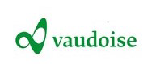

Switzerland-based Vaudoise Assurance competes for both business and top employees in the Swiss insurance market. In a competitive and conservative industry, Vaudoise recognized that digital transformation is the best way to compete in a fast-changing world. The leaders at Vaudoise realized that innovative new technology is a great way to honor relationships with employees, so they equipped them with light, go-anywhere Microsoft Surface Pro devices, Surface Hubs in the office, and Microsoft 365 tools.

> [!TIP]
> The video below contains a different language than the rest of this module. To view closed captions, click the three dots at the bottom right of the video player for more options, then select "closed captions" and the language of your choice.

|||
| :-- | :-- |
| | Watch the video below to learn about how Vaudoise made the connection between employee satisfaction and productivity.|

> [!VIDEO https://www.microsoft.com/videoplayer/embed/RWoQ5t]

For Vaudoise, it was more than a simple device upgrade-it was about enhancing a stellar reputation with tools that support customer engagement for a mobile, adaptable workforce. Their IT teams were able to focus less on cumbersome, continuously-managed system updates, and more on utilizing technology to increase business value. The benefits to Vaudoise go beyond employee satisfaction.

Now that you've seen an example of customer success with Surface for Business, let's explore how you can assess your organization's device needs.