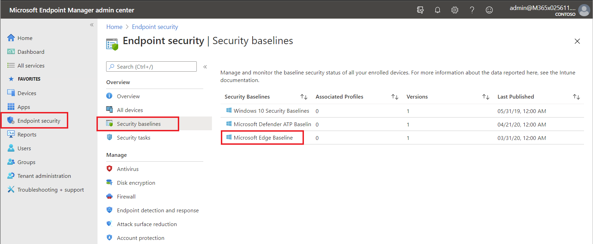
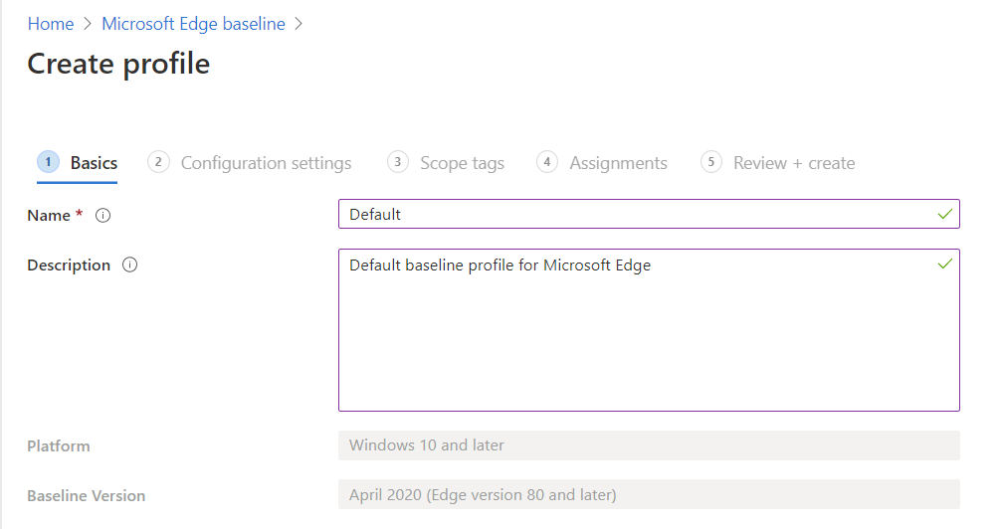
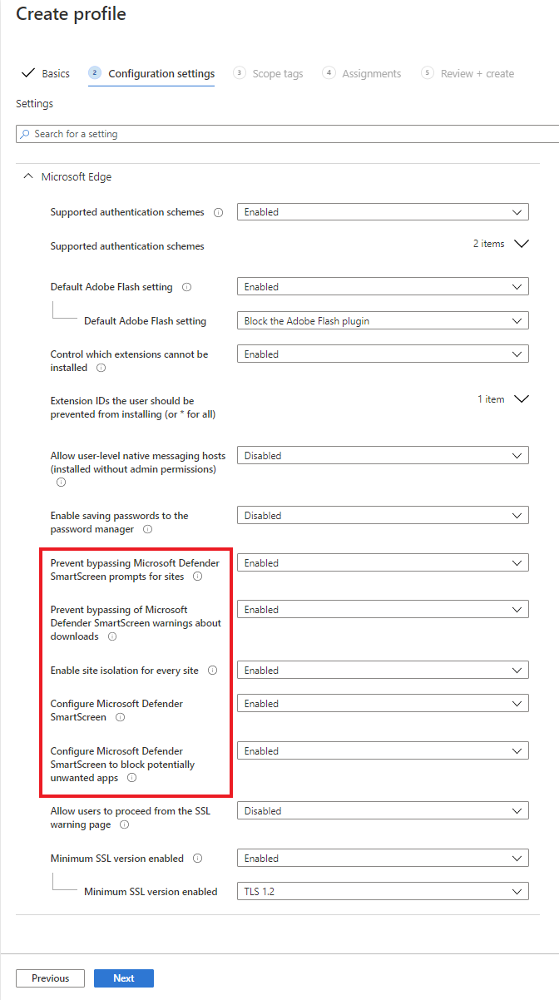
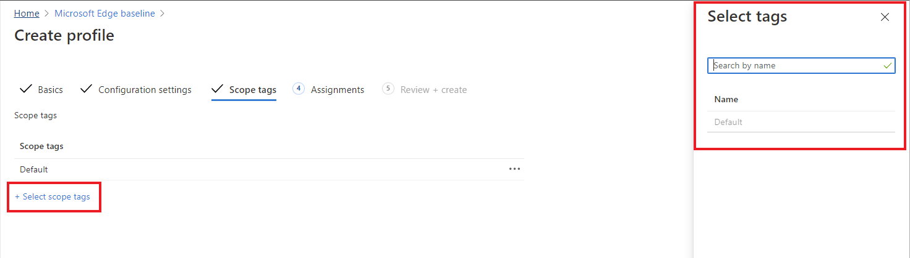
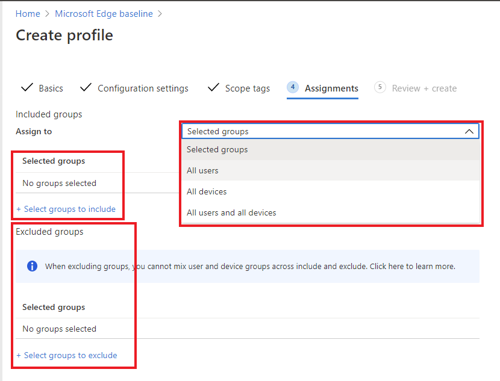

There are a number of ways to manage to Microsoft Edge, including group policy or through Microsoft Intune, but many of these policies can be set right within the Microsoft Endpoint Manager (MEM) admin center.

Watch the video below for a short overview of the settings and policies available for Microsoft Edge in the Microsoft Endpoint Manager admin center.

> [!VIDEO https://www.microsoft.com/videoplayer/embed/RE4F99a]

## Configure Microsoft Edge baseline profile in Microsoft Endpoint Manager admin center

To configure Microsoft Edge with Application Guard and SmartScreen in your Microsoft 365 organization, follow the steps below:

1. From the Microsoft Endpoint Manager admin center, select **Endpoint security**, then **Security baselines**, then select **Microsoft Edge Baseline** from the list of security baselines.

    

2. Select **+ Create profile** from the options at the top to create a new baseline profile.  Enter a *name* and *description* for the profile.

    

3. To enable the settings discussed throughout this module for SmartScreen and Application Guard, set the fields highlighted in red below to **Enabled** and then select **Next**:

    

4. To add tags defining the scope that the profile should be applied to, select **+ Select scope tags** and select the appropriate tag from the list and then **Select** at the bottom of the right pane. Select **Next** when complete:

    

    > [!TIP] 
    > For more information about scope tags, see [Use role-based access control (RBAC) and scope tags for distributed IT](/mem/intune/fundamentals/scope-tags#to-create-a-scope-tag).

5. Choose which users and groups will be assigned this profile.  You can broadly assign this profile to **Selected groups**, **All users**, **All devices**, and **All users and devices**.  Choosing **Selected groups** allows you to specify specific groups in your organization.  Additionally, you add a list of **excluded groups** as needed.
 
   

6. On the last page, review the details of the profile you just created and select **Create** when satisfied.

    > 

The default settings shown here are configured for a high security environment but can be customized to fit your organization’s needs.  

For more information on configuring Microsoft Edge security settings through group policy or Intune, see the following resources:

- [Prepare to install Microsoft Defender Application Guard](/windows/security/threat-protection/microsoft-defender-application-guard/install-md-app-guard#install-application-guard)
- [Configure Microsoft Defender Application Guard policy settings](/windows/security/threat-protection/microsoft-defender-application-guard/configure-md-app-guard)
- [Microsoft Defender SmartScreen setup for admins](/deployedge/microsoft-edge-security-smartscreen#microsoft-defender-smartscreen-setup-for-admins)
