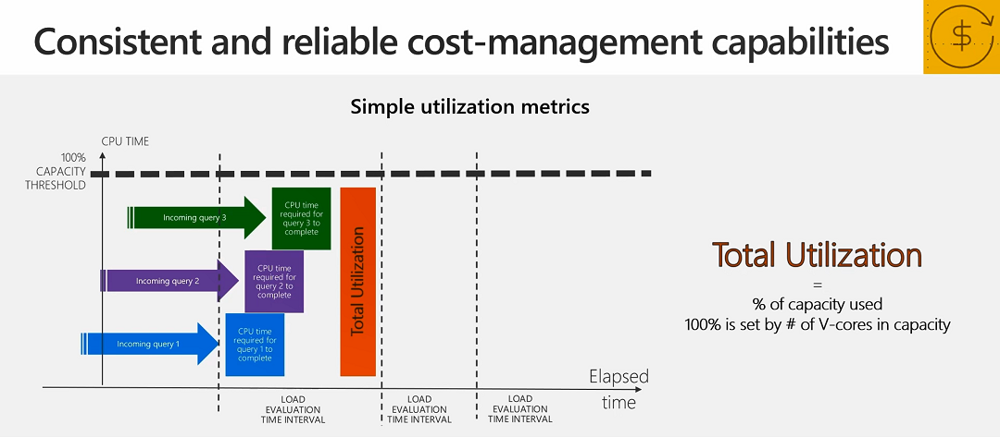

Utilization metrics in Power BI Premium have been reimagined with new metrics, utilization analysis, budget planning, chargebacks, and need to upgrade are clearly visible with built-in reporting.  Simple metrics provide an easy, consistent evaluation of load where the total utilization is a percentage of the capacity used when all the allocated v-cores are at 100%.  Additionally, out-of-the-box reports show peak utilization, background and interactive utilization, and utilization by Power BI artifact.  Allowing administrators to identify cost-sharing and chargebacks across orgs, cost drivers, trends, budget needs, and utilization threshold alerts.

 Watch this video to learn more about new metrics in Power BI Premium and how they can help keep costs manageable.

>[!VIDEO https://www.microsoft.com/videoplayer/embed/RE4HDqk]

