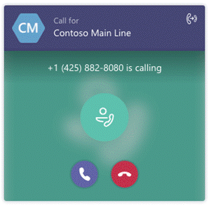

Microsoft Teams Phone System allows you to replace your private branch exchange (PBX) system with a cloud-integrated solution. This includes common PBX functionality, such as the ability to present a menu of options and the ability to manage a queue of callers.

Suppose you're a Microsoft Teams administrator for a large organization that sells digital cameras. With the successful deployment of Teams across your organization, you've provided Teams channels, chats, and improved collaboration. Customers call your company for technical support on their equipment. You want to gather information about their issues with a menu and queue calls during busy times.

In this module, you'll learn how auto attendants and call queues in Microsoft Teams can interact with callers and ensure they're connected to one of your agents as quickly as possible. You'll also learn how to set up auto attendants and call queues.

## Learning objectives

Upon completion of this module, you should be able to:

- Describe the differences between auto attendants and call queues.

- Design an auto attendant to gather information from callers.

- Explain how to set up auto attendants to implement your plan.

- Demonstrate how to plan call queues to manage many callers.

- Describe how to configure call queues to alert agents and route calls.

- Explain how to plan licensing for auto attendants and call queues.

## Prerequisites

- Familiarity with administrating Microsoft Teams

- Awareness of Microsoft 365 Phone System

## Choose when to use auto attendants and call queues

Microsoft Teams Phone provides auto attendants and call queues, which can be used to let external and internal callers move through a menu system to locate and place or transfer calls to users or departments in your organization. These tools can be used to design and build a phone system that suits your exact business needs.

Suppose you're starting to plan how support calls will be handled by your phone system when it's moved to Microsoft Teams for your digital camera company. You want to investigate whether Teams can present the menu of options you've planned and whether it can handle the large volume of calls that you expect to receive at busy times.

Here you'll learn how Microsoft Teams can implement the required attendants and queues for your business.

## What is the auto attendant service?

Phone System provides auto attendants, which can be used to let external and internal callers move through a menu system to locate and place or transfer calls to users or departments in your organization.

An auto attendant is the element of a phone system that gives a caller a series of voice prompts or audio files they hear instead of a human operator. When people call a number associated with an auto attendant, their choices can redirect the call to a user or locate someone in your organization and then connect to that user. They can express their choices and interact with the menu system by using a phone keypad or speech recognition. The choices they make can also redirect the call to another auto attendant, or to a call queue. Auto attendants can:

- Deliver corporate or informational greetings.

- Provide custom corporate menus, which you can customize.

- Search a directory for a name.

- Enable callers to reach or leave a message for a person in your organization.

- Support multiple languages for prompts, text-to-speech, and speech recognition.

- Support specifying holidays and business hours.

- Transfer calls to an operator, other users, call queues, and auto attendants.

- Support shared voicemail for callers to leave a message for an organization.

## What are call queues?

Call queues organize calls into queues whilst alerting a group of users with a choice of different alerting methods. Cloud call queues can provide:

- A greeting message

- Music while people are waiting on hold

- Redirection of calls to agents in mail-enabled distribution lists and security groups

- Configuration parameters such as queue maximum size, timeout, and call handling options

- Shared voicemail for callers to leave a message for an organization

The following image shows what an attendant would see when a caller was in a call queue:

## Prerequisites

To configure auto attendants and call queues, you need the following resources:

- A resource account for each auto attendant and each call queue

- A free Phone System - Virtual User license for each resource account

- At least one Microsoft service number, direct routing number, or a hybrid number for each resource account that you want to be directly dialable

- The service number may be a toll or toll-free number

Agents who receive calls from the call queues must be Enterprise Voice enabled online or on-premises users. In addition, if the call queues are using Direct Routing numbers, agents who need to conference or transfer calls also require:

- If a call queue uses transfer mode, there must be an online voice routing policy assigned.

- If conferencing mode is enabled, a voice routing policy or audio-conferencing license must be applied.

If your agents are using the Microsoft Teams app for call queue calls, they need to be in TeamsOnly mode.

When transferring calls to an external phone number, the resource account performing the transfer (that is, the one associated with the auto attendant or call queue) must have a Microsoft 365 Phone System Virtual User license and one of the following assigned:

- A Calling Plan license and a phone number assigned

- An online voice routing policy (phone number assignment is optional when using Direct Routing)

> [!NOTE]
> Notes for Auto Attendants:
>
>    - Direct Routing service numbers for auto attendant and call queues are supported for Microsoft Teams users and call agents only.
>    - Transfers between Calling Plan trunks and Direct Routing trunks aren't supported.
>    - In a Hybrid scenario, the resource account must be created on-premises.
>

