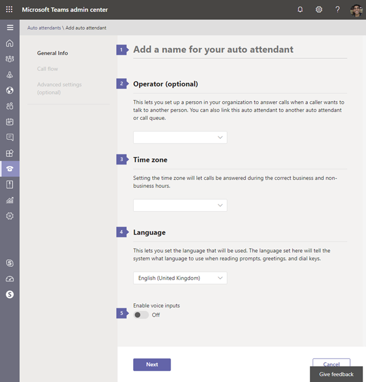
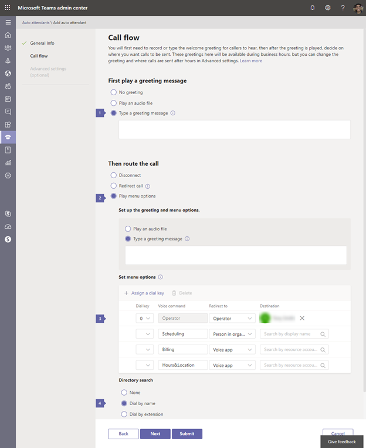
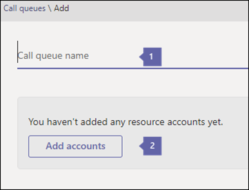
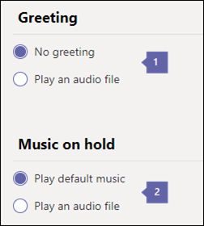
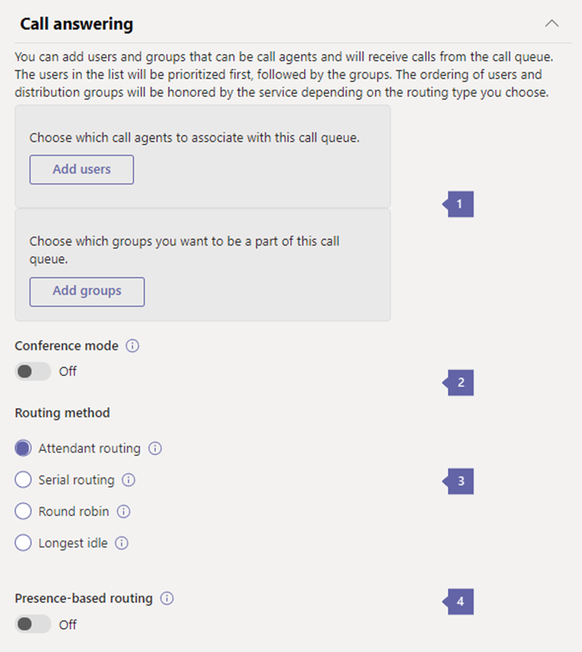
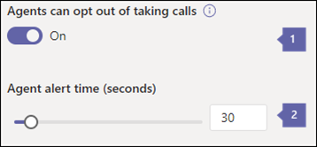
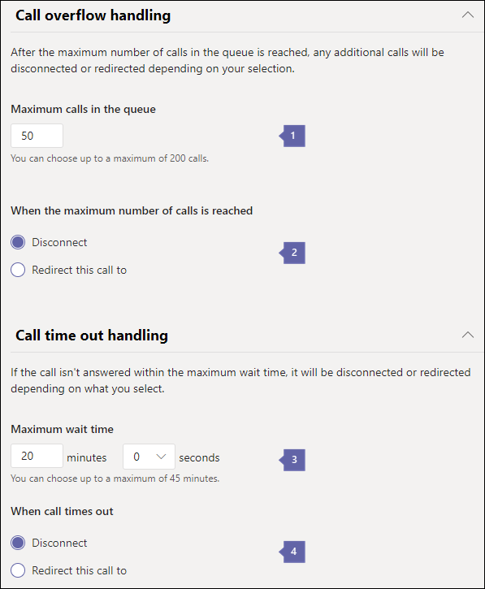

## Implementation of Auto Attendants

Implementation of the design in the earlier diagram is presented in the steps that follow. This implementation uses text-to-speech for the scripts. Phone System has a built-in text to speech engine, so you have the option of listening to your final text to determine whether it conveys the impression you want. If not, it's up to you whether to record your own prompts using recording software or have a professional voice-over artist use your scripts to record audio files.

Auto Attendants and Call Queues can be configured through the Teams admin center, as outlined below or through PowerShell.  The PowerShell resources can be found in the resources section of this module.

To create an auto attendant, go to the Teams admin center under **Voice** and select **Auto attendants**:

1. Give the name of the auto attendant: **Contoso - Top AA**.

1. From the operator list, select a person in your organization, for example: **Julia Wolfe**.

1. Select the Time zone for this auto attendant, for example: **(UTC-04:00) Eastern Daylight Time (US & Canada)**

1. Choose the Language you want to use for prompts, greetings, etc., for example: **English (United Kingdom).**

1. Selecting **Enable voice inputs** will enable voice commands in menus. It will also enable callers to say "Operator" and get transferred directly to the operator.

Next, you can set up **Call flow** for the main menu.

1. In the First play a greeting message, type the message that you want to be read to the caller. For example: **Welcome to Contoso**.

1. In the Route the call section, type the message that the caller will hear prior to hearing the options.

1. From the Set menu options, add in each of the options that you want, for example:

   1. The name that will be read is **Scheduling**, which will **Send to, Julie Wolfe**.

   1. The name that will be read is **Billing**, which will **Send to** the voice app and trigger the **Billing** auto attendant.

   1. The name that will be read is **Hours**, which will **Send to** the voice app and trigger the **Hours and Locations** auto attendant.

1. For the Directory Search, select **Dial by name**

The company greeting is usually only set on the main menu. A nested auto attendant usually flows straight through to the Custom Prompt.

From here, you can usually leave the defaults set for call flows outside business hours, custom call flows during holidays, and dial scope.

### Nested auto attendants

Nested auto attendants don't usually have phone numbers associated or a company greeting, and they only get accessed as directed in the main auto attendant.

Set up the general information for the nested auto attendants using different names but the same time zone, language, speech recognition, and operator settings.

### Test and edit auto attendants

After you've saved your auto attendant, it's listed on the auto attendants page of the admin center. The page also shows some of the options that you set up. The best way to test the implementation is to call the number configured for an auto attendant and choose options to navigate to each of the new auto attendants. You can also quickly place a test call to your auto attendant with the Test button in the Action pane. If you want to edit an auto attendant, select it, and then in the Action pane select Edit.

## Implement a call queue

Let's examine the steps to implement a call queue.

1. In the Microsoft Teams admin center, select **Voice > Call queues**, then select **+ Add queue**:

   1. **1 - Call queue name -** Enter a descriptive display name for the call queue. This name is required and can contain up to 64 characters, including spaces. This name is displayed in the notification for the incoming call.

   1. **2 - Add accounts -** All call queues are required to have a resource account. Resource accounts aren't required to have a service toll or toll-free phone number.

1. Next, set the greeting:

   1. **1 - Greeting -** The optional greeting played for people who call the call queue number. You can upload an audio file (.wav, .mp3, or .wma formats).

   1. **2 - Music on hold -** You can use the default Music on Hold provided with the call queue. You can also upload an audio file in .wav, mp3, or .wma formats to use as your custom Music on hold.

1. Now you can select the **Call answering** options:

   1. **1 - Call agents and groups -**To add individual agents directly, without adding them to a group, select Add users. Put individual agents in the order in which you want them to receive the call. You can add up to 20 individual agents (to add more than 20, put them in a group).

   1. **2 - Conference mode -** Conference mode significantly reduces the amount of time it takes for a caller to be connected to an agent, after the agent accepts the call. If you have more than one call queue, you can enable conference mode on some or all your call queues; enabling or disabling conference mode on one call queue doesn't impact any other call queues

   1. **3 - Routing method -** You can choose either **Attendant, Serial, Longest idle, or Round Robin** as the distribution method. All new and existing call queues have attendant routing selected by default. When attendant routing is used, the first call in the queue rings all call agents at the same time. The first call agent to pick up the call gets the call.****

   1. **4 - Presence-based routing -** Presence-based routing uses the availability status of call agents to determine whether an agent should be included in the call routing list for the selected routing method. Call agents whose availability status is set to Available are included in the call routing list and can receive calls. Agents whose availability status is set to any other status are excluded from the call routing list and won't receive calls until their availability status changes back to Available.

1. Choose agent opt-out options:

   1. **1 - Agent can opt out of getting calls -** You can choose to allow call queue agents to opt-out of taking calls from a particular queue by enabling this option. Enabling this option allows all agents in this queue to start or stop receiving calls from this call queue at will. You can revoke the agent opt-out privilege at any time by clearing the check box, causing agents to become automatically opted in for this queue again (the default setting for all agents).

   1. **2 - Agent alert setting -** This defines the duration of an agent being notified of a call before the Serial or Round Robin routing methods move to the next agent. The default setting is 30 seconds, but it can be set for up to 3 minutes.

1. Finally, you can set the overflow handling options.

   1. **1 - Maximum calls in the queue -** Use this to set the maximum calls that can wait in the queue at the same time. The default is 50, but it can range from 0 to 200. When this limit is reached, the call is handled in the way you set on the When the maximum number of calls is reached setting below.

   1. **2 - When the maximum number of calls is reached -** When the call queue reaches its maximum size (set using the Maximum calls in the queue setting), you can choose what happens to new incoming calls.

   1. **3 - Call Timeout: maximum wait time -** You can also decide how much time a call can be on hold in the queue before it times out and needs to be redirected or disconnected. Where it's redirected is based on how you set the When a call times out setting. You can set a time from 0 to 45 minutes.

   1. **4 - When call times out -** When the call reaches the limit you set on the How long a call can wait in the queue setting, you can choose what happens to the call.****

1. Save the call queue.

### Edit and test your call queues

After you've saved your call queue, it will be listed on the call queues page of the Teams admin center. This display will allow you to briefly see some of the options that you have set up. The best way to test the implementation is to call the number configured for the call queue.

