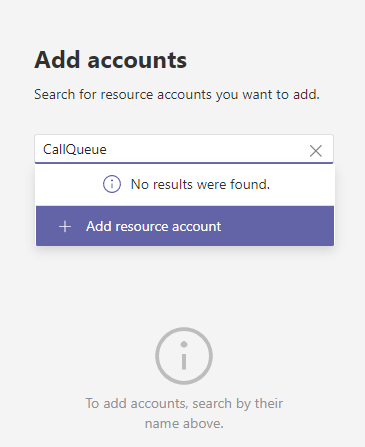
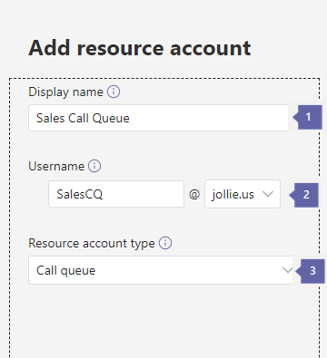
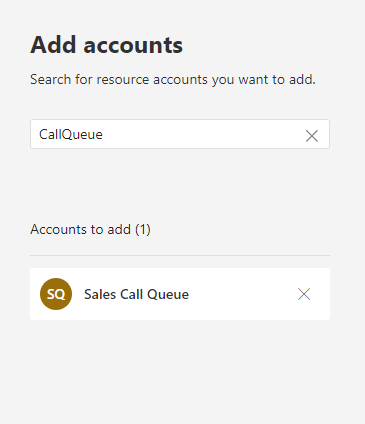
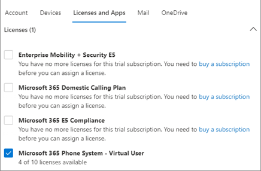
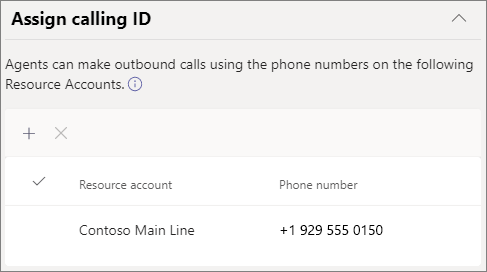

Resource accounts are disabled objects in Azure Active Directory that are required for each auto attendant or call queue in Teams. They can be assigned phone numbers when they're used as a calling ID. This means agents will see the resource account name when they receive an incoming call

1. In the Teams Admin Center, under call queues, Select **Add accounts**.

1. Search for the resource account that you want to use with this call queue, select **Add**, and then select **Add** again.

    > [!div class="mx-imgBorder"]
    > 

1. Select **+Add Resource Account** if account is not found.

    > [!div class="mx-imgBorder"]
    > 

    1. **Display name -** Input the display name.

    1. **Username and domain -** Input the username and the domain from the drop-down menu

    1. **Resource type -** Select the Resource account type, either a call queue or auto attendant

    > [!div class="mx-imgBorder"]
    > 

## Assign a license

For each resource account, you must assign a *Microsoft 365 Phone System - Virtual User* license or *Phone System* license.

> [!div class="mx-imgBorder"]
> 

1. In the Microsoft 365 admin center, select the resource account to which you want to assign a license.

1. On the **Licenses and Apps** tab, under **Licenses**, select **Microsoft 365 Phone System - Virtual User**.

1. select **Save changes**.

### Assign calling ID

> [!div class="mx-imgBorder"]
> 

If you plan to use a Teams channel for your call agents, you can assign an outbound caller ID number for the agents by specifying one or more resource accounts with a phone number.

select **Add**, search for the resource accounts that you want to allow agents to for calling ID purposes when making outbound calls, select **Add**, and then select **Add**.

If you are not using a Teams channel to control agent membership, consider directly setting the caller ID for members of the call queue to the service number of the call queue or appropriate auto attendant.

