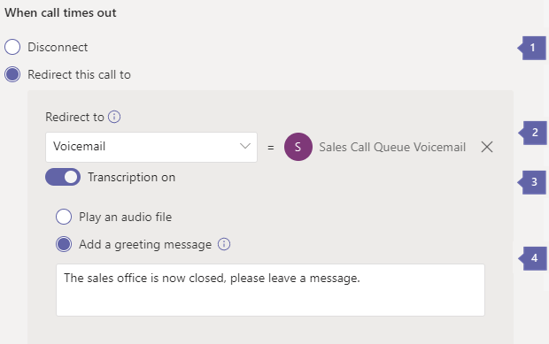

A voicemail can be sent to an Office 365 Group.  The creation of Office 365 groups is not included in this training; however, the assignment of an Office 365 Group to a Microsoft Teams Voicemail is present.

Voicemail can be used if the number of maximum calls is reached the call can be either **Disconnected** or **Redirect this call** to a voicemail and the voicemail will be attributed to an Office 365 Group.

Likewise, if a Call time out handling, if the call isn't answered within wait time, it will be **Disconnected** or **Redirect this call** to option depending on what you select.

> [!div class="mx-imgBorder"]
> 

- **Call overflow handling/What call times out** - Use this to set the call handling to either disconnect or redirect the call.

- **Redirect this call to** - This can be to a Person in the organization, Voice App such as a resource account (auto attendant or call queue), External phone number, or a voicemail. The voicemail can be configured to go to an Office 365 Group, the group is searched for and selected.

- **Transcription** - Transcription of the voicemail can be configured for on or off.

- **Announcement** - When the voicemail message is played it can be an audio file, either an MP3, WAV, or WMA. File must be less than 5 MB, or a drafted greeting message can be played. If you choose this option, enter text you want the system to read (up to 1000 characters). For example, "Sorry that we can't take your call at this time. Please leave your name, phone number, and reason for your call after the beep."

