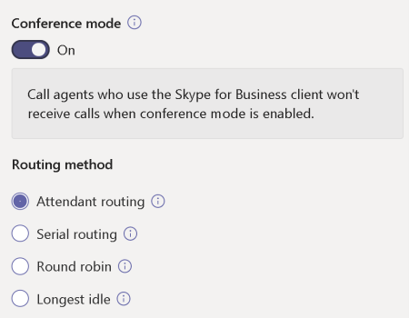

> [!div class="mx-imgBorder"]
> 

In the image above, you can see that you have a choice of routing methods for the call queue.

You can choose either **Attendant, Serial, Longest idle**, or **Round Robin** as the distribution method. All new and existing call queues have attendant routing selected by default.

**Attendant routing:** causes the first call in the queue to ring all call agents at the same time. The first call agent to pick up the call gets the call.

**Serial routing:** incoming calls ring all call agents one by one, from the beginning of the call agent list. Agents can't be ordered within the call agent list. If an agent dismisses or doesn't pick up a call, the call will ring the next agent and will try all agents until it's picked up or times out.

**Longest idle:** routes the next available call to the call agent whose has been idle the longest time. The idle time is defined as the length of time a call agent's presence state is set to Available or Away (if less than 10 minutes), at the time of the call. If a call agent's presence is set to Away for more than 10 minutes, the idle timer resets. Presence states of users are queried every minute.

> [!TIP]
> Setting Routing Method to Round robin or Longest idle is the recommended setting. 

