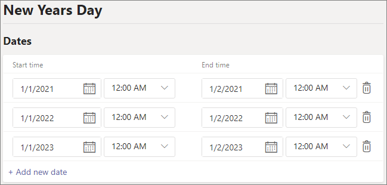

You can use the Teams Holidays feature to provide alternate messages, routing to callers for specific dates and times, when departments call queues or people in your organization will be following different working hours or won't be available. For example, you might create a holiday for New Year's Day when your organization may be closed.

The holidays you create here are available when you set up an auto attendant, each with its own greeting and call routing settings.

## Create a holiday

To create a holiday, follow these steps in the Teams admin center:

1. In the Microsoft Teams admin center, go to **Org-wide settings > Holidays**.

1. Select **New holiday**.

1. Enter a name for the holiday.

1. Select **Add new date**.

1. Under **Start time**, select the calendar icon and choose the date when you'd like the holiday to begin.

1. Use the drop-down list to select a start time for the holiday.

1. Under **End time**, select the calendar icon and choose the date when you'd like the holiday to end.

1. Use the drop-down list to select an end time for the holiday. **The End** time must be after the **Start time**.
    > [!NOTE]
    > If the holiday is for one full day (i.e., a 24-hour period), the End time should be set to the next day and the time to 12:00 AM. For example, if your organization is closed on January 1 for New Year's Day, set the Start time to January 1 at 12:00 AM and set the End time to January 2 at 12:00 AM

1. Optionally, add more dates for recurring holidays.

1. Select **Save**.

## Change a holiday

To change a holiday

1. In the Microsoft Teams admin center, go to **Org-wide settings** > **Holidays**.

1. Select the holiday from the list.

1. Under **Start time**, select the calendar icon and choose the date when you'd like the holiday to begin.

1. Use the drop-down list to select a start time for the holiday.

1. Under **End time**, select the calendar icon and choose the date when you'd like the holiday to end.

1. Use the drop-down list to select an end time for the holiday. The **End time** must be after the **Start time**.

1. Select **Save**.

