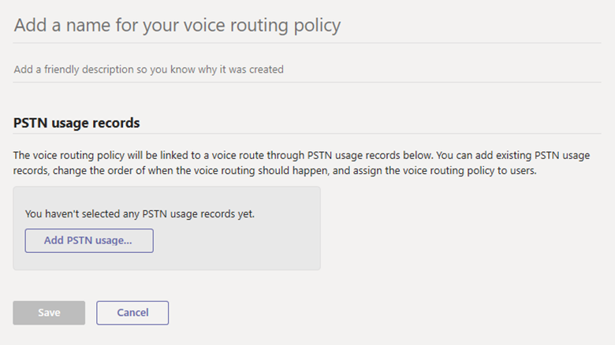

Direct Routing is a way to provide a PSTN (Public Switched Telephone Network) connection to Microsoft Teams users so that they can make and receive external phone calls on Teams.

Traditionally, for an organization, internal and external telephone calls have been delivered using a Private Branch Exchange (PBX) phone system, usually located on the organization’s data center Microsoft Teams can be used as a business telephony solution, replacing an existing PBX phone system and its associated equipment and costs with a cloud-based system, to provide full PBX voice calling capabilities inside and outside your organization.

Voice routing helps you dictate how calls are routed through your Session Border Controllers (SBCs).

To decide if a direct route is required answer the following questions, if any are yes, Direct Routing is the right solution for you:

- You want to use Teams with Phone System.

- You need to retain your current PSTN carrier.

- You want to mix routing, with some calls going through Calling Plan, some through your carrier.

- You need to interoperate with third-party PBXs and/or equipment such as overhead pagers, analog devices, and so on.

With this option:

- You connect your own supported Session Border Controller (SBC) to the Phone System without the need for additional on-premises software.

- You can use virtually any telephony carrier with a Phone System.

- You can choose to configure and manage this option, or it can be configured and managed by your carrier or partner (ask if your carrier or partner provides this option).

- You can configure interoperability between your telephony equipment—such as a third-party PBX and analog devices—and a Phone System.

This option requires the following:

- Uninterrupted connection to Microsoft 365

- Deploying and maintaining a supported SBC

- A contract with a third-party carrier

- Unless deployed as an option to provide connection to third-party PBX, analog devices, or other telephony equipment for users who are on Phone System with Calling Plan

You would use Direct Routes to a SBC if you are to utilize a hosted or on-premises SBC.  This is different to an SBC hosted by a SIP Trunk provider in that you or a service provider will need to configure the SBC for you ahead of time.

The following technical reasons exist to utilize an SBC:

- A SBC allows integration into a call center application.

- A SBC can be used for call compliance recording.

- A SBC provides the ability to use Microsoft Calling Plans outside of the supported geographical areas.

There are multiple ways of associating an SBC; this can be completed through the Graphical User Interface (GUI) or PowerShell.  It must be noted the only way to configure a Survivable Branch Appliance is through PowerShell.

There are 4 steps of providing a direct route. Follow these steps for your deployment:

1. Connect the SBC with Microsoft Phone System and validate the connection

1. Enable users for Direct Routing, voice, and voicemail

1. Configure voice routing

1. Number Translation

## Connect the SBC with Microsoft Phone System and validate the connection

To connect your SBC to Microsoft Phone System, follow these steps:

1. Navigate to the Microsoft Teams admin center at [https://admin.teams.microsoft.com](https://admin.teams.microsoft.com/)

1. In the left navigation pane, select **Voice** and **Direct Routing**.

1. Select the **SBCs** tab and select **Add** to create a new entry.

1. Enter a valid FQDN for the SBC.

    > [!NOTE]
    > Make sure the domain name portion of the FQDN matches a domain that's registered in your tenant and keep in mind that the “*.onmicrosoft.com” domain name isn't supported for the SBC FQDN domain name. For example, if you have two domain names, “contoso.com” and “contoso.onmicrosoft.com,” use “sbc.contoso.com” as the SBC name. If using a subdomain, make sure this subdomain is also registered in your tenant. For example, if you want to use “sbc.service.contoso.com,” then “service.contoso.com” needs to be registered.

1. Configure the following settings for the SBC, based on your organization's needs:

    | Setting| Value| Explanation|
    | :--- | :--- | :--- |
    | Enabled| Off| Used to enable this SBC for outbound calls. You can temporarily remove the SBC from service while it is being updated or during maintenance.|
    | SIP signaling port| 5067 (can be changed during setup)| This is the listening port that's used to communicate with Direct Routing by using the Transport Layer (TLS) protocol.|
    | Send SIP options| On| This setting defines if an SBC will or won't send SIP Options messages. If this isn't turned on, the SBC will be excluded from the monitoring and alerting system. We recommend that you enable SIP Options.|
    | Forward call history| Off| Indicates whether call history information is forwarded through the trunk. When you turn this on, the Microsoft 365 or Office 365 proxy sends a history-info and Referred-by header.|
    | Forward P-Assisted-Identity (PIA) Header| Off| Indicates whether the P-Asserted-Identity (PAI) header will be forwarded along with the call. The PAI header provides a way to verify the identity of the caller.|
    | Concurrent call capacity| 24| When you set a value, the alerting system will notify you when the number of concurrent sessions is 90 percent or higher than this value. If you don't set a value, alerts aren't generated. However, the monitoring system will report the number of concurrent sessions every 24 hours.|
    | Failover response Code| 408, 503,504| If Direct Routing receives any 4xx or 6xx SIP error code in response to an outgoing Invite, the call is considered completed by default. Outgoing means a call from a Teams client to the PSTN with traffic flow: Team's client -> Direct Routing -> SBC -> telephony network). When you specify a failover response code, this forces Direct Routing to try another SBC (if another SBC exists in the voice routing policy of the user) when it receives the specified codes if the SBC can't make a call because of network or other issues.|
    | Failover time (seconds)| 10| When set to 10 (default value), outbound calls that aren't answered by the gateway within 10 seconds are routed to the next available trunk. If there are no additional trunks, then the call is automatically dropped. In an organization with slow networks and slow gateway responses, calls may be unintentionally dropped.|
    | Preferred country/region for media traffic| None| Use to manually set your preferred country or region for media traffic. We recommend that you set this only if the call logs indicate that the default assignment of the datacenter for the media path doesn't use the path closest to the SBC datacenter. By default, Direct Routing assigns a datacenter based on the public IP address of the SBC, and always selects the path closest to the SBC datacenter. However, in some cases, the default path might not be the optimal path. This parameter allows you to manually set the preferred region for media traffic.|
    | SBC Supports PIDF/LO for emergency calls| Off| Specify whether the SBC supports Presence Information Data Format Location Object (PIDF/LO) for emergency calls.|
    | Ring phone while trying to find the user| Off| Historically Ring back Bot could be enabled to force a ring signal/audio to be heard by the caller while Teams routed the call to the correct end user.|
    | Location-based routing| Off| Allows for network-based routing to nearest SBC|
    | Bypass Mode| None| Media bypass enables you to shorten the path of media traffic and reduce the number of hops in transit for better performance|

1. When you're done, select **Save**.

You have successfully configured Direct Routing to a Session Border Controller from Microsoft Teams.

The configuration of SBCs can be done through the graphical user interface (GUI) or through PowerShell, the resources section contains how you can configure Direct Routes through PowerShell if required.

## Enable users for Direct Routing, voice, and voicemail

When you are ready to enable users for Direct Routing, follow these steps:

1. Create a user in Microsoft 365 or Office 365 and assign a Phone System license.

1. Ensure that the user is homed in Skype for Business Online.

1. Configure the phone number and enable enterprise voice and voicemail.

1. Assign Teams Only mode to users.

### Create a user and assign the license

There are two options for creating a new user in Microsoft 365 or Office 365. However, Microsoft recommends that your organization choose one option to avoid routing issues:

- Create the user in on-premises Active Directory and sync the user to the cloud. See Integrate your on-premises directories with Azure Active Directory.

- Create the user directly in the Microsoft 365 admin center. See Add users individually or in bulk to Microsoft 365 or Office 365

If your Skype for Business Online deployment coexists with Skype for Business 2015 or Lync 2010 or 2013 on-premises, the only supported option is to create the user in the on-premises Active Directory and sync the user to the cloud.

### Ensure that the user is homed online

This step is applicable to Skype for Business Server Enterprise Voice enabled users being migrated to Teams Direct Routing.

Direct Routing requires the user to be homed online. You can check by looking at the RegistrarPool parameter, which needs to have a value in the infra.lync.com domain. It's also recommended, but not required, to change management of the LineURI from on-premises to online when migrating users to Teams Direct Routing.

The user you assigned the voice routing policy to also needs to have a phone number assigned. First, a custom voice routing policy must be assigned, to end users that will be enabled for Microsoft Phone.

This step is applicable to Skype for Business Server Enterprise Voice enabled users being migrated to Teams Direct Routing.
Direct Routing requires the user to be homed online. You can check by looking at the RegistrarPool parameter, which needs to have a value in the infra.lync.com domain. It's also recommended, but not required, to change management of the LineURI from on-premises to online when migrating users to Teams Direct Routing.

Connect a Skype for Business Online PowerShell session by issuing the following command:

```PowerShell
Get-CsOnlineUser -Identity "<User name>" | fl RegistrarPool,OnPremLineUriManuallySet,OnPremLineUri,LineUri

```

Further information can be obtained in the resources section below for enabling users via PowerShell - See Enable users for Direct Routing - Microsoft Teams | Microsoft Docs.

## Create a custom voice routing policy

1. Follow these steps to create a new custom voice routing policy:

1. Navigate to the Microsoft Teams admin center at [https://admin.teams.microsoft.com](https://admin.teams.microsoft.com/)

1. In the left navigation pane, select **Voice** and **Voice routing policies**.

1. Select **Add** to create a new entry.

    > [!div class="mx-imgBorder"]
    > 

1. Enter a meaningful name and description for the policy.

1. Under PSTN usage records, select **Add PSTN usage…**, and then select the records that you want to add. If you need to create a new PSTN usage record, select **Add**.

1. If you added multiple PSTN usage records, arrange them in the order that you want.

1. When you're done, select **Apply**.

1. select **Save**.

1. After creating a new custom voice routing policy, you can route calls to the correct session border controller by using the correct voice routing policy.

1. For examples for further consideration, refer to the reference section - Configure voice routing for Direct Routing.

## Number Translation

Sometimes tenant administrators may want to change the number for outbound and/or inbound calls based on the patterns they created to ensure interoperability with Session Border Controllers (SBCs). This article describes how you can specify a Number Translation Rules policy to translate numbers to an alternate format.
You can use the Number Translation Rules policy to translate numbers for the following:
Inbound calls: Calls from a PSTN endpoint (caller) to a Teams client (callee)
Outbound calls: Calls from a Teams client (caller) to a PSTN endpoint (callee)
The policy is applied at the SBC level. You can assign multiple translation rules to an SBC, which are applied in the order that they appear when you list them in PowerShell. You can also change the order of the rules in the policy.
To create, modify, view, and delete number manipulation rules, use the `New-CsTeamsTranslationRule`, `Set-CsTeamsTranslationRule`, `Get-CsTeamsTranslationRule`, and `Remove-CsTeamsTranslationRule` cmdlets.
To assign, configure, and list number manipulation rules on SBCs, use the `New-CSOnlinePSTNGateway` and `Set-CSOnlinePSTNGateway` cmdlets together with the `InboundTeamsNumberTranslationRules, InboundPSTNNumberTranslationRules, OutboundTeamsNumberTranslationRules, OutboundPSTNNumberTranslationRules, InboundTeamsNumberTranslationRules, InboundPSTNNumberTranslationRules, OutboundTeamsNumberTranslationRules,` and `OutboundPSTNNumberTranslationRules` parameters.
