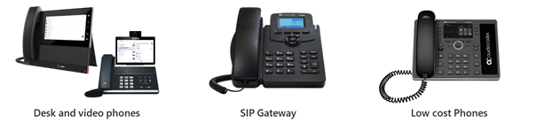

Microsoft Teams Phones are designed for users who require a traditional phone experience. 

Teams-certified phones provide the best experience with Microsoft Teams and support the broadest range of features. In addition to Teams-certified phones, you can choose lower-cost phone designed for Teams or utilize generic SIP phones via a gateway.

In the picture below, you can see the difference between different types of Teams Phones. Teams-certified phones, shown on the left, provide a Teams app experience for calling and meetings. A SIP phone via a gateway offers no specific Teams functionality and will usually have a traditional LCD display for calling. Low-cost Teams phones, shown on the right-hand side, do not offer the full range of capabilities of Teams-certified phones, but benefit from the ability to connect directly to Microsoft Teams.

> [!div class="mx-imgBorder"]
> 

Teams-certified phones have a broad array of features to help your users do their jobs, and help you manage their use. The following list shows the main advantages and features available in Teams-certified phones:

| Feature| Description|
| :--- | :--- |
| Authentication| Phones use Modern Authentication to simplify signing in and to improve security. Users can sign in by entering their username and password on the phone or by signing in from another device like PC/smartphone.|
| Speed dial and call history| Users have quick access to their contacts, call history, and voicemail. They can easily manage their contacts and speed dial entries directly from their phone.|
| Meetings and calls| Users can view their schedules and easily join meetings using Teams' one-touch join.|
| Call groups| Phone agents who participate in call groups can easily manage their availability and accept or decline incoming calls from the call queue.|
| User delegation| Executive assistants and admins can manage their executives' phones - intercept incoming calls; make calls on behalf of the executive; take over calls that the executive has placed on hold; and monitor whether the executive is on a call, on hold, and so on.|
| Hot-desking| Users can get their contacts, meetings, and other preferences, just by signing into a phone. When they're done, they can sign out and leave the phone ready for the next user.|
| Video Phones| Teams phones with video support let users join calls and video conferences just like they were at their computers. Users can keep their privacy by using a phone's camera shutter and microphone mute switch when available.|
| Better together| Phones can lock and unlock in an integrated fashion when connected to their Windows PC running a 64-bit Teams desktop client.|
| Accessibility| Phones have several accessibility features, such as high contrast text, to make it easier for anyone to use them.|
| Dynamic and enhanced E911 support| Signed-in users who call 911 will see their location on the phone.|

In addition to the above features, you can control what capabilities are available depending on the type of license and phone policy that are assigned to the user signing into the phone. For example, users who sign into a phone with their personal accounts can access calling, meetings, calendaring, presence, and contact functionality. Accounts assigned a Common Area Phone license that sign into a phone; however, may only get access to a limited range of features; call history and meeting schedules may not be retained, for example, to protect users' privacy. To manage phones, you need a privileged account with a role of a Global admin, Teams Service admin, or Teams Device admin assigned.

In the Teams admin center, you can view and manage phones, collaboration bars, Teams displays, and Teams panels enrolled in Teams in your organization. Information that you'll see for each device includes device name, manufacturer, model, user, status, action, last seen, and history. You can customize the view to show the information that fits your needs, such as sorting by device model when you need to apply specific updates to devices.

## Enrollment of Microsoft Teams Phones into Intune

Phones, collaboration bars, Teams displays, and Teams panels are automatically enrolled in Microsoft Intune if it is part of your Microsoft 365 subscription, as part of the user sign-in process. After a device is enrolled, device compliance is confirmed, and Conditional Access policies are applied to the device.

Conditional Access is an Azure Active Directory (Azure AD) feature that helps you to ensure devices accessing your Microsoft 365 resources are properly managed and are secure.

If you apply Conditional Access policies to the Teams service, Teams Phones and Teams Displays that access Teams must be enrolled into Intune, and their settings need to comply with Intune policies. If the device isn't enrolled into Intune, or if it's enrolled but its settings don't comply with your policies, Conditional Access will prevent a user from signing in to or using the Teams app on the device.

Teams Android-based devices, including all Teams-certified phones, are managed by Intune via Android Device Administrator (DA) management. Before devices can be enrolled into Intune, there are a few basic steps to perform.

1. Set Intune as the mobile device management authority.

1. Enable Android device administrator enrollment.

1. Assign licenses to users.

1. Assign Device Administrator compliance policies.

If users are already able to enroll Android devices via Device Administrator management into Intune, then these steps should already have been performed and users should already be licensed for Intune. Common area phone devices will need an Intune license applied to allow enrollment and management to take place.

## Managing Teams Phones using configuration profiles

You can use configuration profiles to centrally manage settings and features for different Teams devices in your organization, including collaboration bars, Teams displays, Teams phone, and Teams panels. You can create or upload configuration profiles to include settings and features you want to enable or disable, and then assign a profile to a device or set of devices.

To create a configuration profile for a Teams device type in the Endpoint Manager admin center, perform the following steps:

1. Sign into the Microsoft Teams admin center at [https://admin.teams.microsoft.com](https://admin.teams.microsoft.com/).

1. In the left navigation, go to **Devices** > select the Teams device type. For example, select **Devices** > **Teams Phones** to continue to create a new configuration profile for Teams Phones.

1. Select the **Configuration profiles** tab and select **Add**.

1. Enter a name for the configuration profile and optionally add a friendly description.

1. Specify the settings you want for the profile, and then select **Save**. The newly created configuration profile is displayed in the list of profiles.

After creating a configuration profile for a Teams device type, assign it to one or more devices. Perform the following steps to assign a configuration profile in the Microsoft Teams admin center:

1. In the left navigation, go to **Devices** and select the Teams device type. For example, to assign a configuration profile to a Teams panels device, select **Devices** and **Teams panels**.

1. Select one or more devices, and then select **Assign configuration**.

1. In the Assign a configuration pane, search for configuration profile to assign to the selected devices.

1. Select Apply. For the devices to which you applied the configuration policy, the Action column displays Config Update and the Configuration profile column displays the configuration profile name.

The devices in scope of a configuration profile will be automatically configured with the setting defined. This may take several hours to take effect.

To validate the configuration has applied, select the device within the Endpoint Manager admin center, then choose **Device Configuration** to and examine the **State**.
