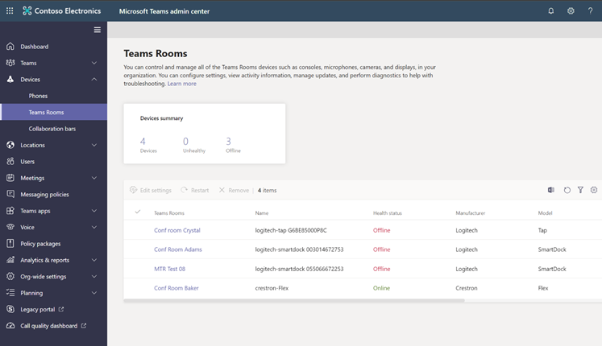

Microsoft Teams Rooms are the native meeting room system solution for Teams. These include functionality to support traditional meeting rooms experiences, such as audio, video, and screen sharing. Microsoft Teams Rooms also support advanced capabilities including multi-screen support, meeting transcription, smart room speakers that identify who is speaking, and meeting views, such as Together Mode and receive regular updates to functionality from Microsoft. 
Microsoft Teams Rooms scale to different room sizes. Teams Rooms use a wide variety of certified audio and video peripherals based on the size and use of the room. By selecting the right core device and console, combined with microphones, speakers, cameras, and displays appropriate for the space, you can deploy Microsoft Teams Rooms into spaces of any size from small huddle spaces up through large conference spaces and boardrooms. 

In the following picture, you can see the key benefits of deploying Microsoft Teams Rooms. These include the ability to transform existing meeting rooms by adding Teams, fit into different spaces from huddle rooms, personal offices to large event and board rooms, simple management with integration into the Teams Admin Center, and the ability to connect with third-party hardware and software solutions that are certified for use.

> [!div class="mx-imgBorder"]
> 

Microsoft Teams devices are designed to help people maximize the power of Teams and bridge the gap between remote and shared workspaces. Through a combination of Teams meetings features, people-centric room experiences, and industry-leading hardware, users benefit from low-friction, inclusive, and interactive meetings, whether they join remotely or in the meeting room.

There are two types of Microsoft Teams Room systems, Windows, and Android. Microsoft Teams Rooms on Windows (MTRoW) run Windows 10 and typically include a Surface Pro device or a certified PC device and center room touchscreen. MTRoW devices are usually designed for larger meeting spaces, such as medium and large meeting rooms and support usage with a wide range of certified Teams devices.

Microsoft Teams Rooms on Android (MTRoA) devices run similar software to Microsoft Teams Phone and Displays and are managed using similar concepts. They are typically designed for smaller meeting spaces, including huddle rooms or small meetings rooms, and are also suitable for personal meeting room devices dedicated to a specific user. Like MTRoW devices, these devices can also have a center room touchscreen attached and HDMI ingest for screen sharing and support multiple screens.

## Licensing requirements

Microsoft Teams Room Systems require a license. Two dedicated SKUs are available for licensing meetings and calling on a per-device basis for meeting room devices (such as Microsoft Teams Rooms, Microsoft Surface Hub, and collaboration bars for Microsoft Teams). The following table shows the differences between the two SKUs:

|  | **Microsoft Teams Rooms Standard**| **Microsoft Teams Rooms Premium**|
| :--- | :--- | :--- |
| **Skype for Business**| Yes| Yes|
| **Microsoft Teams**| Yes| Yes|
| **Phone System**| Yes| Yes|
| **Audio Conferencing**| Yes| Yes|
| **Microsoft Intune**| Yes| Yes|
| **Managed Services**| No| Yes|

To provide the room a phone number and make or receive a call from the room or join an audio conference using a phone number,  you need to assign either a **Domestic or International Calling Plan** if you aren’t using Direct Routing.

## Management options

There are two core options for managing Microsoft Teams Rooms - unmanaged and managed.

An unmanaged option allows the flexibility as an IT administrator to manage devices without Microsoft or partner assistance. Managed options include Microsoft Teams Room Premium, Microsoft Endpoint Manager, and Azure Monitor. All options include capabilities to manage device settings, collect statistics, and collect logs using the Teams Admin Center.

> [!div class="mx-imgBorder"]
> 

The easiest way to manage Teams Rooms is to let it manage itself. When run in an unmanaged configuration, all Windows updates and Teams Rooms application updates come directly from Microsoft. Teams Rooms runs a scheduled task nightly at 2:00 in the morning to download and install any pending updates. The Teams Rooms compute module needs access to the Microsoft update servers on the Internet. You use the local administrator account to sign into the machine when necessary.

By using Microsoft Endpoint Manager Configuration Manager, you can deploy operating software for Microsoft Teams Rooms to multiple devices and using Operating System Deployment (OSD) functionality, packages, and task sequences. Using this approach requires creation of defined packages, task sequences, and allows deployment of the monitoring agent to managed devices. This approach is validated for Surface Pro-based Microsoft Teams Rooms by Microsoft and requires vendor guidance for non-Surface Pro based devices.

Azure Monitor allows you to leverage cloud-based integrated end-to-end management of Microsoft Teams Rooms devices, using Log Analytics within Azure Monitor to provide basic telemetry and alerts. This allows configuration of a dashboard view of device heartbeat status, hardware status, operating system details, deployed Microsoft Teams Room application software versions, application errors, and other information including device restarts.

> [!div class="mx-imgBorder"]
> 

Microsoft Teams Rooms Premium consists of several features such as inventory management, update management, troubleshooting and remediation, and many more. These features and services make up the Microsoft Teams Rooms managed service. In addition to the managed services, Teams Rooms Premium includes the Teams Rooms standard license.

The Microsoft Teams Rooms managed service is for organizations wanting to improve their meeting room experience and rapidly scale their footprint by offering proactive management for Microsoft Teams Rooms devices.

| **Responsibilities**| **Teams Admin Center**| **Teams Rooms Managed Services**|
| :--- | :--- | :--- |
| Intelligent room planning recommendations | Customer| Microsoft|
| Room deployment validation & intelligent config management| Customer| Microsoft|
| 24x7x365 dynamic monitoring| Customer| Microsoft|
| Real-time intervention and automatic remediation| Customer| Microsoft|
| Intelligent, managed updates| Customer| Customer + Microsoft|
| Best practices applied to remote remediations and guidance on in-person remediations| Customer| Customer + Microsoft|
| Correlated insights across your eco-system| Customer| Microsoft|
| Threat detection and security KBs| Customer| Microsoft|

## Creating room accounts

Microsoft Teams Rooms needs to be assigned a "device account" in Active Directory, Exchange, and Skype for Business. The account is used to access its meeting calendar and establish Microsoft Teams or Skype for Business connectivity. People can book this account by scheduling a meeting with it. Microsoft Teams Rooms will be able to join that meeting and provide various features to the meeting attendees.

Every device account is unique to a single Microsoft Teams Rooms device and requires some setup:

- The device account must be configured with a Microsoft Teams Room System Standard or Premium license (or equivalent) and enabled with an Exchange Room Resource Mailbox. The device account must be configured in Microsoft Teams as a room resource.

- Your infrastructure must be configured to allow Microsoft Teams Rooms to validate the device account and to reach the appropriate Microsoft services.

> [!NOTE]
> In hybrid environments. the account used for Microsoft Teams Rooms must have password sync enabled in Azure Active Directory (AAD) Sync because Microsoft Teams Rooms authentication requires Microsoft 365 or Office 365 authentication. When setting up the account, make sure that the account's SIP address matches its User Principal Name (UPN) in AAD. 

You can think of a device account as the resource account that people recognize as a conference room's or meeting space's account. When you want to schedule a meeting using that conference room, you invite the account to that meeting. In order to use Microsoft Teams Rooms most effectively, you do the same with the device account that's assigned to each one.

If you already have a resource mailbox account set up for the meeting space where you're installing Microsoft Teams Rooms, you can change that resource account into a device account. Once that's done, all you need to do is add the device account to a Microsoft Teams Rooms device.

These properties represent the minimum configuration for a device account to work with Microsoft Teams Rooms. Your device account may require further setup.

| **Property**| **Purpose**|
| :--- | :--- |
| Exchange mailbox (Exchange 2013 SP1 or later, or Exchange Online)| Enabling the account with an Exchange mailbox gives the device account the capability to receive and send both mail and meeting requests and to display a meetings calendar on the Microsoft Teams Rooms device. The Microsoft Teams Rooms mailbox must be a room mailbox.|
| Skype for Business is enabled| Skype for Business must be enabled to use various conferencing features, like video calls, IM, and screen-sharing. Both Skype for Business Online and Skype for Business Server are supported.|
| Password-enabled| The device account must be enabled with a password, or it cannot authenticate with either Exchange or Skype for Business Server.|

The easiest way to set up device accounts is to configure them using remote Windows PowerShell. It’s a commonly used Best Practice not to create custom scripts, but use the Microsoft provided and managed script [SkypeRoomProvisioningScript.ps1](https://go.microsoft.com/fwlink/?linkid=870105). This script will help create new device accounts or validate existing resource accounts you have to help you turn them into compatible Microsoft Teams Rooms device accounts.

## Enabling Voice for Microsoft Teams Room Systems

As an optional step, after creation of a Microsoft Teams Room device account, complete the voice configuration for the Room account by enabling voice services for the account. If you don’t enable voice services, then users will not be able to dial-out from a Microsoft Teams Room.

A standard or premium Meeting Room system license includes a Phone System license, however, unless Direct Routing is in use, a Calling Plan license will also need to be applied.

To enable voice services, use remote Windows PowerShell with the same Microsoft Teams PowerShell module used for the device account creation. Enable Enterprise Voice for the device account using the Set-CsMeetingRoom cmdlet as follows:

```powershell
Set-CsMeetingRoom -Identity "MicrosoftTeamsRoom@contoso.com" -EnterpriseVoiceEnabled:$True

```

The cmdlet does not provide any output if activation is successful.

Use the following cmdlet to control, if the “EnterpriseVoiceEnabled” attribute is now true:

```powershell
Get-CsMeetingRoom -Identity "MicrosoftTeamsRoom@contoso.com" | Format-List EnterpriseVoiceEnabled

```

After enabling voice services for a device account the Microsoft Teams Room will display a dial-pad. This will allow the user to dial in to a third-party PSTN conference bridge from the Microsoft Teams Room or perform direct calls to individual subscribers.

## Microsoft Teams Room Policy Options

If you have Microsoft Teams Rooms-certified devices in your organization, you have flexible management options. You can manage the devices yourself in the same central location where you manage all your Teams solutions. Microsoft Teams Admin Center or you can transfer management responsibility to dedicated experts using Microsoft Teams Rooms Managed Services. You can also delegate management access to a partner of your choice for either of the options.

With the Microsoft Teams Admin Center, you can perform the following tasks:

- Perform device management like restarting devices and downloading device logs

- Apply Teams-specific settings

- Check the health status of Microsoft Teams Room devices and their peripherals, including cameras, displays, microphones, and so on

- Review current and past meeting activity (such as details about call quality, network health and connectivity, and number of participants)

- See peripherals (such as cameras and projectors) connected to a Microsoft Teams Room device

To manage Teams Rooms devices, open the **Microsoft Teams admin center** and go to **Devices** > **Teams Rooms**. To manage devices using the Teams admin center, you need a privileged account with one of the following roles assigned: Global Administrator, Teams Administrator, or Teams Device Administrator.

You can change settings on one or more devices in your organization. To change settings, select the device or devices you want to manage and then select Edit Settings. A new pane will open with all the settings you can change on your devices. The following table lists the settings you can change using the Microsoft Teams admin center. Some settings are only available when you select a single device and not if you want to bulk edit multiple devices.

:::row:::
:::column:::

**Setting**

:::column-end:::
:::column:::

**Accepted values**

:::column-end:::
:::column:::

**Supports bulk edit**

:::column-end:::
:::row-end:::
:::row:::
:::column:::

Email

:::column-end:::
:::column:::

Email address

:::column-end:::
:::column:::

No

:::column-end:::
:::row-end:::
:::row:::
:::column:::

Supported meeting mode

:::column-end:::
:::column:::

Skype for Business (default) and Microsoft Teams/Skype for Business and Microsoft Teams (default)/Skype for Business Only

:::column-end:::
:::column:::

Yes

:::column-end:::
:::row-end:::
:::row:::
:::column:::

Modern authentication

:::column-end:::
:::column:::

On/Off

:::column-end:::
:::column:::

Yes

:::column-end:::
:::row-end:::
:::row:::
:::column:::

Exchange address

:::column-end:::
:::column:::

Email address

:::column-end:::
:::column:::

No

:::column-end:::
:::row-end:::
:::row:::
:::column:::

Domain\username (optional)

:::column-end:::
:::column:::

Account domain and user name

:::column-end:::
:::column:::

No

:::column-end:::
:::row-end:::
:::row:::
:::column:::

Configure domain

:::column-end:::
:::column:::

Comma-separated list

:::column-end:::
:::column:::

Yes

:::column-end:::
:::row-end:::
:::row:::
:::column:::

***Meetings***

:::column-end:::
:::column:::

**Accepted values**

:::column-end:::
:::column:::

**Supports bulk edit**

:::column-end:::
:::row-end:::
:::row:::
:::column:::

Automatic screen sharing

:::column-end:::
:::column:::

On/Off

:::column-end:::
:::column:::

Yes

:::column-end:::
:::row-end:::
:::row:::
:::column:::

Show meeting names

:::column-end:::
:::column:::

On/Off

:::column-end:::
:::column:::

Yes

:::column-end:::
:::row-end:::
:::row:::
:::column:::

Automatically leave if everyone else left meeting

:::column-end:::
:::column:::

On/Off

:::column-end:::
:::column:::

Yes

:::column-end:::
:::row-end:::
:::row:::
:::column:::

***Device***

:::column-end:::
:::column:::

**Accepted values**

:::column-end:::
:::column:::

**Supports bulk edit**

:::column-end:::
:::row-end:::
:::row:::
:::column span="3":::
:::column-end:::
:::row-end:::
:::row:::
:::column:::

Dual monitor mode

:::column-end:::
:::column:::

On/Off

:::column-end:::
:::column:::

Yes

:::column-end:::
:::row-end:::
:::row:::
:::column:::

Bluetooth beaconing

:::column-end:::
:::column:::

On/Off

:::column-end:::
:::column:::

Yes

:::column-end:::
:::row-end:::
:::row:::
:::column:::

Automatically accept proximity-based meeting invitations

:::column-end:::
:::column:::

Selected/Unselected

:::column-end:::
:::column:::

Yes

:::column-end:::
:::row-end:::
:::row:::
:::column:::

Send logs with feedback

:::column-end:::
:::column:::

On/Off

:::column-end:::
:::column:::

Yes

:::column-end:::
:::row-end:::
:::row:::
:::column:::

Email address for logs and feedback

:::column-end:::
:::column:::

Email address

:::column-end:::
:::column:::

Yes

:::column-end:::
:::row-end:::
:::row:::
:::column:::

***Peripherals***

:::column-end:::
:::column:::

**Accepted values**

:::column-end:::
:::column:::

**Supports bulk edit**

:::column-end:::
:::row-end:::
:::row:::
:::column:::

Conferencing microphone

:::column-end:::
:::column:::

List of available microphones

:::column-end:::
:::column:::

No

:::column-end:::
:::row-end:::
:::row:::
:::column:::

Conferencing speaker

:::column-end:::
:::column:::

List of available speakers

:::column-end:::
:::column:::

No

:::column-end:::
:::row-end:::
:::row:::
:::column:::

Default volume

:::column-end:::
:::column:::

0-100

:::column-end:::
:::column:::

No

:::column-end:::
:::row-end:::
:::row:::
:::column:::

Default speaker

:::column-end:::
:::column:::

List of available speakers

:::column-end:::
:::column:::

No

:::column-end:::
:::row-end:::
:::row:::
:::column:::

Default volume

:::column-end:::
:::column:::

0-100

:::column-end:::
:::column:::

No

:::column-end:::
:::row-end:::
:::row:::
:::column:::

Content camera

:::column-end:::
:::column:::

List of available cameras

:::column-end:::
:::column:::

No

:::column-end:::
:::row-end:::
:::row:::
:::column:::

Content Camera Enhancements

:::column-end:::
:::column:::

On/Off

:::column-end:::
:::column:::

No

:::column-end:::
:::row-end:::
:::row:::
:::column:::

Rotate Content Camera 180 degrees

:::column-end:::
:::column:::

On/Off

:::column-end:::
:::column:::

No

:::column-end:::
:::row-end:::
:::row:::
:::column:::

***Theming***

:::column-end:::
:::column:::

**Accepted values**

:::column-end:::
:::column:::

**Supports bulk edit**

:::column-end:::
:::row-end:::
:::row:::
:::column:::

:::column-end:::
:::column:::

Default/No theme/Custom/List of built-in themes

:::column-end:::
:::column:::

Yes

:::column-end:::
:::row-end:::


