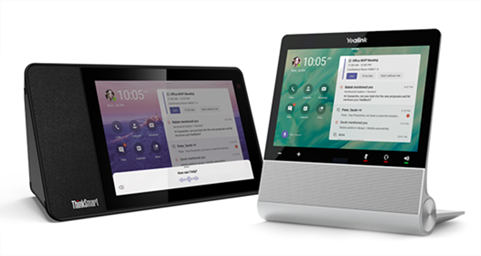

Microsoft Teams displays are a category of all-in-one dedicated Teams devices that feature an ambient touchscreen and a hands-free experience powered by Cortana. With Teams displays, users can use a microphone, camera, and speakers (or Bluetooth headset) for a reliable calling and meeting experience. Teams displays integrates with users' Windows PCs to bring a companion experience that allows for seamless cross-device interaction.

The following picture shows two examples of typical Teams Display devices:

> [!div class="mx-imgBorder"]
> 

In addition to the features supported by Teams phones, the following features are unique to Teams displays:

- Dedicated displays for Teams Users can access all of the core Teams features including chat, meetings, calls, teams and channels, files and more.

- Ambient experience Users can easily stay on top of their work with always-on and glanceable displays to see important activities and notifications without context-switching on their primary work device. Users can also personalize Teams displays by customizing the background through settings.

- Hands-free with Cortana Users can interact with Teams displays using their voice to effortlessly join and present in meetings, dictate replies to a Teams chat, check what’s on the calendar, and more.

- Leave a note on lock screen - Guests can choose to leave audio, video, and text notes, and users can check the notes left by guests and see who’s stopped by.

Teams Display devices are typically used as companion devices alongside a laptop or a desktop PC. The typical user for a Teams Display won’t necessarily be a user that would otherwise use a Teams Phone and will not always require Teams Phone System capabilities. For example, some users of Teams Displays may use their device primarily to join meetings. From an administrator’s perspective, a Teams Display provides the same management capabilities as a Teams Phone and can be subject to identical policies or rules.

## Teams Phones management and deployment skills are used to manage Teams Displays

Skills used to manage Teams Phones are applicable when managing Teams Displays as these are an evolution of Teams Phones. You can upgrade Teams phones in your organization to Teams displays using the Microsoft Teams admin center. This option is available only to phones that support upgrading to Teams displays.

