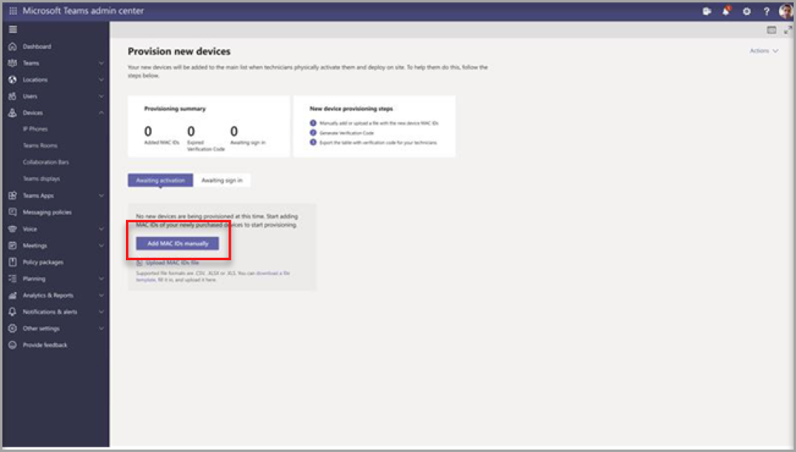
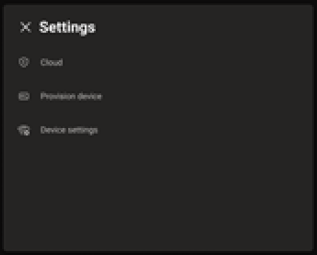
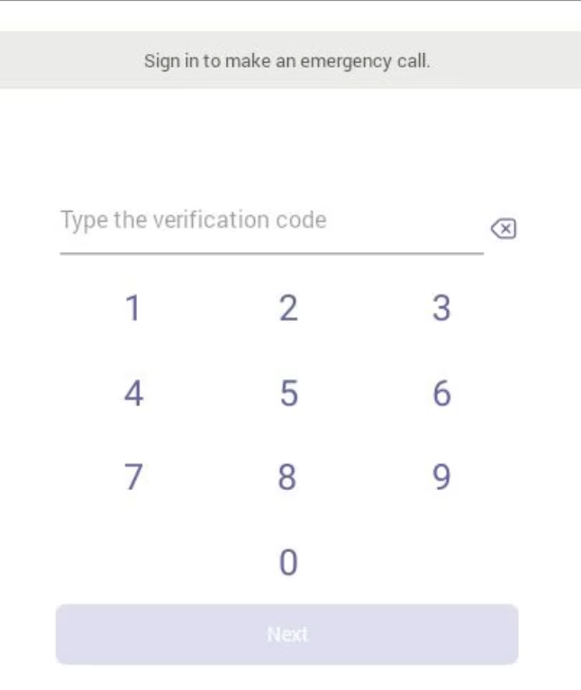
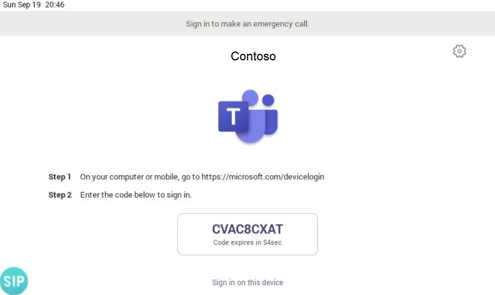
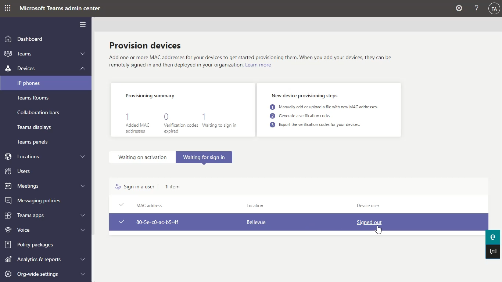
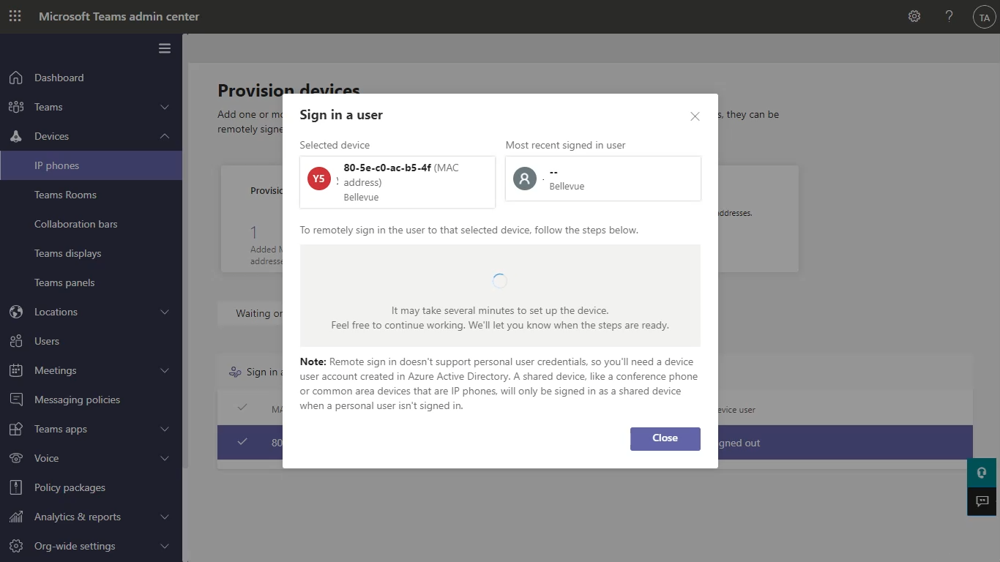

IT admins can remotely provision and sign into a Teams Android device. This is useful when deploying devices to many desks and reducing the need for first sign-in and setup by the end user. It enables technicians to provide device information and verification codes to IT admins who can then, once a device is allocated to the user shortly after, ensure the device is ready to use.

To provision a device remotely, the admin needs to upload the MAC IDs of the devices being provisioned and create a verification code. The entire process can be completed remotely from the Teams admin center.

## Pre-requisites for remote provisioning

Before you can use remote provisioning features, you must use devices that are compatible with remote provisioning and run compatible firmware. If you are repurposing devices, then ensure updates are applied before attempting to reset and use remote provisioning. If you are buying new devices, confirm with the supplier that the correct level of firmware updates is already applied. If firmware updates are required, then often firmware can be updated on devices remotely via the vendors’ web-based management portal on the device or via a vendor's management software package.

The following table provides an overview about firmware versions required of devices from several vendors:

| **Device category**| **Device model**| **Firmware version**|
| :--- | :--- | :--- |
| Teams phones| Yealink T55/T56/T58| 58.15.0.124|
| Teams phones| Yealink VP59| 91.15.0.58|
| Teams phones| Yealink CP960| 73.15.0.117|
| Teams phones| Yealink MP56/MP54/MP58| 122.15.0.36|
| Teams phones| Crestron UC-2| 1.0.3.52|
| Teams phones| Poly Trio C60| 7.0.2.1071|
| Teams phones| CCX400/CCX500/CCX600| 7.0.2.1072|
| Teams phones| Audio Codes C448HD/C450HD/C470HD| 1.10.120|
| Teams panels| Crestron 770/1070| 1.004.0115|

## Performing remote provisioning

To remotely provision a new device, perform the following steps in written order:

1. Navigate to the Teams admin center at [https://admin.teams.microsoft.com](https://admin.teams.microsoft.com/)

1. Sign in to the Teams admin center with an account that has the Teams Administrator role.

1. Select and expand **Devices**.

1. Then select **Provision new device** from the **Actions** tab.

1. In the **Provision new devices** window, you can either add the MAC address manually or upload a file.

1. To manually add a device MAC address, From the **Awaiting Activation** tab, select **Add MAC ID**.

On the following picture, you can see the Microsoft Teams admin center portal on the **Provision new devices window** with the **Add MAC IDs** section highlighted.

> [!div class="mx-imgBorder"]
> 

- Enter the MAC ID, enter a location, which helps technicians identify where to install the devices and select **Apply** when finished.

- To upload a file with multiple MAC addresses, from the **Awaiting Activation** tab, select **Upload MAC IDs**. Download the file template and enter MAC IDs and locations and save the file.

- Next choose **Select file**, and then select **Upload**.

You need a verification code for the devices to perform activation. The verification code is generated in bulk or at the device level and is valid for 24 hours. From the **Awaiting Activation** tab, select an existing MAC ID. A password is created for the MAC address and is shown in the **Verification Code** column.

Provide the list of MAC IDs and verification codes to the field technicians. You can export the detail directly in a file and share the file with the technician who is doing the actual installation work. This procedure can significantly speed up deployments and lower administrative overhead.

## Provision the device

When the device is powered on and connected to the network, you as an engineer or an on-site technician can provision the device on the location it shall be used in the future. These steps are completed on the Teams device and identical across different vendors.

Select **Provision device** from the **Settings** screen as shown in the picture below.

> [!div class="mx-imgBorder"]
> 

Then enter the device-specific verification code in the provided input field.

> [!div class="mx-imgBorder"]
> 

Once the device is provisioned successfully, the tenant’s name appears on the sign-in page. On the following picture, you can see how the page looks like and how you or an onsite technician is guided to finish the setup procedure.

> [!div class="mx-imgBorder"]
> 

Back in the Microsoft Teams admin center, the provisioned device appears in the **Awaiting sign in** tab. Start the remote sign-in process by selecting the individual device. Select a device from the **Awaiting sign in** tab.

> [!div class="mx-imgBorder"]
> 

Follow the instructions in **Sign in a user**, and then select **Close**.

> [!div class="mx-imgBorder"]
> 

You have successfully completed provisioning of a device, and the use is now ready for working with it.

